..  _afp:

Apple Filing Protocol (AFP)
===========================

An Apple / OSX native network sharing system akin to :ref:`samba` from
MS Windows and :ref:`nfs` from Unix. However as of OSX 10.9 Mavericks and 10.10
Yosemite the default network sharing protocol in OSX is SMB/CIFS
(`apple reference <https://support.apple.com/en-gb/HT204445>`_). However AFP
is still enabled by default and if SMB is not available then AFP is used. AFP
is also necessary for network based Time Machine backups.

..  _time_machine:

Time Machine
------------

Time Machine is the built in backup system in Apple's OSX (Operating System
10). It is a `requirement <https://support.apple.com/en-us/HT202784>`_ of Time
Machine that network volumes be over AFP. By way of example this document steps
through the configuration of a Time Machine compatible network volume hosted on
Rockstor and how to backup to this volume from an OSX client machine.

..  _create_afp_share:

Creating an AFP Share
---------------------

In order to establish an AFP share it is first necessary to have a
pre-configured storage Pool, a share of this pool or part there of, and a
Rockstor user to
authenticate against this Share. Finally the Share must be exported via the AFP
method. The following list details a suggested order and gives links to the
documentation on each of these steps.

* To create a storage pool see :ref:`createpool` in the :ref:`pools` section.
* :ref:`Add a Rockstor user <adduser>` to match the OSX user, see the :ref:`users` section.
* A :ref:`Share <shares>` of this storage pool is then required, see :ref:`createshare` in the :ref:`pools` section.
* Finally this Share is exported via :ref:`afp_export`.

The Time Machine Pool
^^^^^^^^^^^^^^^^^^^^^

In the following example a dedicated **time_machine_pool** has been created.

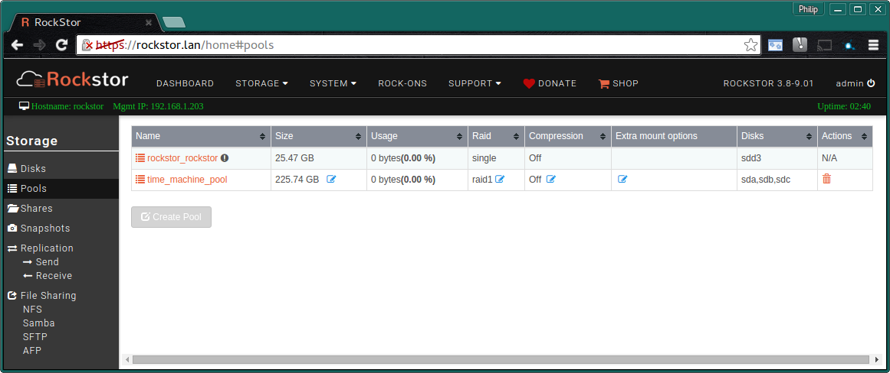

*A 3 disk Raid1 pool of drives*

The "Backup" Share
^^^^^^^^^^^^^^^^^^

Here a :ref:`Share <shares>` named **Backups** has been created; note that it
is strongly advised that any Share to be used by Time Machine be at least 3
to 5 times the size of a single full backup. A typical OSX install
before any data is 6-20 GB depending on upgrades applied etc. This makes it
advisable to allocate around **30-100 GB per client machine**.

In this example we have changed the owner and group of our share to that of an
existing Rockstor user and removed *Other* users access as it is not required.
Note that the Rockstor user name doesn't have to match that of the OSX user
but it is easier if it does as it will then be auto populated on the client
machine.

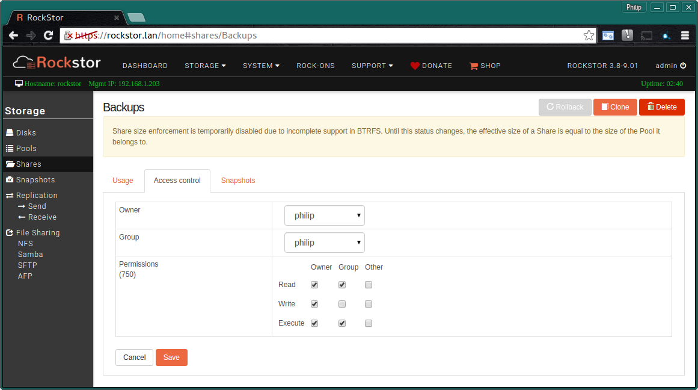

**If multiple users are required to share this Network Volume then create an
appropriate group eg macuser and ensure all the Rockstor Mac users belong to
this group. You can then select this group and enable group write.**

Please note that if practical it is best to create one share per machine for
Time Machine backups as this prevents single client machines monopolizing the
available space as Time Machine defaults to using all available space and
will only remove it's own old backups when space is short; and not another
machine's or user's backups. This results in frequently used machines backups
dominating the available space and can prevent occasionally used machines from
having space to do their backups.

The Access Control section of a Share also allows for setting up read only
shares if this is desired.

Our Example Share named "**Backups**" of space provided by the
"**time_machine_pool**":

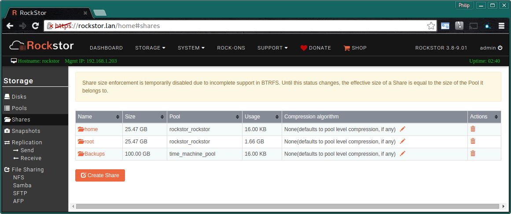

*A 100 GB share of the time_machine_pool*

..  _afp_export:

Add AFP Export
^^^^^^^^^^^^^^

Finally **export** the **Share** via the **AFP** entry in **File Sharing**.
This menu entry is available in the **Storage** section. Note that the **AFP
Service** will first have to be **switched ON** before these options are
available.

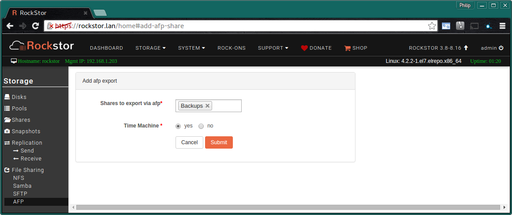

**Note the Time Machine option**: this defaults to off and is not required for
normal AFP file sharing.

..  _osx_afp_config:

Client OSX Configuration
------------------------

Having now setup an AFP share as in :ref:`create_afp_share` we can now
configure the client Mac machine/s to access it. The steps required are
outlined below.

* Connect to the Rockstor Share as the Rockstor user.
* Select this Share Connection in Time Machine's Preferences (if desired).

Connect to Share in Finder
^^^^^^^^^^^^^^^^^^^^^^^^^^

The first step is to locate the Rockstor server by name under the **Shared**
section in **Finder**. Here the Rockstor server was configured with the
hostname "**rockstor**".

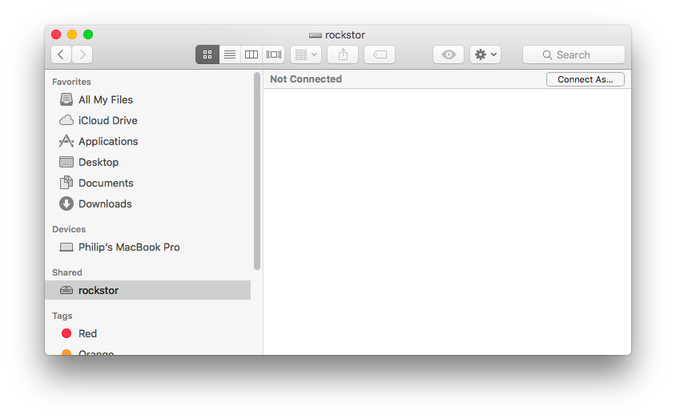

Now use the **Connect As** button displayed in the top right corner of the
**Finder** right hand window. Note that you will then be required to enter the
**Rockstor Username** and **Password** setup earlier. OSX may capitalize the
first character but this doesn't matter and in this example the user was
auto populated as the OSX user and the Rockstor user where the same. This is
not necessary but is convenient.

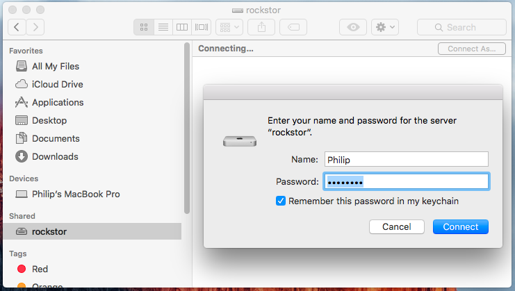

The Rockstor Share named "**Backups**" is now visible in Finder and ready for
general purpose use, however if *Time Machine* was selected during the
:ref:`afp_export` section of :ref:`create_afp_share` then this share can also
be used by OSX's Built in Backup System. See :ref:`tm_select_share`.

N.B. In **Finder** it is also possible to invoke an afp type network
connection via **Go** then **Connect to Server** menu options *(Option + K)*.
Then enter **afp://philip@rockstor** where *philip* is the user and *rockstor*
is the hostname of the rockstor system. On some setups this may be required to
ensure an afp rather than an smb type connection. A dialog will then present
the available shares. Note right click *Get Info* to examine the nature of an
established connection.

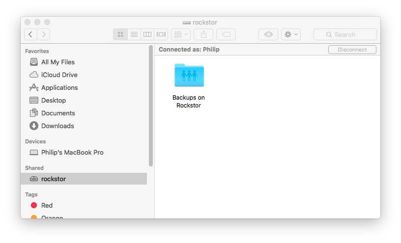

..  _tm_select_share:

Select Share in Time Machine
^^^^^^^^^^^^^^^^^^^^^^^^^^^^

Now open Time Machine Preferences either by right clicking on it's icon in the
top bar (a analogue clock with an arrow around it) or by opening System
Preferences and selecting Time Machine.

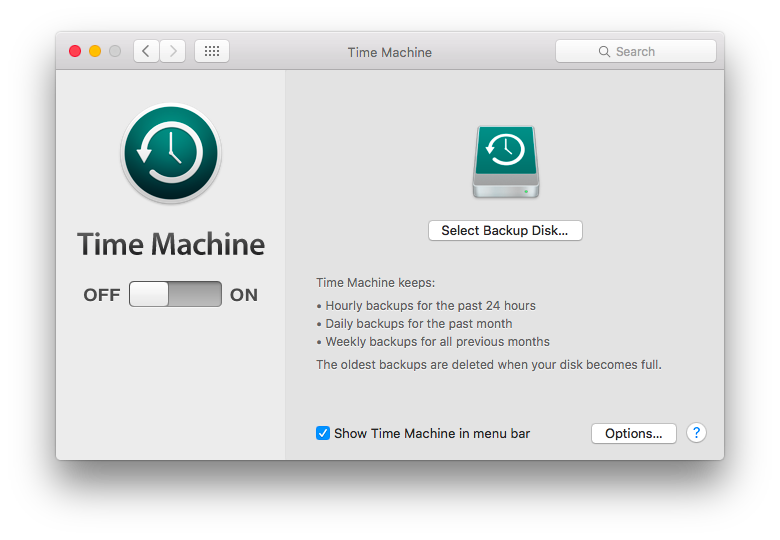

In the following image we see Finder's connection to the share on the left
and Time Machine offering this same Share as a storage option on the right.

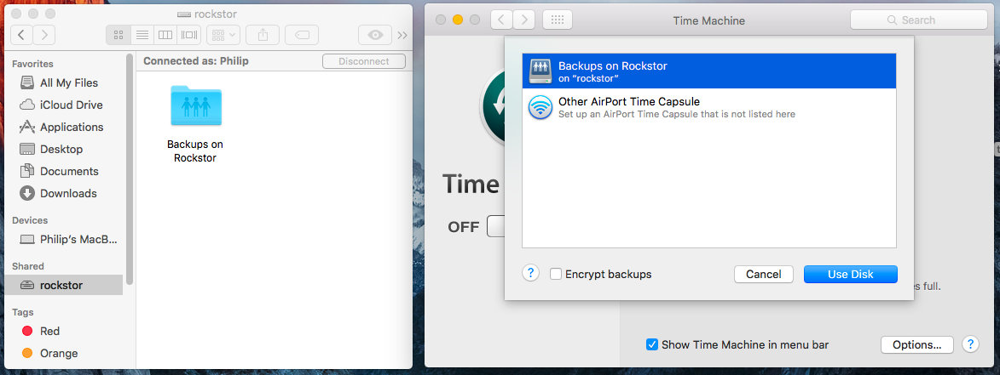

Note that it will be required to **Re-enter** the **Rockstor user** and
**password** after having clicked on the **Use Disk** button.

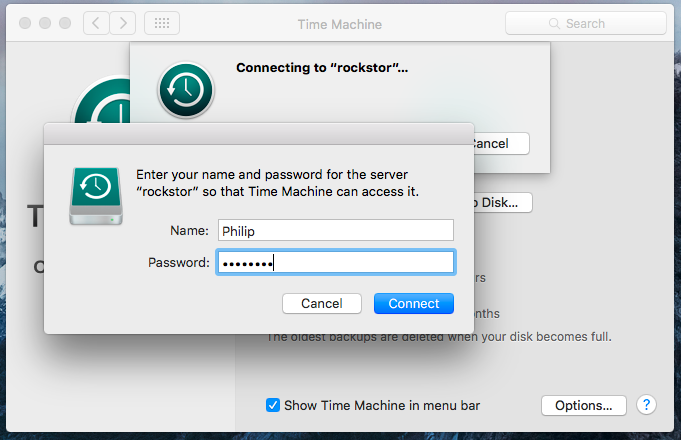

Time Machine should now **default** to **ON** and begin it's first backup. The
first backup will take longer that subsequent backups due to initialization
tasks. A progress bar and the estimated time remaining should be displayed
shortly after the initialization tasks have completed.

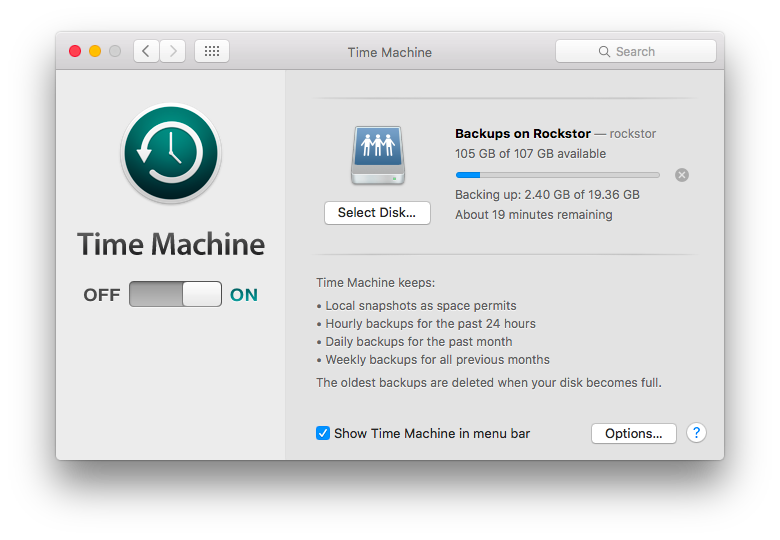

In El Capitan (OSX 10.11) a notification will be issued upon Time Machine's
completion. All versions of OSX should indicate the last successful Time
Machine backup in the Time Machine Preferences dialog.

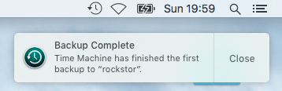

