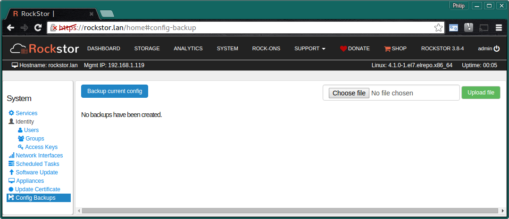
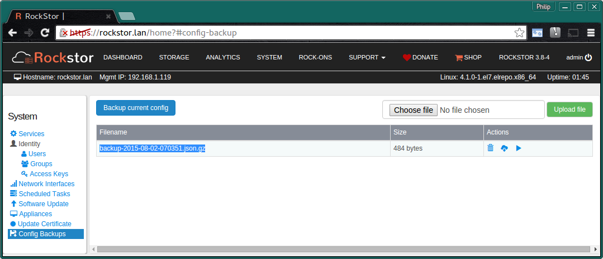
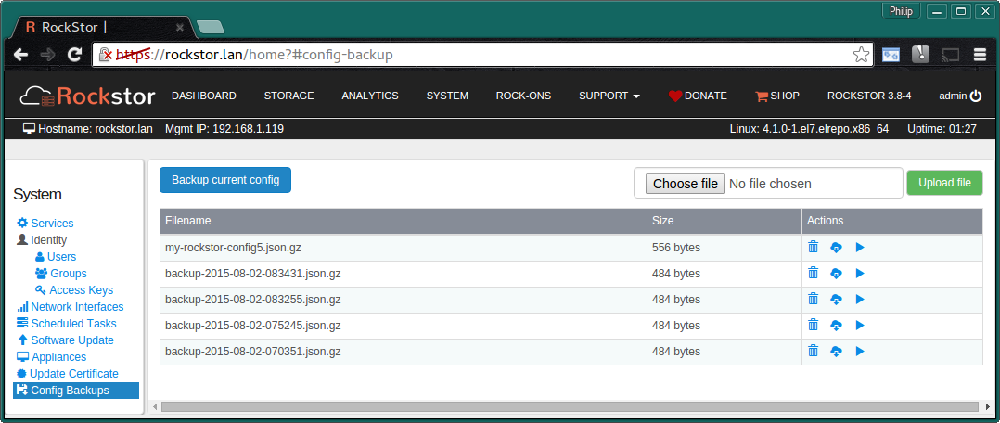

..  _config_backup:

Configuration Backup and Restore
================================

The current configuration of Rockstor can be saved at any time and restored to
any previously saved point.  This is a particularly useful feature when making
extensive configuration changes as it provides the possibility to revert to a
known good configuration.

This feature is found in the **Config Backups** section on the **System** page.

In the above there are no previous configuration backups.

Creating a Configuration Backup
-------------------------------

Simply click on the **Backup Current Config** button and a new configuration
backup will be saved and named according to the date and time it was taken.

This shows a single save point; note the icons in the actions column.
Mouse over tooltips assist with identifying these icons and their function.

Possible Actions
^^^^^^^^^^^^^^^^
By using the **Bin**, **Download**, and **Play** icons in the action column it
is possible to:-

* **Bin** / dispose of a particular configuration backup
* **Download** a particular backup file to you local machine
* **Play** / Restore the selected configuration

..  _config_restore:

Restoring a Configuration Backup
--------------------------------

Restoring a previously saved configuration is done by using the **Play** icon
in the **Actions** column of the chosen configuration; or by uploading a
previously downloaded configuration file and then applying / playing back that
configuration in the same way ie:-

Note in the above listing we have several saved configurations.The config
named **my-rockstor-config5.json.gz** is an example of an **uploaded**
configuration that was renamed locally after having been downloaded
previously and is now ready to be applied using the **Play** icon as usual.

**All configuration backups are stored in zipped json format in the
/opt/rockstor/static/config-backups directory**