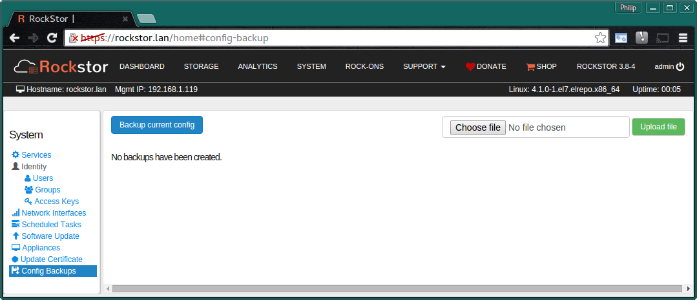
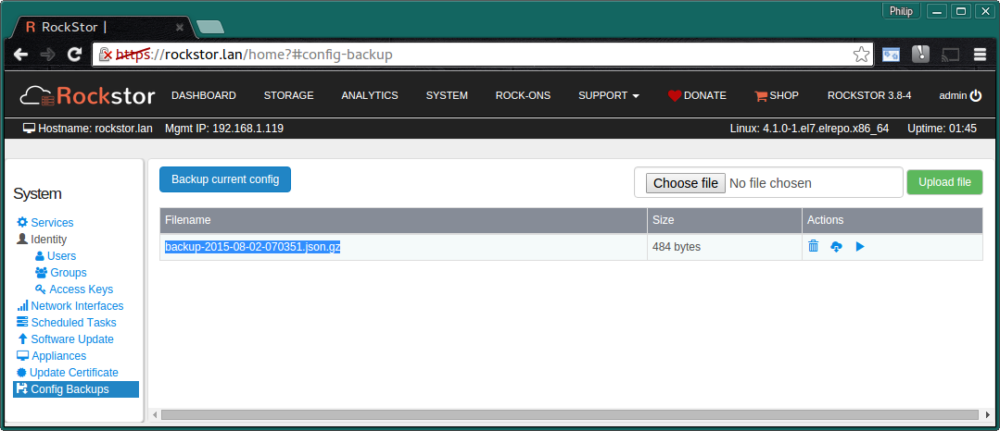

..  _config_backup:

Configuration Backup and Restore
================================

**Please note that this feature is in beta testing and not yet recommended
for production use**

*Bug reports or suggestions are always welcome on* `our forum <https://forum.rockstor.com/>`_

The current configuration of Rockstor can be saved at any time and restored to
any previously saved point.  This is a particularly useful feature when making
extensive configuration changes as it provides the possibility to revert to a
known good configuration. Once a configuration backup has been generated and
downloaded it can also be used in system migration scenarios.

.. raw:: html

   

   Upon restore, the configuration of most features included in the backup
   will be restored regardless of their current state. As a result, their current
   configuration will be overwritten (to the exception of <em>Users</em> and
   <em>Groups</em>, see <a href="#special-notes-on-configuration-restore">below</a>).
   

The following state information is saved as part of a backup

* Users and Groups
* Samba configuration and exports
* NFS configuration and exports
* Schedule task configuration
* Service configurations (ntp, smartd etc..)
* Service status (on / off)
* Scheduled task configuration
* Rock-on configuration

*Note: as of Rockstor-3.9.2-56, AFP configuration and exports are no-longer supported.*

Since Rockstor can dynamically detect  :ref:`Pool <pools>`,  :ref:`Share <shares>`, and :ref:`Snapshot <snapshots>` information
after an external change like a :ref:`reinstallation <reinstall>`, there is no need to save this
information. For more information visit the :ref:`reinstall_import_data` section
in the :ref:`reinstall` howto.  While the above list covers the essentials of the whole state,
the following state information is not currently saved to a backup. There are
plans to add these states to the list of saved states in the future.

* Appliance configurations
* Dashboard customizations
* Network interface settings

This feature is found in the **Config Backups** section on the **System** page.

In the above there are no previous configuration backups.

..  _config_backup_create:

Creating a Configuration Backup
-------------------------------

Simply click on the **Backup Current Config** button and a new configuration
backup will be saved and named according to the date and time it was taken.

This shows a single save point; It's recommended that you **download** the backup
and save it somewhere safe and secure. In case of a :ref:`reinstallation <reinstall>`, you can upload
it and restore the system to this save point as explained below.

Note the icons in the actions column.  Mouse over tooltips assist with
identifying these icons and their function.

..  _config_backup_actions:

Possible Actions
----------------

By using the **Bin**, **Download**, and **Play** icons in the action column it
is possible to:-

* **Bin** / dispose of a particular configuration backup
* **Download** a particular backup file to you local machine
* **Play** / Restore the selected configuration

Note, that it is also possible to upload a previously downloaded configuration
and then apply / play back that configuration.

..  _config_restore:

Restoring a Configuration Backup
--------------------------------

Restoring a previously saved configuration is done by using the **Play** icon
in the **Actions** column of the chosen configuration; or by uploading a
previously downloaded configuration file and then applying / playing back that
configuration in the same way ie:-

..  image:: conf_uploaded.png
    :scale: 80%
    :align: center

Note, in the above listing we have several saved configurations.  The config
named **my-rockstor-config5.json.gz** is an example of an **uploaded**
configuration that was renamed locally after having been downloaded
previously and is now ready to be applied using the **Play** icon as usual.

**All configuration backups are stored in zipped json format in the
/opt/rockstor/static/config-backups directory**

..  _config_notes:

Special Notes on Configuration Restore
--------------------------------------

As mentioned above, restoring a configuration backup will reset your system
configuration but a few points should be mentioned:

* **Preparation**: a lot of configuration settings such as NFS/Samba exports,
  services configuration, or rock-ons, depend on the presence of specific shares
  on the system. In a Rockstor reinstallation scenario, it is thus recommended to
  first :ref:`import pools and shares <reinstall_import_data>` from the disk before
  restoring a configuration backup.
* **Time**: upon restore, all settings may take some time to propagate, depending
  on the size of the backup. If a particular setting doesn't seem to be restored
  immediately, try refreshing the page after a few minutes. Rock-ons, for instance,
  can take several seconds to minutes to be re-installed if necessary.
* **Users and Groups**: only those present in the backup but not in the current
  system will be restored. This means that users and groups  created after the backup
  will not be deleted upon config backup restore.
