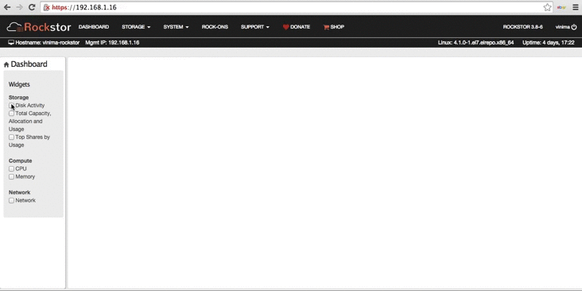
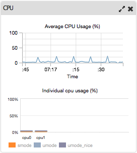
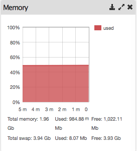
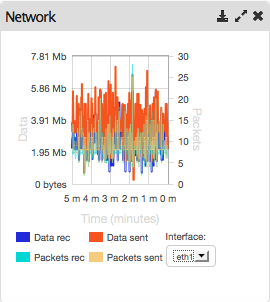

Dashboard
=========

The RockStor dashboard is a view for an admin to rapidly monitor the storage, compute and network resources of the appliance.

The dashboard is designed as a configurable set of widgets, each displaying
information about the resources mentioned above. Here are some features of
the dashboard that enhance user experience.

* Widgets can be selected or deselected from the left sidebar to create a
  custom dashboard. They can also be deselected by clicking the X icon on the
  top right.
* Widgets can be rearranged, maximized and minimized to customize the layout.
* The new configuration is automatically saved for future logins.

Dashboard Widgets
-----------------
Widgets have two states, compact and expanded. They can be toggled between the two states by clicking the resize icon located at the top right of each widget.
The compact state displays minimal information required for monitoring a particular resource, and the expanded state displays more detail, and may have more functionality like viewing history of the resource etc.

CPU Widget
^^^^^^^^^^

The CPU widget displays the cpu usage of the appliance and is updated every
second. The widget display is divided into two parts. The top graph displays
the percent of time spent in system mode, user mode, and user mode nice, for
each cpu, for the current time interval. The bottom graph displays the
percentage of average time spent in each mode over all cpus, over the last 5
minutes.

Memory Widget
^^^^^^^^^^^^^

The memory widget displays a graph of memory usage over the last 5 minutes.

Disk activity Widget
^^^^^^^^^^^^^^^^^^^^

The disk activity widget displays the top 5 disks sorted by read/write
activity. Activity can be sorted by reads, writes or both.

Network activity Widget
^^^^^^^^^^^^^^^^^^^^^^^

The network activity widget displays data sent/received, and packets sent/received for the selected network interface, over the last 5 minutes.

