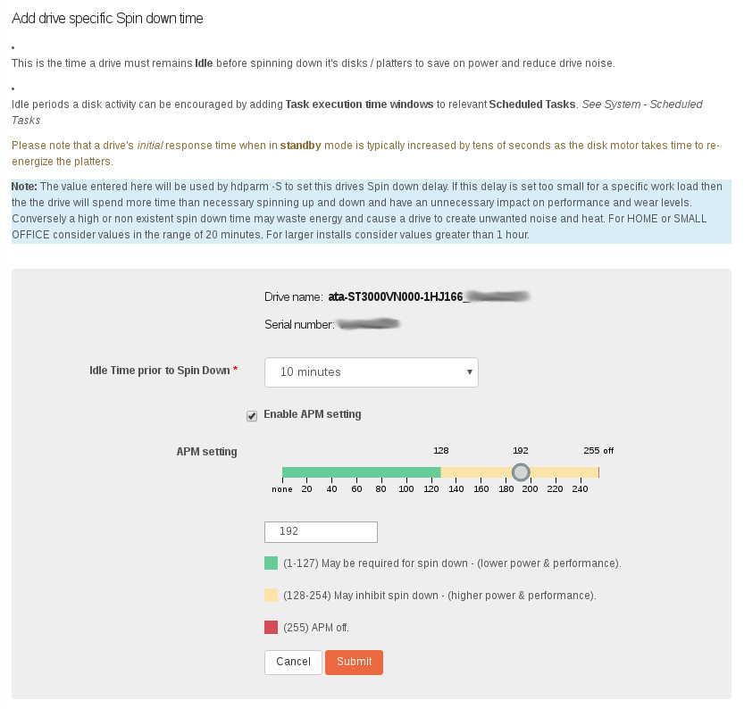
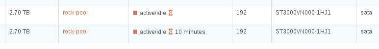
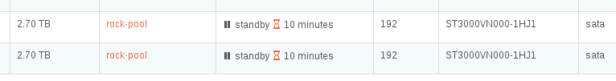
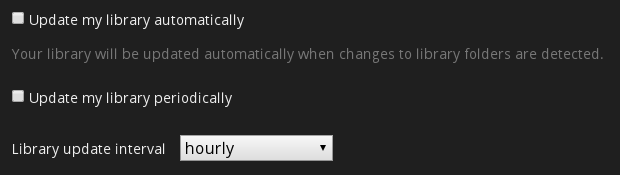

.. _diskpowerdown:

Disk Power Down
===============

Most modern Hard Disk Drives (HDD) are capable of balancing performance and
power use, however in some circumstances it may be desirable to alter the
default settings. The Storage - :ref:`disks` Rockstor Web-UI page contains
the Disks table which has a :ref:`powerstatus` to indicates the current
drive status, and the :ref:`apmsetting` which reflects the current Advanced
Power Management setting for each drive.  These configuration elements are
related and as such are combined in a unified :ref:`drivespindown` Web-UI
page arrived at by clicking on the **hour glass** icon withing the Power
Status column.

.. _powerstatus:

Power Status Column
-------------------

Within this :ref:`disks` table column it is possible to request that a
particular drive imediately enter standby (spin down) state, via the **pause**
icon, or configure a drives *build in* capability to spin down after a set
period of inactivity. It is also possible to configure a drives overall
balance between performance and power saving. Spin down and APM are usually
both configurable via an *hour glass* icon click which opens the
:ref:`drivespindown` page detailed in the next section.

.. _drivespindown:

Drive Specific Spin Down Time
-----------------------------

This page consists of 2 main elements.

* **Idle Time prior to Spin Down** - drop down to configure this element.
* **APM setting** - slider or text box to configure the balance between power use and performance.

**Power Status (hour glass icon) configuration screen**

**Note the colour coded key to explain the potential interplay between the APM
setting and the Idle Spin Down capabilities of a drive.**

Internally Rockstor relies on the hdparm (-C & -B) command to set both of these
configuration elements. But a caveat is that not all drives respond similarly
as the manufacturers, drive model, and even firmware versions will affect how
the hdparm requests are processed. So it is worth trying out various settings
to achieve your desired outcome. The configuration screen gives some
recommendations. As a rule of thumb it is usually not required to change the
APM settings so only try changing away from the default if your desired Spin
Down configuration time fails to work.

Also note that some drives require a full power cycle to adopt a new settings
and that some BIOS settings can aid or inhibit a drives ability to spin itself
down.

In the following we see an example of where one drive has had it's idle time
configured while the other has not.

**Note that if a Spin Down configuration request fails for some
reason, ie that the device doesn't support this action. Then the text
indicating the time value will not appear.**

In the following image we see both drives having been configured for a
"10 minutes" idle spindown.

.. image:: hdds_active_idle.png
   :width: 100%
   :align: center
Both drives active/idle (still spinning) but set to 10 minutes.

The following image shows both drives after having entered the **Standby**
state (no disk rotation). Notice that in this state the **pause** icon is
also disabled, since it's function is now redundant.

.. _apmsetting:

APM Column
----------

These values reflect the current Advanced Power Management setting for each
drive. This value is between 1 and 255 but if it couldn't be read, as not all
devices support this setting, then it will be displayed as **???**. In this
case the APM config enable tick option in the configuration screen will be
disabled.

.. _idletime:

What is Idle Time
-----------------

Simply put it is the period of time elapsed since a drive last received
a request to store or retrieve data. As such, if there are processes in
Rockstor or any of it's Rock-ons that are periodically accessing a share hosted
on a pool that has the disk in question as a member then the drive may fail to
ever enter a Standby (Spin Down) state.  Placing :ref:`rockons_root` share on a
pool with drives that you would rather power down is likely to lead to those
drives never entering the Standby state as any number of processes involved
within any of the potentially many Rock-ons may prevent the associated pool
member drives from spinning down due to general background 'drive request'.

An example of a share's background access that may interfere with drive power
down settings is with the Plex Rock-on:

Here we see some settings that relate to how often a library should be scanned
for changes. This could well wake pool drive members that host this share.

