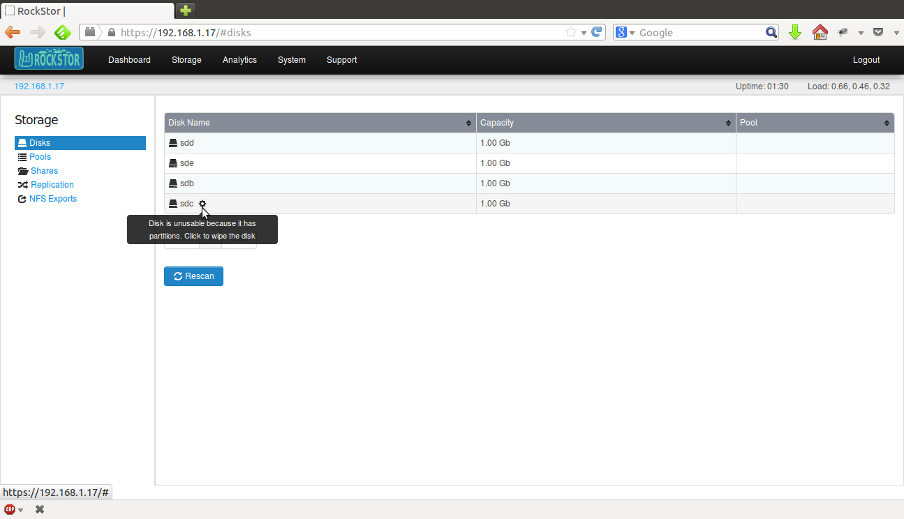
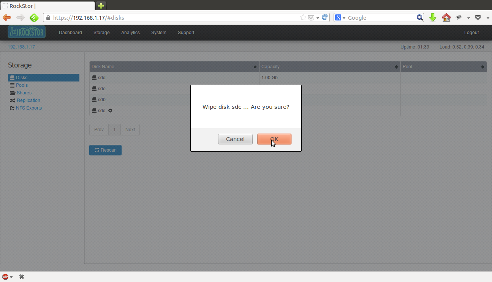
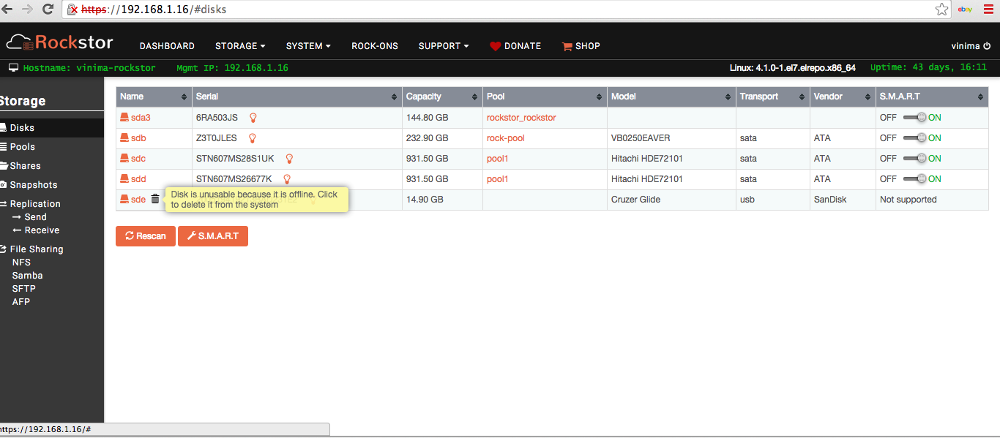
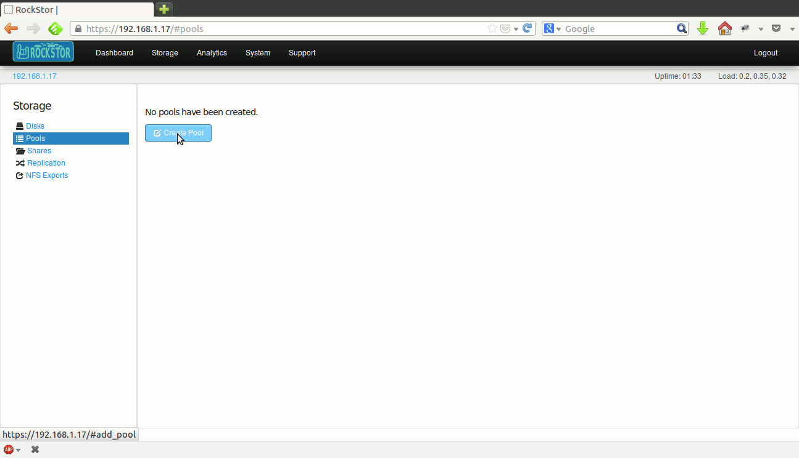
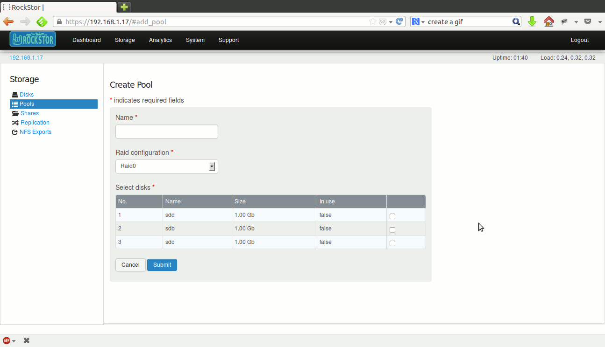
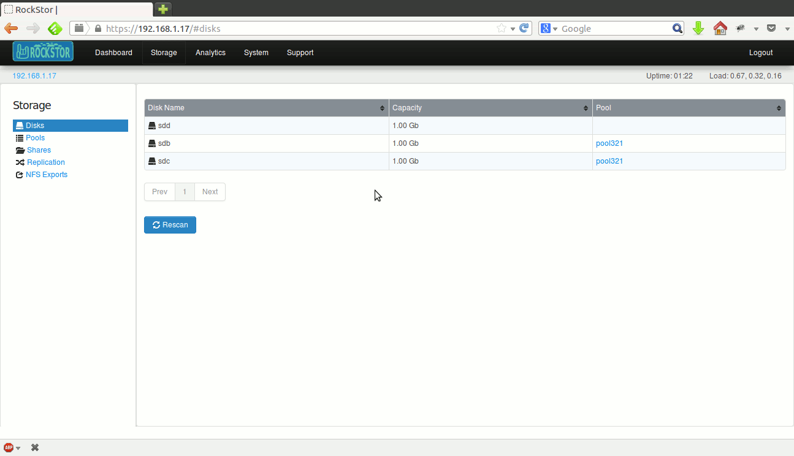
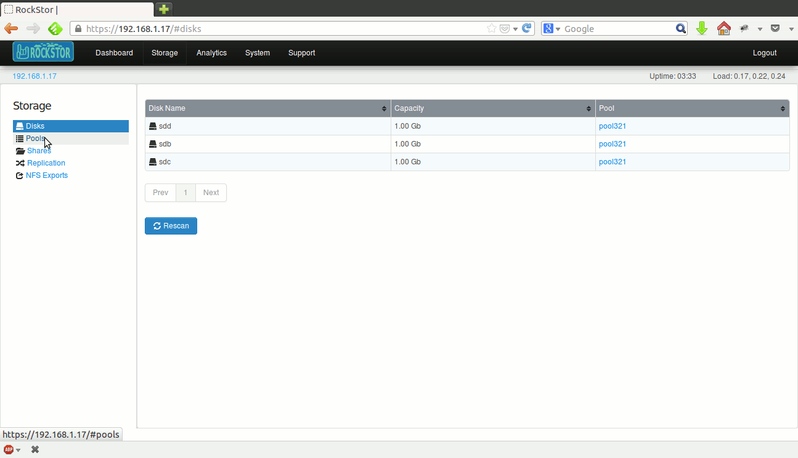

Disks and Pools
===============

Scan for new disks
------------------

In the webui, click on the *Storage* tab to enter the main Storage view. This
also serves as the Disks view, which is selected by default in the left
sidebar. Already existing disks in the system are displayed.

.. image:: disks_rescan.png
   :scale: 65%
   :align: center

Click the **Rescan** button to scan for any new disks added to the system since
the last scan.

If there are large number of disks in the system, the table is paginated and
the current page number is displayed below the table along with **Prev** and
**Next** buttons.

The display can be sorted by individual columns by clicking small
up/down arrows displayed in each column header.

Partitioned disks
^^^^^^^^^^^^^^^^^

Rockstor works only with whole disk drives that do not contain a partition
table. If a disk has a partition table, it is suspected to have data and
Rockstor doesn't allow it's usage until the partition table is explicitly
wiped. Such disks are displayed with a little sprocket icon next to them and
relevant help text is displayed upon mousing over this icon.

Inorder to use a partitioned disk, it's partition table needs to be wiped as
indicated by the help text. Click on the sprocket icon and a popup confirmation
dialog is displayed. Upon confirmation, the partition table is wiped and the
disk will be ready for use as shown below.

Broken or removed disks
^^^^^^^^^^^^^^^^^^^^^^^

Rockstor detects when a disk drive goes offline(damaged or removed from the
system) and marks it as such. This is indicated by the little trash icon next
to the disk and relevant help text is displayed upon mousing over this icon.

Inorder to remove the disk from Rockstor, click on the trash icon and a popup
confirmation dialog is displayed. Upon confirmation, the disk will be removed
as shown below.

Create a pool
-------------

Pool related operations including creating a pool can be done from the *Pools*
view. In the webui, click on the *Storage* tab to enter the main Storage
view. Now click on **Pools** in the left sidebar to enter the *Pools* view. If there are any pools in the system, they are displayed in a
table.

If there are large number of pools, the table is paginated and the
current page number is displayed below the table along with **Prev** and
**Next** buttons.

The display can be sorted by individual columns by clicking small
up/down arrows displayed in each column header.

Click on **Create Pool** button and the create pool form will be
displayed. Submit this form to create a new pool as shown below.

When creating a new pool, choose the appropriate redundancy from the *Raid
configuration* dropdown menu.

Redundancy options
^^^^^^^^^^^^^^^^^^
All standard BTRFS redundancy options are available when creating a pool.

* **Single**: One or more disks can be used. Data is neither mirrored nor
  striped. But metadata is mirrored across drives. Drives of different
  capacities can be used with this configuration.
* **Raid0**: Two or more disks of same size can be used. Both metadata and data
  are striped across the disks.
* **Raid1**: Two or more disks of same size can be used and the configuration applies
  to both data and metadata.
* **Raid10**: This is a Raid0 of Raid1 mirrors. Four or more disks of same size
  can be used and the configuration applies to both data and metadata.

Resize a pool
-------------

A pool can be resized by adding more disks to it. Go to the Storage tab of the
webui and click on *Pools* in the left sidebar to enter the *Pools* view. In
the displayed table of pools, click the pool to be resized to enter the pool
detail view. Now, click on the **Resize** button and a popup form is
displayed. Select disks to be added and submit the form. Upon success, pool's
detail view is dispalyed which lists the new disk(s) added and the resulting
new size of the pool as shown below.

Delete a pool
-------------

A *pool* can be deleted as long as it is empty, i.e., there are no *shares*
remaining in it.

Go to the Storage tab of the webui and click on *Pools* in the left sidebar to
enter the *Pools* view. In the displayed table of pools, click on the **trash**
icon corresponding to the pool to delete it as shown below.

A pool can also be deleted by clicking the **Delete** button inside it's detail
view.

Scrub a pool
------------

A *pool* scrub operation can take a while depending on the size of the pool. To
start a scrub, go to the pool's detail view and click on the **Start scrub**
button. The button will be disabled during the scrub process and enabled again
once the scrub finishes.

