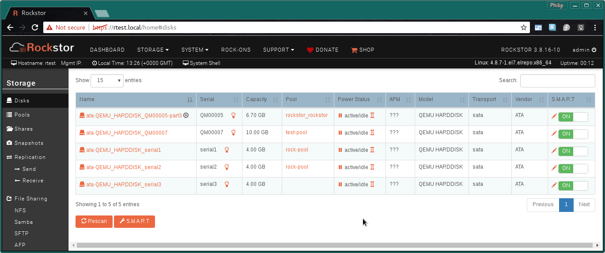
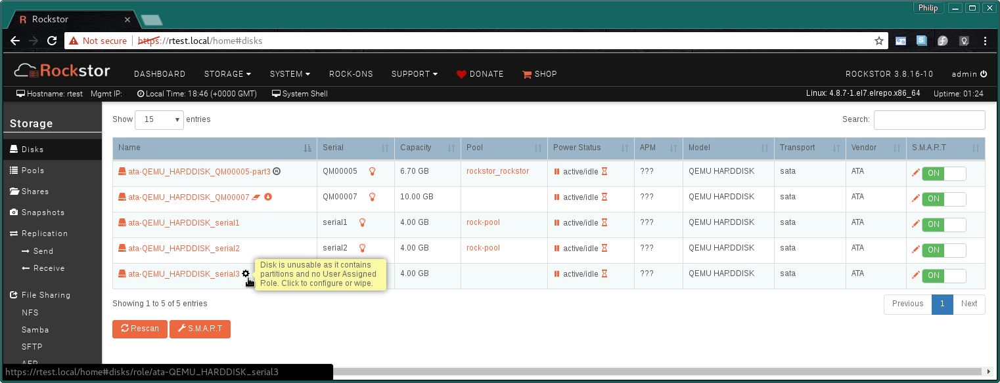
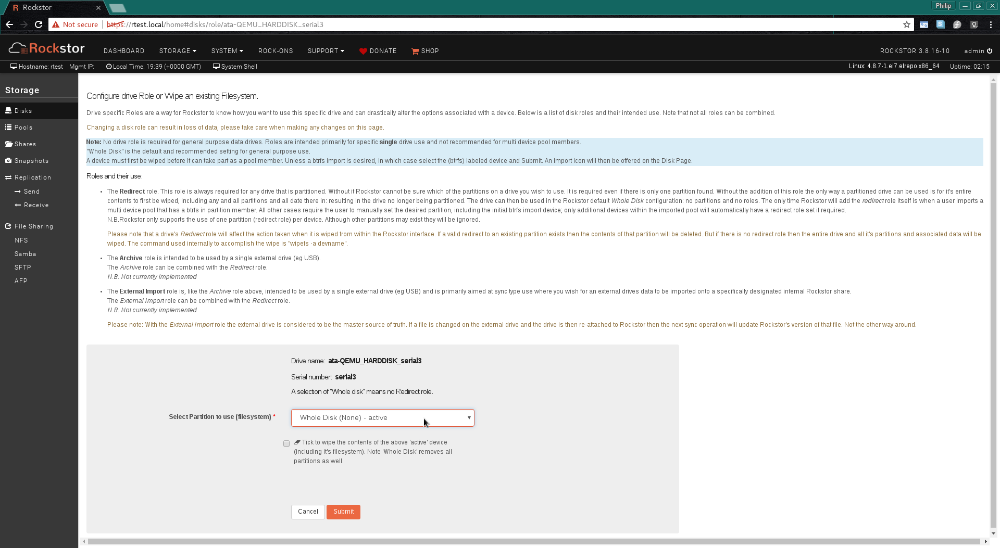
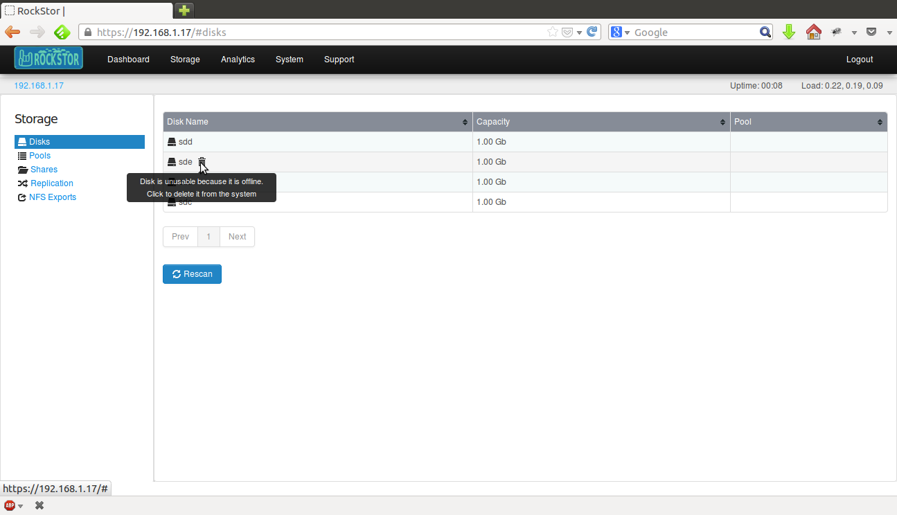
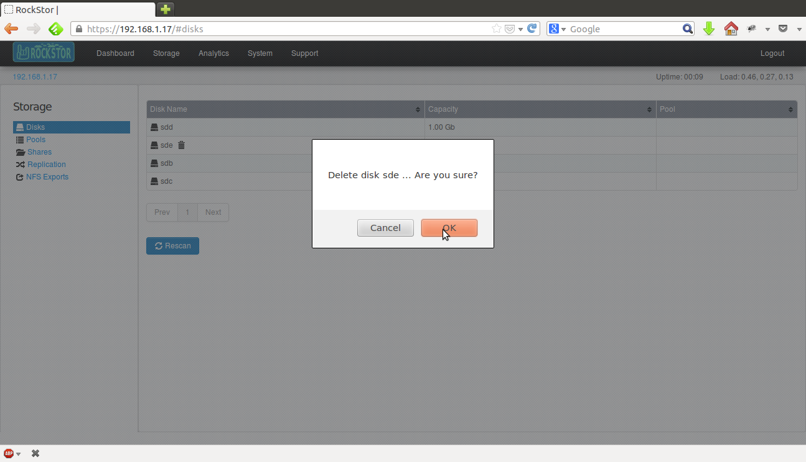

..  _disks:

Disks
=====

Disks can be Hard Disk Drives(HDDs), Solid State Drives(SSDs), USB drives,
virtual disks from a hypervisor or open LUKS mount, or even sdcards. Rockstor
supports and recommends whole disk btrfs (ie no partitions or partition table),
but can also recognise and configure btrfs pool members in partitions; but
this is not encourages. The recommendation to use whole disk btrfs pool members
arises from the simplification afforded by removing the partition 'layer' all
together. This way partition types, partition table types, sizes relative to
whole disk etc are all made irrelevant as each disk is simply and wholly a pool
member and only a pool member. I.e. Keep it Simple and Straightforward (KISS).

Disk related operations such as S.M.A.R.T monitoring, data importing etc. can
be managed from the **Disks** page listed under the **Storage** tab of the
Web-UI. This page is an overview of disks **currently or previously known** to
the system and is essentially a table where each row is an entry for a single
real or virtual drive. **Previously attached drives** that are no longer found
to be attached are re-named to **detached-<random-string>**. Attached devices
are named according to their boot to boot stable udev assigned by-id names (ie
/dev/disk/**by-id** entries). All devices require and are tracked by their
unique **serial number** which allows for consistent settings even when a disk
is moved from one pool to another (via sequential pool resize operations).

*Table links from left to right:-*

* **Drive 'by-id' Name** - see drive's **SMART data** / status.
* **Bulb Icon** - flash drive's activity light to **identify it's physical location**.
* **Pool Name** - :ref:`pools` specific **details** page.
* **Pause Drive** - immediate **spin down** (suspend mode).
* **Hour glass** - configure **auto spin down timer** given no activity.
* **S.M.A.R.T Pen Icon** - configure **custom smart options**.
* **S.M.A.R.T Switch** - enable or disable for each device.

*Buttons:-*

* **Rescan** - the hardware for any supported drives, see :ref:`scandisks` below.
* **S.M.A.R.T** - system wide **custom configuration** (advanced).

The disks table can be sorted by individual columns by clicking the small
up/down arrows displayed in each column header.

With a large numbers of disks the table will be paginated and the current page
number will be displayed below the table along with **Prev** and **Next**
buttons.

..  _scandisks:

Scan for Disk Changes
---------------------

Clicking the **Rescan** button forces an update of the Disk table. This is
particularly useful if a drive has been added or removed since Rockstor was
power-on ie *hot plugged/unplugged*. It is recommended that this action be
taken just prior to *removing detached devices* to ensure the table contents
is freshly updated.

..  _btrfsdisk:

Import whole disk BTRFS
-----------------------

If after *Rescan* or after a Rockstor reinstall the system finds an
**existing whole disk BTRFS filesystem** a small **down arrow icon** next to
the drive name will be visible. This down arrow can be used to import the
btrfs filesystem, assuming all prior pool members are attached.

*The import icon:*

.. image:: images/existing-btrfs-whole-disk-import-tooltip.png
   :width: 100%
   :align: center

**import icon tooltip** *"Click to import data (pools, shares and snapshots)
on this disk automatically. Multi-device support included."*

 the exiting **whole disk btrfs** filesystem - see :ref:`reinstall_import_data` in our :ref:`reinstall` HowTo.

*or configure / wipe*

.. image:: images/existing-btrfs-whole-disk-config-tooltip.png
   :width: 100%
   :align: center

**configure or wipe icon tooltip** *"Disk is unusable because it has an
existing whole disk BTRFS filesystem on it. Click to configure or wipe."*

    * **configure or wipe** and re-use as if new - see :ref:`wipedisk` below.

..  _btrfspartition:

Import BTRFS in partition
-------------------------

Rockstor can also import btrfs pools that have partitioned members (*although
whole disk is recommended as this is a simpler arrangement*). If at least
one member is a whole disk btrfs (ie no partition table or partitions) then the
above :ref:`btrfsdisk` method can be used on this whole disk member. But if
all pool members are partitions then a 'redirect role' will be needed on one of
the pool members.

The following shows the tooltip guide for an as yet un-imported pre exiting
single device BTRFS in partition:

.. image:: images/existing-btrfs-partition-import-tooltip.png
   :width: 100%
   :align: center

**configure or wipe tooltip** *"Disk is unusable as it contains partitions:
one of which has an existing BTRFS filesystem on it. A User Assigned redirect
role is required prior to import. Click to configure or wipe."*

.. _diskredirectrole:

Adding a Redirect Role
----------------------

Rockstor has an ability to work with existing partitioned devices, however the
recommendation is to use whole disks. But where this is specifically not
desired or is otherwise unavoidable then a simple mechanism is available to
allow the use of a single partition per disk. This covers most use cases
and is a design decision intended to keep configuration simple.

If a disk has a partition table, it is suspected to have data and Rockstor
doesn't allow it's usage until a single partition is chosen (via a Redirect
Role) or the partition table is explicitly wiped (removing all partitions and
their contained data from the entire disk).

Prior to configuration, partitioned disks are displayed with a little
**gear icon** next to their name:

**configure or wipe tooltip** *"Disk is unusable as it contains partitions
and no User Assigned Role. Click to configure or wipe."*

N.B. a variation of this 'cog icon' tooltip message is observed if any of the
exiting partitions are found to be un-imported BTRFS members. See the above
:ref:`btrfspartition` section for more details and an image showing this
variation.

In either case clicking on this icon opens the :ref:`diskroleconfig` screen:

.. _diskroleconfig:

Disk Role Configuration
-----------------------

Disk roles are not required and are not advised for general purpose disk use.
They are intended as a way to label individual disks for specific use. Example
of such uses are documented on the configuration page:

Disk role configuration page:

**N.B.** Currently the only implemented role is the **Redirect role**, quoting
from the configuration page:

*"The Redirect role. This role is always required for any drive that is
partitioned. Without it Rockstor cannot be sure which of the partitions on a
drive you wish to use. It is required even if there is only one partition
found. Without the addition of this role the only way a partitioned drive can
be used is for it's entire contents to first be wiped, including any and all
partitions and all date there in: resulting in the drive no longer being
partitioned. The drive can then be used in the Rockstor default Whole Disk
configuration: no partitions and no roles. The only time Rockstor will add
the redirect role itself is when a user imports a multi device pool that has
a btrfs in partition member. All other cases require the user to manually set
the desired partition, including the initial btrfs import device; only
additional devices within the imported pool will automatically have a
redirect role set if required.*

*N.B.Rockstor only supports the use of one partition (redirect role) per
device. Although other partitions may exist they will be ignored.*

*Please note that a drive's Redirect role will affect the action taken when it
is wiped from within the Rockstor interface. If a valid redirect to an
existing partition exists then the contents of that partition will be
deleted. But if there is no redirect role then the entire drive and all it's
partitions and associated data will be wiped. The command used internally to
accomplish the wipe is "wipefs -a devname"."*

..  _wipedisk:

Wiping a Partition or Whole Disk
--------------------------------

If not importing data from a pre-existing filesystem (whole disk or partition)
it is recommended that it first be wiped. This will remove all data and
filesystem indicators on the wiped device; or in the case of a whole disk wipe
all partitions and the partition table as well.

**N.B. In the case of reusing a partition it is the users responsibility to
ensure that the partition type is correct for the intended use. In the case
of 'BTRFS in partition' this would be type ext2.**

All partition or whole disk wiping is accomplished from the
:ref:`diskroleconfig` screen and only an **active** selection can be wiped.
If a partition or whole disk entry is not active, first select it and
**Submit** this selection, this will change the "active" selection. Note
however that changing the "active" selection of a device can cause data loss
so please consider this action carefully and read the configuration page
warnings.

.. image:: images/whole-disk-wipe.png
   :width: 100%
   :align: center

**Note the accompanying warning that appears once the erase icon tick is
selected.**

Broken or removed disks
-----------------------

Rockstor detects when a disk drive goes offline (damaged or removed from the
system) and marks it as such. This is indicated by a **little trash icon** next
to the disk name and relevant help text is displayed upon mousing over this icon.

In order to remove the disk from Rockstor click on the trash icon and a popup
confirmation dialog is displayed. Upon confirmation, the disk will be removed
as shown below.

