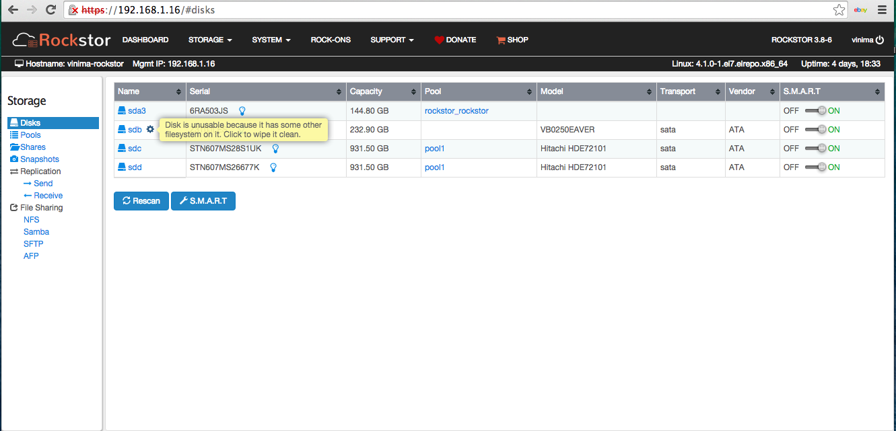
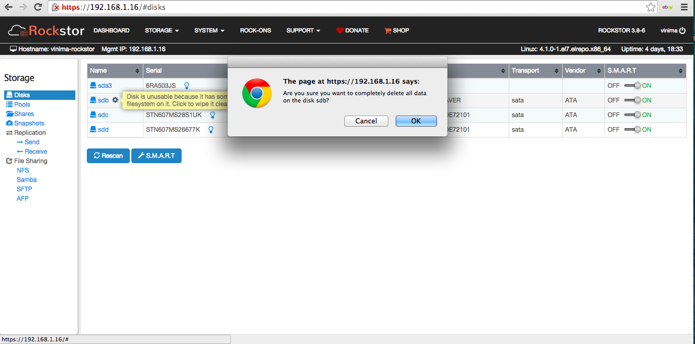

..  _disks:

Disks
=====

Disks can be Hard Disk Drives(HDDs), Solid State Drives(SSDs), USB drives,
virtual disks from the hypervisor etc.. depending on your setup. Rockstor
supports whole disks, but not partitions.

Disk related operations such as S.M.A.R.T monitoring, data importing etc.. can
be managed from the **Disks** screen listed under the **Storage** tab of the
Web-UI. At a first glance, an overview of disks **currently or previously
known** to the system are displayed.

*Table links from left to right:-*

* **Drive Name** - see that drive's **SMART data** / status
* **Bulb Icon** - to flash the drive's activity light ie to **identify its location**
* **Pool Name** - that pool's specific **details** page
* **S.M.A.R.T** - enable or disable for each device

*Buttons:-*

* **Rescan** - the hardware for any supported drives, see :ref:`scandisks` below
* **S.M.A.R.T** - system wide **custom configuration** (advanced)

.. image:: images/disks_overview.png
   :scale: 80%
   :align: center

The disks table can be sorted by individual columns by clicking the small
up/down arrows displayed in each column header.

With a large numbers of disks the table will be paginated and the current page
number will be displayed below the table along with **Prev** and **Next**
buttons.

..  _scandisks:

Scan for new disks
------------------

Clicking the **Rescan** button starts a scan for any new disks added to the
system since the last scan. This is particularly useful if a drive has been
added to the system since Rockstor was power-on ie *hot plugged*.

..  _btrfsdisk:

Existing whole disk BTRFS
-------------------------

If after scanning or after a Rockstor reinstall the system finds an
**existing whole disk BTRFS filesystem** a small **down arrow icon** next to
the drive name will indicate this. This down arrow can be used to import the
discovered btrfs filesystem. In this situation there are two
options:

* **import** the exiting **whole disk btrfs** filesystem - see :ref:`reinstall_import_data` in our :ref:`reinstall` HowTo

*or*

* **wipe the disk** and re-use as if new - see :ref:`wipedisk` below

..  _partitioneddisks:

Partitioned disks
-----------------

Rockstor works only with whole disk drives that do not contain a partition table.
If a disk has a partition table, it is suspected to have data and
Rockstor doesn't allow it's usage until the partition table is explicitly
wiped. Such disks are displayed with a little **gear icon** next to their
name. Relevant help text is displayed upon mousing over this icon indicating
the above restriction. See the next section :ref:`wipedisk` for the procedure.

..  _wipedisk:

Wiping a Partitioned Disk
-------------------------

Before a partitioned or previously used disk can be deployed it's partition
table or existing whole disk filesystem needs to be wiped, as
indicated by the help text above. Click on the **gear icon** and a popup confirmation
dialog will be displayed. Upon confirmation, the entire disk will be wiped and
ready for use as shown below.

**Please note that whole disk btrfs filesystems can also be imported, see:**
:ref:`btrfsdisk`

Broken or removed disks
-----------------------

Rockstor detects when a disk drive goes offline (damaged or removed from the
system) and marks it as such. This is indicated by a **little trash icon** next
to the disk name and relevant help text is displayed upon mousing over this icon.

.. image:: images/disk_offline.png
   :scale: 65 %
   :align: center

In order to remove the disk from Rockstor click on the trash icon and a popup
confirmation dialog is displayed. Upon confirmation, the disk will be removed
as shown below.

.. image:: images/disk_remove.png
   :scale: 65 %
   :align: center
