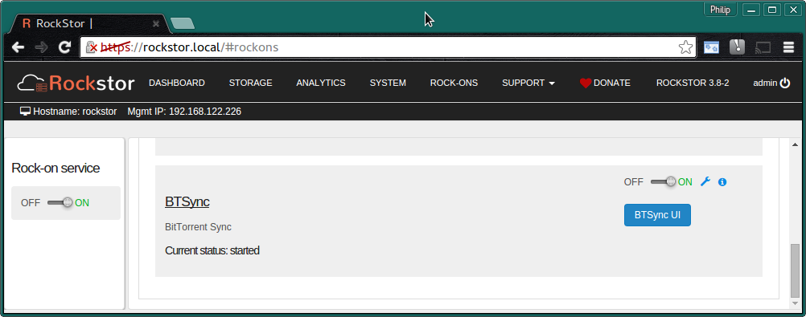

.. _btsync_rockon:

BTSync Rock-on
==============

Please be aware of the common prerequisites for all Rockstor :ref:`rockons_intro`;
specifically the :ref:`rockons_preinstall` and :ref:`rockons_root`
requirement.

What is BTSync
--------------

`BitTorrent Sync <https://www.getsync.com/>`_ is a
`cross platform <https://www.getsync.com/platforms/desktop>`_ closed source
peer-to-peer file synchronization system known for it's advanced
`feature <https://www.getsync.com/features>`_ set.  Please note however that
the full feature set has recently been
`reserved <http://blog.getsync.com/2015/03/03/sync-2-0-skip-the-cloud-share-direct/>`_
for paid subscription members; the paid and free versions
`differ <http://help.getsync.com/customer/portal/articles/1901266-sync-free-vs-sync-pro>`_
significantly. Note the 10 folder limit for the free version.

BTSync's synchronization mechanism works by evaluating files in 4 MB
*chunks*; transferring only the *changed chunks* of files between clients.  If
files are less than 4 MB in size and have changed then they are transferred
to all participating clients in their entirety.
The web based :ref:`btsync_ui` making it a good fit with Rockstor.

.. _btsync_doc:

BTSync Documentation
--------------------

The BitTorrent Sync `Help Center <http://help.getsync.com/>`_ is the best place to start and their
`Sync 2.0 Overview <http://help.getsync.com/customer/portal/articles/1902649-sync-2-0-overview>`_
is a good introduction to the technology.
Please note the `supported platforms <http://help.getsync.com/customer/portal/articles/1909016-supported-platforms?b_id=3895>`_
and their `FAQ <http://help.getsync.com/customer/portal/articles/1916920-faqs>`_.

.. _btsync_install:

Installing BTSync Rock-on
-------------------------
First please consider the pre-requisites for any Rockstor Rock-on; these
are linked to at the :ref:`top <btsync_rockon>` of this document. Note also
that the BTSync Rock-on will require a Share to sync/store it's
associated folders. Note that this is in addition to the :ref:`rockons_root`
that may well already have been made.

Click the **Install** button next to the BitTorrent Sync listing on the Rock-ons page.

.. _btsync_share:

BTSync Share
^^^^^^^^^^^^

Next we select the **Storage area** for the BitTorrent Sync files.  Here we are
using the **recommended Share name**.

* **btsync-data** - room enough for your data and snapshots.

.. image:: btsync_share.png
   :scale: 80%
   :align: center

N.B. to create this storage area please see our :ref:`createshare`.

.. _btsync_port:

BTSync Ports
^^^^^^^^^^^^

These are the **Default Ports** and it is unlikely you will have to alter them.

.. image:: btsync_ports.png
   :scale: 80%
   :align: center

Now to verity the configuration.

Check that the entered details are correct before clicking **Submit**.

Closing the resulting simple *Installation is in progress* dialog and we have:-

**The BitTorrent Sync Rock-on is ON**

N.B. Notice the **BTSync UI** button and the **spanner** to view the
Rock-on settings and add additional Rockstor Shares.

.. _btsync_addshares:

Adding Shares to BTSync
-----------------------

This facility is only required if you wish to have the BTSync Rock-on access
more than one Rockstor Share.

From the information dialog **i icon** on the BTSync Rock-on listing we get:-

Reproduced here for clarity:-

***Additional information about BTSync Rock-on***::

   Authentication

   Default username for your BTSync UI is **admin** and password is **password**

   Storage

   You can also assign additional Shares for custom organization of your data.

First BTSync UI visit
---------------------

The first time you access the **BTSync UI** the following series of screens
will appear:-

BTSync PP, Terms, EULA
^^^^^^^^^^^^^^^^^^^^^^

This is an opt in to BTSync's
`Privacy Policy <http://getsync.com/legal/privacy>`_,
`Terms <http://getsync.com/legal/terms-of-use>`_, and
`EULA <http://getsync.com/legal/eula>`_.
It is required that you agree to these conditions prior to using the Application.

.. image:: btsync_welcome.png
   :scale: 80%
   :align: center

30 day free Pro Trial
^^^^^^^^^^^^^^^^^^^^^

An initial free trial of the Pro version for 30 days. Remember the 10 folder
limit on the free version.

Link Devices
^^^^^^^^^^^^

In this example "This is my first Sync 2.0 device" was selected.

Create Identity
^^^^^^^^^^^^^^^
A name by which you will know this device.

Note the **"Please choose carefully as this cannot be changed later"**.

.. _btsync_ui:

BTSync UI
---------

We now have the **Default BTSync UI**.

.. image:: btsync_ui.png
   :scale: 80%
   :align: center

You can now sync other BTSync sources with this Rockstor BTSync Rock-on Share; see :ref:`btsync_doc`.

**Remember that the /data folder inside BTSync corresponds to your Rockstor Share**