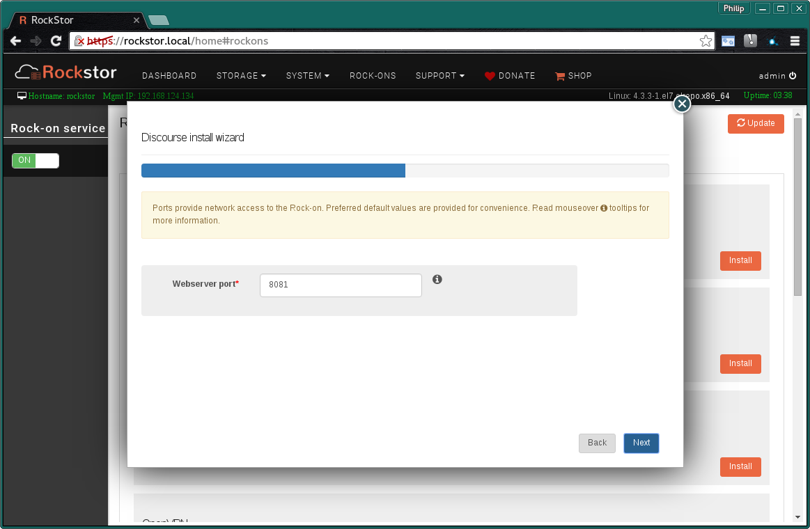
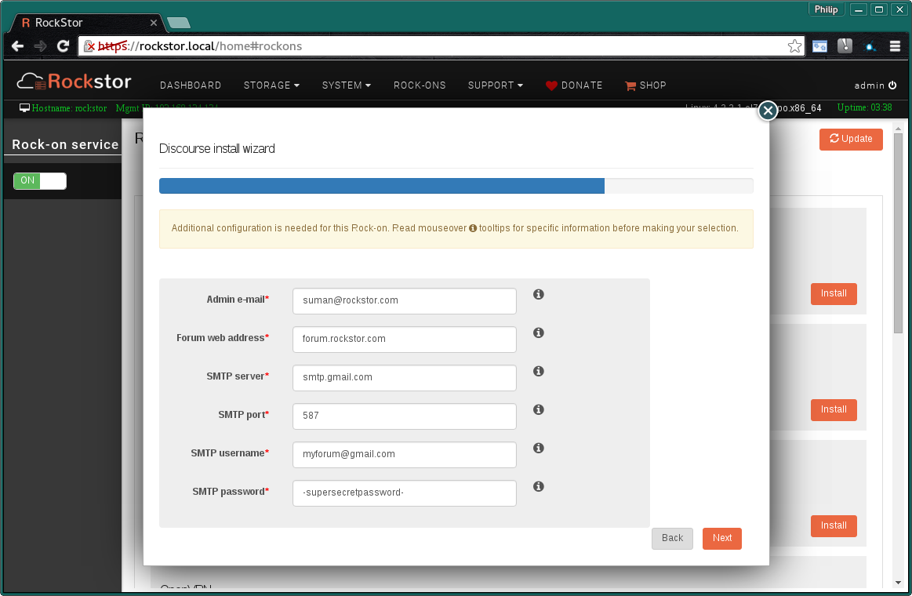
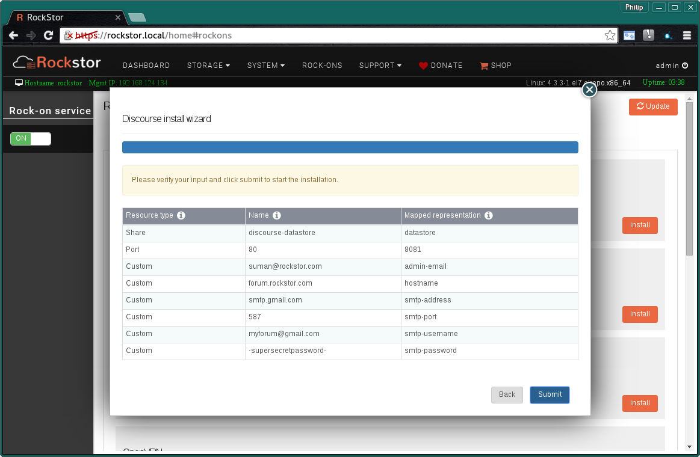
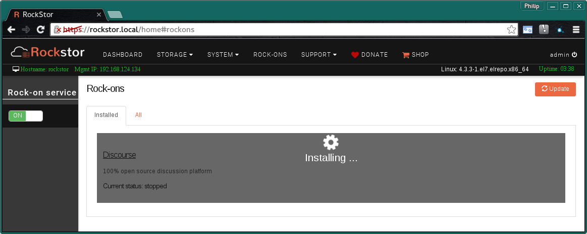
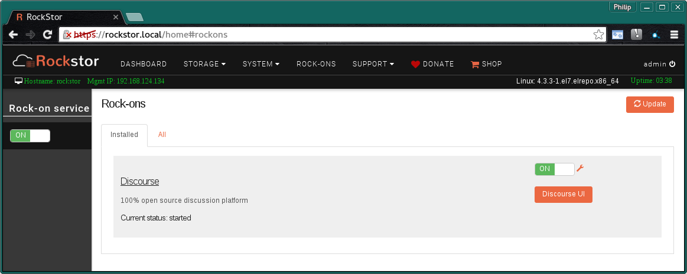

.. _discourse_rockon:

Discourse Rock-on
=================

Please be aware of the common prerequisites for all Rockstor :ref:`rockons_intro`;
specifically the :ref:`rockons_preinstall` and :ref:`rockons_root`
requirement.

Our `Discourse Rock-on forum <http://forum.rockstor.com/t/discourse-rock-on/941>`_ area.

.. _discourse_whatis:

What is Discourse
-----------------

Discourse is open source forum / discussion server software and is what the
`Rockstor forum <http://forum.rockstor.com/>`_ itself uses; in fact Rockstor's
forum is in fact hosted as a Rock-on on a Rockstor system. It is available in
`17 languages and counting <https://www.transifex.com/discourse/discourse-org/>`_
and supports such features as `single sign on <https://meta.discourse.org/t/official-single-sign-on-for-discourse/13045>`_
and real time notifications. The source code for Discourse if available on
`the Discourse GitHub Page <https://github.com/discourse/discourse>`_. Visit
the Discourse `online sandbox <http://try.discourse.org/>`_ for a demonstration.

.. _discourse_doc:

Discourse Documentation
-----------------------

Discourse's `About Page <https://www.discourse.org/about/>`_ is a good place to
start along with their `FAQ <https://www.discourse.org/faq/>`_ and their
`Blog <https://blog.discourse.org/>`_.

.. _discourse_install:

Installing Discourse Rock-on
----------------------------

First please consider the pre-requisites for any Rockstor Rock-on; these
are linked to at the :ref:`top <discourse_rockon>` of this document. Note also
that the Discourse Rock-on will require a Share to store it's forum data.
Note that this is in addition to the
:ref:`rockons_root` that may well already have been made.

.. image:: discourse_install.png
   :scale: 80%
   :align: center

Click the **Install** button next to the Discourse listing on the Rock-ons page.

.. _discourse_share:

Discourse Share
^^^^^^^^^^^^^^^

Next we select the **Discourse datastore**.  Here we are using the
**recommended Share name**.

* **discourse-datastore** - room enough for your entire forum storage needs.

.. image:: discourse_share.png
   :scale: 80%
   :align: center

N.B. to create this storage area please see our :ref:`createshare`.

.. _discourse_port:

Discourse Ports
^^^^^^^^^^^^^^^

This is the **Default Port** and it is unlikely you will have to alter it. The
port shown on your particular install may not be the same as in the following
image. Also note that you may have to forward this port on your network's
firewall to the Rockstor system to have internet access to Discourse.

.. _discourse_mail:

Discourse Mail credentials
^^^^^^^^^^^^^^^^^^^^^^^^^^

Discourse now requires the following email details / credentials:-

* **Admin e-mail** - email of the forum admin eg suman@rockstor.com
* **Forum web address** - FQDN eg forum.rockstor.com
* **SMTP server** - eg smtp.gmail.com
* **SMTP port** - eg 587
* **SMTP username** - eg myforum@gmail.com
* **SMTP password** - the password for the above use on the given email server

**Submit** button when done.

Note that the details given are examples only, make sure that the the displayed
details are accurate before finally confirming them in the following screen.

Check that the entered details are correct before clicking **Submit**.

Closing the resulting simple *Installation is in progress* dialog and we have:-

and a few minutes later depending on internet and machine speed:-

**The Discourse Rock-on is ON**

N.B. Notice the **Discourse UI** button and the **spanner** icon to adjust the
Rock-on settings.

.. _discourse_ui:

Discourse UI
------------

The **Default Discourse UI** accessed via the **Discourse UI** button on the
Rock-ons page:-

.. image:: discourse_ui.png
   :scale: 80%
   :align: center

You can now configure and discuss in your very own Discourse Rock-on;
:ref:`discourse_doc`.
