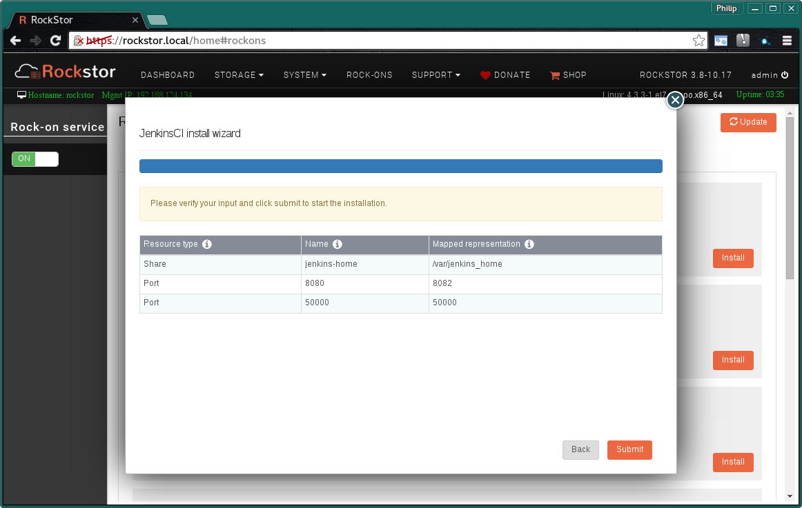
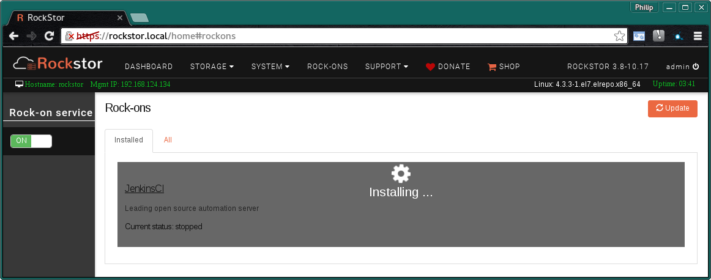

.. _jenkins_rockon:

Jenkins Rock-on
=================

Please be aware of the common prerequisites for all Rockstor :ref:`rockons_intro`;
specifically the :ref:`rockons_preinstall` and :ref:`rockons_root`
requirement.

Our `Jenkins Rock-on forum <https://forum.rockstor.com/t/jenkins-rock-on/947>`_
area.

.. _jenkins_whatis:

What is Jenkins
-----------------

`Jenkins, <https://www.jenkins.io/>`_ previously known as *Hudson*, is an
`MIT Licenced <https://github.com/jenkinsci/jenkins/blob/master/LICENSE.txt>`_
open source automated testing and deployment system, ie a continuous integration
and continuous delivery system. The idea is that such a system can be used
to automate repetitive tasks such as those associated with testing and
deployment. This reduces the possibility of human error and is aimed at
increasing productivity and shortening the time to deploy fixes to production.
Famous organisations that use Jenkin are; Dell, NASA, Netflix, and GitHub. A
`more extensive list
<https://wiki.jenkins.io/pages/viewpage.action?pageId=58001258>`_
is available from the Jenkins documentation linked below.

.. _jenkins_doc:

Jenkins Documentation
-----------------------

The `Jenkins documentation <https://www.jenkins.io/>`_ page is a good place to
start. There you will find a quick 'What is' a list of features, introductory
articles, how to take a test drive via their Java Web Start facility, install
instructions, and the aforementioned list of organisations benefiting from
Jenkins. See also the `Jenkins Blog <https://www.jenkins.io/node/>`_ page.

.. _jenkins_install:

Installing Jenkins Rock-on
----------------------------

First please consider the pre-requisites for any Rockstor Rock-on; these
are linked to at the :ref:`top <jenkins_rockon>` of this document. Note also
that the Jenkins Rock-on will require a Share to use as it's working directory.
Note that this is in addition to the
:ref:`rockons_root` that may well already have been made.

.. image:: jenkins_install.png
   :scale: 80%
   :align: center

Click the **Install** button next to the Jenkins listing on the Rock-ons page.

.. _jenkins_share:

Jenkins Share
^^^^^^^^^^^^^

Next we select the **Jenkins Home**. Here we are using the obviously named
**jenkins-home** share setup for this purpose. Note that this share **should not
be owned by root** as the Jenkins server, once installed, will run as the owner
of the share configured here.

* **Jenkins Home** - share owned by a custom non-admin non-root user ie jenkins.

.. image:: jenkins_share.png
   :scale: 80%
   :align: center

N.B. to create this storage area please see our :ref:`createshare`.

The following image illustrates an example *Access Control* setting for the
*jenkins-home* share.

.. image:: jenkins_share_owner.png
   :scale: 80%
   :align: center

Note that the jenkins user does not exist by default but can be created easily
by following the :ref:`users` part of our documentation.

.. _jenkins_ports:

Jenkins Ports
^^^^^^^^^^^^^

These are the **Default Ports** and it is unlikely you will have to alter them.
The ports shown on your particular install, especially the *Server port* may
not be the same as in the following image. This depends on what other Rock-ons
have already been installed. Also note that you may have to forward the *Server
port* on your network's firewall to the Rockstor system to have internet access
to Jenkins's UI.

* **Agent port** - the port Jenkins agents use to communicate with the server.
* **Server port** - the Web UI port of the Jenkins server.

.. image:: jenkins_ports.png
   :scale: 80%
   :align: center

**Next** button.

The next screen to appear is a summary of the details entered so far.

Check that the entered details are correct before clicking **Submit**.

Closing the resulting simple *Installation is in progress* dialog and we have:-

and a few minutes later depending on internet and machine speed:-

**The Jenkins Rock-on is ON**

.. image:: jenkins_on.png
   :scale: 80%
   :align: center

N.B. Notice the **JenkinsCI UI** button and the **spanner** icon to adjust the
Rock-on settings.

.. _jenkins_ui:

Jenkins UI
----------

The **Default Jenkins UI** accessed via the **JenkinsCI UI** button on the
Rock-ons page:-

.. image:: jenkins_ui.png
   :scale: 80%
   :align: center

You can now juggle your Jenkins jobs for your continuous integration in your
very own Jenkins server Rock-on; :ref:`jenkins_doc`.
