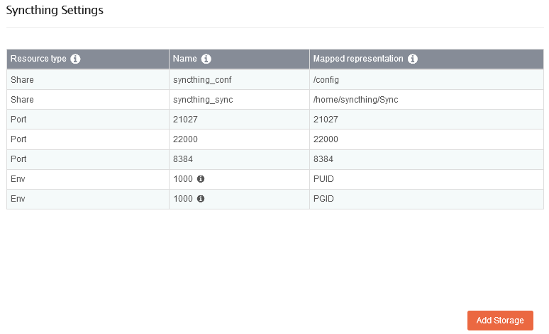
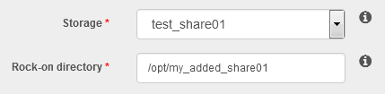
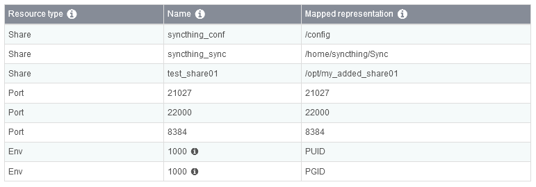
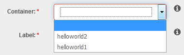
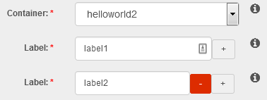

.. _rockons_intro:

Rock-ons (Docker Plugins)
=========================

**Rock-ons** are Rockstor's name for it's use of `docker
<https://www.docker.com/>`_ containers to provide a **Plugin System** to easily
expand the functions of a base Rockstor install. This feature is relatively new
to Rockstor but is proving to be quite popular and is under active development.

Each Rock-on aims to provide a single additional service and the list of
:ref:`rockons_available` is expanding all the time.

.. _rockons_preinstall:

Initial Rock-ons Setup
----------------------

As Rock-ons / docker containers are like mini linux installs they require
somewhere to live.  In Rockstor it is recommend that you setup a Share
specifically for this purpose.

Note that all Rock-ons will then be installed into this shared area but each will
remain independent and during the setup of each Rock-on you are given the option to
store their respective configuration and data in other shares.  This is
good practice as it keeps your Rock-on config and data apart from the
Rock-ons themselves.  You do not have to separate the config and data within each
Rock-on but that is also good practice, and is why this option is offered.

It is assumed you have already setup your :ref:`pools` and one or more
shares in those pools (see our :ref:`createshare`) appropriate for your Rock-ons,
ie a plex-movies share and a plex-config share.

But we also need to create the :ref:`rockons_root` share.

.. _rockons_root:

The Rock-ons root
^^^^^^^^^^^^^^^^^
All Rock-ons require the **Rock-on service** to be enabled and prior to enabling
this service it must be configured.  This is a simple matter of configuring a
sufficiently large share for the rock-ons to be installed into.  It is possible
to use the existing 'out of the box' home share but this is not recommended.

The following shows a **Recommended Minimum 5 GB rock-ons-root** share backed by
a previously created pool named **rock-pool**.

.. image:: rockons_root_share.png
   :scale: 80%
   :align: center

Note that during the lifetime of Rock-ons several snapshots will be created so
plan to be able to expand this share if need be.

Then click on the **spanner** next to the **Rock-on service** on the **System** page.

.. image:: small_services.png
   :scale: 100%
   :align: center

Now to **select** the share to use for your **Rock-ons root**.

.. image:: rockons_root_config.png
   :scale: 100%
   :align: center

**Select** the **rock-on-root** share that we created earlier and **Submit**

You can now **enable** the **Rock-on service** and proceed to the Rock-ons page.

.. image:: rockons_page.png
   :scale: 80%
   :align: center

If no Rock-ons are showing on the **All** tab then click the **Update** button
to refresh the list of available Rock-ons. To install a listed Rock-on use
its **Install** button on the Rock-ons WebUI page.

.. _adding_rockons:

Adding your own Rock-on
-----------------------

The `rockon-registry <https://github.com/rockstor/rockon-registry>`_ contains
the current list of freely available rock-on definition files and servers
as the repository for :ref:`rockons_available`. Please consider contributing,
or asking your favourite project to contribute, a rock-on via a GitHub pull request
to this repository (see :ref:`contributerockons` for more information). Note
that it is also possible to add to the available Rock-ons by placing a suitably 
configured and named json file in the */opt/rockstor/rockons-metastore* directory 
of your Rockstor install. For full instructions and examples please see the 
rockon-registry `README.md <https://github.com/rockstor/rockon-registry/blob/master/README.md>`_.
Some projects prefer to host their own Rock-on plugins and this feature enables
the use of other projects official Rock-ons. An example of a project that takes
advantage of this feature is `Emby <https://emby.media>`_ with their official
`Rock-on <https://github.com/MediaBrowser/Emby.Build/blob/master/rockstor-plugins/embyserver.json>`_
definition file for the Emby server component. However this same Emby Rock-on
has now been added to the official Rockstor Rock-on registry.

.. _rockons_available:

Rock-ons available by default
-----------------------------

As this list is continually growing the best place to view the currently
included by default Rock-ons is at the
`rockon-registry <https://github.com/rockstor/rockon-registry>`_ or on the
Rock-ons page *All* tab within the Rockstor WebUI directly after pressing the
**Update** button.

.. _rockons_without_writeups:

Rock-ons without write-ups
^^^^^^^^^^^^^^^^^^^^^^^^^^

Although the following Rock-ons are currently without specific install
instructions they are like all Rock-on installs, fairly self explanatory.

* `Bitcoin <https://bitcoin.com/>`_: Bitcoin full node
* `Bitwarden <https://github.com/dani-garcia/bitwarden_rs>`_: Unofficial server written in Rust for the password manager Bitwarden
* `Booksonic <https://booksonic.org>`_: Audiobooks streaming server
* `Cardigann <https://github.com/cardigann/cardigann>`_: A proxy server for adding new indexers to Sonarr and other media managers
* `Collabora online <https://www.collaboraoffice.com/code/>`_: LibreOffice-based online office suite
* `COPS <https://blog.slucas.fr/projects/calibre-opds-php-server/>`_: links to your Calibre library database and provides automation features
* `CouchPotato <https://couchpota.to/>`_: Downloader for usenet and bittorrent users
* `Crashplan <https://www.crashplan.com/en-us/>`_: Automatic cloud-based backups
* `Deluge <http://deluge-torrent.org/>`_: Deluge is a movie downloader for bittorrent users
* `Dropbox <https://dropbox.com>`_: Cloud-based file syncing solution
* `Duck DNS <https://www.duckdns.org>`_: Free dynamic DNS service
* `Duplicati 2.0 <https://www.duplicati.com>`_: Free backup software to store encrypted backups online
* `ecoDMS <https://www.ecodms.de/index.php/en/>`_: Electronic Document Managing System
* `Emby server <https://emby.media/>`_: Emby media server
* `Ghost <https://ghost.org/>`_: A publishing platform for professional bloggers
* `GitLab CE <https://about.gitlab.com/>`_: Git repository hosting and collaboration
* `Gogs <https://gogs.io/>`_: Go Git Service, a lightweight Git version control server and front end
* `Gollum <https://github.com/gollum/gollum>`_: Gollum is a simple wiki system built on top of Git
* `Haproxy <https://github.com/daniel-illi/docker-haproxy-letsencrypt/tree/rock-on>`_: Reliable, High Performance TCP/HTTP Load Balancer with letsencrypt integration
* `Headphones <https://github.com/rembo10/headphones>`_: Automated music downloader for NZB and Torrent
* `Home Assistant <https://home-assistant.io/>`_: Open-source home automation platform
* `HTTP to HTTPS redirect <https://github.com/geldim/docker-https-redirect>`_: Access the Rockstor web UI without having to remember to type "https:"
* `Jackett <https://github.com/Jackett/Jackett>`_: Proxy server for queries from apps such as Sonarr, CouchPotato, and Mylar
* `JDownloader 2 <http://jdownloader.org/>`_: Free, open-source download management tool
* `Koel <https://koel.phanan.net/>`_: Simple web-based personal audio streaming service
* `Lazy Librarian <https://lazylibrarian.gitlab.io>`_: Automated ebook downloader for NZB and Torrent
* `Logitech Squeezebox <http://mysqueezebox.com/index/Home>`_: Server for Squeezebox Devices
* `MariaDB <https://mariadb.org/>`_: MariaDB, relational database management system
* `Medusa <https://pymedusa.com>`_: Automatic video library manager for TV shows
* `Minecraft <https://www.minecraft.net/en-us/>`_: Minecraft server
* `Muximux <https://github.com/mescon/Muximux>`_: Lightweight portal to view & manage your HTPC apps
* `Mylar <https://github.com/evilhero/mylar>`_: Automated Comic Book (cbr/cbz) downloader
* `Netdata <https://www.netdata.cloud>`_: Real-time performance and health monitoring solution
* `Nextcloud <https://www.nextcloud.com/>`_: Next generation open source enterprise file sync and share
* `NZBGet <http://nzbget.net/>`_: The most efficient usenet downloader
* `NZBHydra <https://github.com/theotherp/nzbhydra>`_: Meta search for NZB indexers
* `Ombi <https://ombi.io/>`_: Host your own Plex Request and user management system
* `OwnCloud-Official <https://owncloud.org/>`_: Secure file sharing and hosting
* `Pi-hole <https://pi-hole.net/>`_: A black hole for Internet advertisements
* `Plexpy <https://github.com/JonnyWong16/plexpy>`_: Python-based Plex usage tracker
* `PocketMine <https://www.pocketmine.net/>`_: Server software for Minecraft: Pocket Edition
* `Radarr <https://github.com/Radarr/Radarr>`_: Radarr is a PVR for Movies on Usenet and Torrents
* `Resilio Synch <https://www.resilio.com/>`_: Fast, private file sharing for teams and individuals
* `Rocket.Chat <https://rocket.chat/>`_: Open Source Chat Platform
* `SaBnzbd <http://sabnzbd.org/>`_: The best usenet downloader
* `Seafile <https://www.seafile.com/>`_: Secure file sharing and hosting
* `Sickbeard <http://sickbeard.com/>`_: Internet PVR for your TV shows, by Linuxserver.io
* `SmokePing <https://oss.oetiker.ch/smokeping/>`_: Network latency history monitor
* `Sonarr <https://sonarr.tv/>`_: (formerly NZBdrone) A PVR for usenet and bittorrent users
* `Subsonic <http://www.subsonic.org>`_: Music server
* `Teamspeak <https://teamspeak.com/en/>`_: VoIP software
* `TFTP server <https://github.com/jumanjihouse/docker-tftp-hpa>`_: TFTP server
* `Transmission with OpenVPN <https://haugene.github.io/docker-transmission-openvpn/>`_: Transmission torrent client with webUI while connecting to OpenVPN
* `Ubuiquiti Unifi by Linuxserver.io <https://unifi-network.ui.com/>`_: Unifi Access Point controller, provided by Linuxserver.io
* `Unifi Controller <https://unifi-network.ui.com/>`_: Unifi Access Point controller
* `uTorrent <https://www.github.com/domibarton/docker-utorrent>`_: BitTorrent client
* `Watchtower <https://github.com/containrrr/watchtower>`_: A process for automating Docker container base image updates
* `Xeoma <http://felenasoft.com/xeoma/>`_: Video surveillance
* `Zabbix-XXL <https://github.com/monitoringartist/zabbix-xxl>`_: Network and application monitoring
* `ZeroNet <https://zeronet.io>`_: Decentralized websites using Bitcoin crypto and the BitTorrent network

.. _rockons_with_writeups:

Rock-ons with write-ups
^^^^^^^^^^^^^^^^^^^^^^^

Please see the following sections for some specific Rock-on install details.
Note that not all Rock-ons have their own specific instructions in these docs.

.. toctree::
   :maxdepth: 2

   discourse
   jenkins
   openvpn-server
   owncloud
   plex-media-server
   syncthing
   transmission-bittorrent
   youtrack
   zoneminder

.. _rockons_advanced_config:

Advanced Configuration
----------------------

While the installation and initial setup of Rock-ons is kept as simple and 
user-friendly as possible, it is possible to further customize their configuration 
post-install. At the time of writing, users can extend their existing Rock-on 
installation with additional storage, or add customized docker container labels. 
Note that this area is under active development to provide further customization.  

.. _rockons_add_storage:

Add Storage
^^^^^^^^^^^^^^^^^
The **Add Storage** feature allows the binding of any Rockstor share to an installed 
Rock-on. As any share can be added as storage to multiple Rock-ons, this represents a 
convenient and easy way to make a set of files accessible to multiple Rock-ons.  

To start, make sure the Rock-on is turned OFF, and click on the little wrench icon next 
to the ON / OFF toggle to display a summary of the Rock-on's settings.

.. image:: addstorage_wrench.png
   :scale: 100%
   :align: center

This summary table displays, all volumes, ports, environment variables, labels, and devices 
used by the Rock-on (if any). After a fresh Rock-on install, all objects set during the 
install are reported here. In our example, the *Syncthing* Rock-on has the Rockstor **shares** 
*syncthing_conf* and *syncthing_sync* mapped to the ``/config`` and ``/home/syncthing/Sync`` 
paths inside the Rock-on, respectively, exposes three different ports to the host, and 
uses two environment variables (*PUID* and *GUID*). 

To **Add Storage** to this Rock-on, click the *Add Storage* button on the bottom right corner. 
Note that this button will only be displayed if the Rock-on supports this feature. In the 
following dialog window, select a previously-created share (see our :ref:`createshare` section), 
and define the path under which it will be seen from within the Rock-on.

In this example, the Rockstor **share** *test_share01* will be added as ``/opt/my_added_share01`` 
from within the Rock-on.  

The next window summarizes the already-existing and new settings to be applied (here: new share). 
If everything is correct, click "Next" and then "Submit" to update the Rock-on settings with 
the newly-added storage. Internally, Rockstor will first uninstall the Rock-on before 
re-installing it with the updated settings summarized in the previous table. 

.. _rockons_add_labels:

Add Labels
^^^^^^^^^^^^^^^^^
The **Add Labels** feature allows to apply customized *docker container labels* 
(`docker documentation <https://docs.docker.com/config/labels-custom-metadata/>`_) to any 
installed Rock-on. To add a new label within an existing Rock-on, make sure the Rock-on is turned 
OFF, and click on the little wrench icon next to the ON / OFF toggle to display a summary of the 
Rock-on's settings (see :ref:`rockons_add_storage` for description of this table).  

To add a label to a given Rock-on, click the **Add Label** button at the bottom of the Rock-on 
settings summary page.

.. image:: addlabels_settings_summary.png
   :scale: 100%
   :align: center

Notably, as labels are applied at the *container* level, the next dialog 
will allow you to select the container to which the label will be applied. Conveniently, Rockstor 
will only list the containers included in the current Rock-on. In the example below, the Rock-on 
includes two containers: *helloworld1* and *helloworld2*.

To apply two different labels to the container *helloworld2*, simply add as many label fields as 
needed, and type your labels.

Click "Next" and verify your new label-to-container mapping(s) before finishing the procedure by 
clicking "Next" and "Submit". Internally, Rockstor will first un-install the Rock-on before 
re-installing it with the newly-defined labels.

