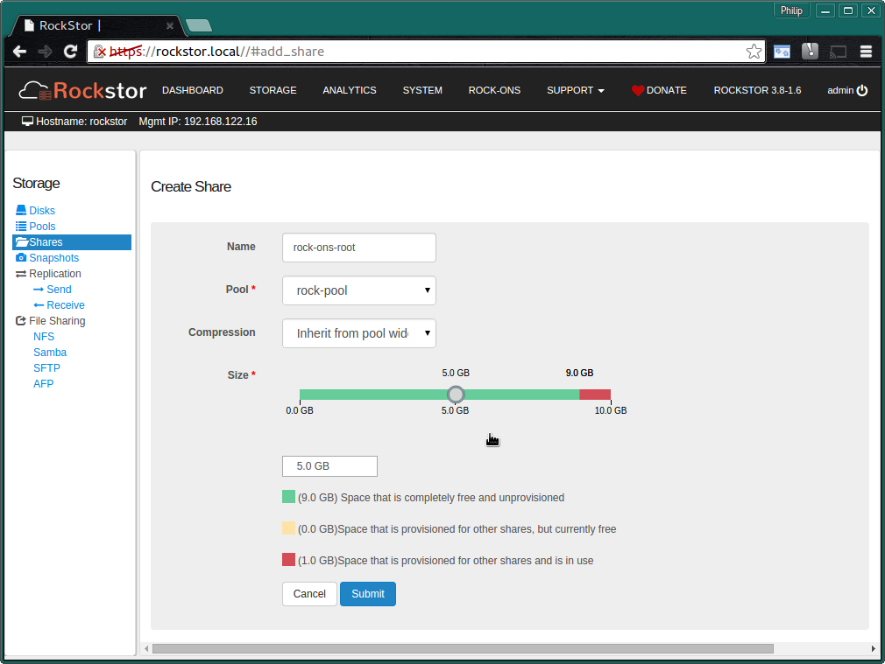
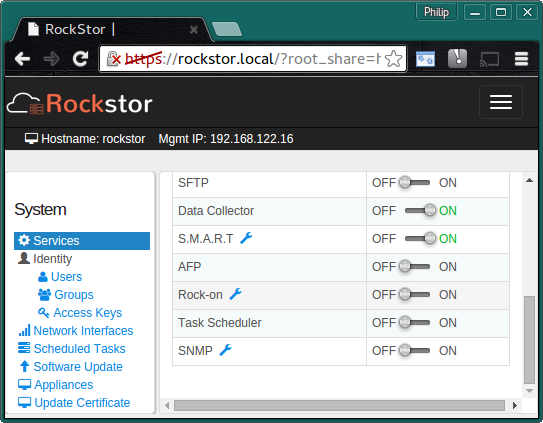
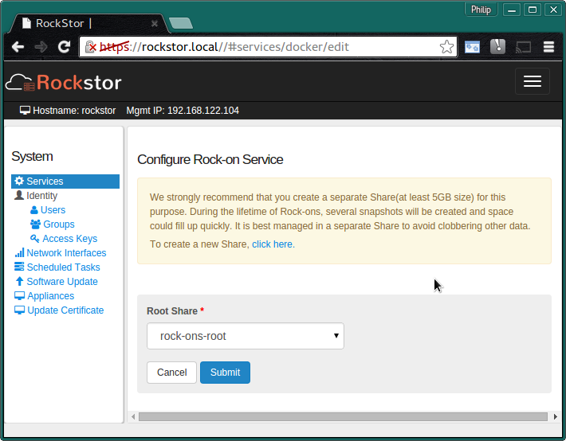
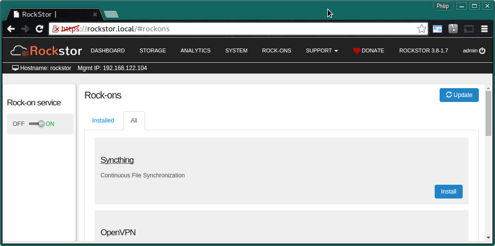

.. _rockons_intro:

Rock-ons (Docker Plugins)
=========================

**Rock-ons** are Rockstor's name for it's use of `docker
<https://www.docker.com/>`_ containers to provide a **Plugin System** to easily
expand the functions of a base Rockstor install. This feature is relatively new
to Rockstor but is proving to be quite popular and is under active development.

Each Rock-on aims to provide a single additional service and the list of
:ref:`rockons_available` is expanding all the time.

.. _rockons_preinstall:

Initial Rock-ons Setup
----------------------

As Rock_ons / docker containers are like mini linux installs they require
somewhere to live.  In Rockstor it is recommend that you setup a Share
specifically for this purpose.

Note that all Rock-ons will then be installed into this shared area but each will
remain independent and during the setup of each Rock-on you are given the option to
store their respective configuration and data in other shares.  This is
good practice as it keeps your Rock-on config and data apart from the
Rock-ons themselves.  You do not have to separate the config and data within each
Rock-on but that is also good practice, and is why this option is offered.

It is assumed you have already setup your :ref:`pools` and one or more
shares in those pools (see our :ref:`createshare`) appropriate for your Rock-ons,
ie a plex-movies share and a plex-config share.

But we also need to create the :ref:`rockons_root` share.

.. _rockons_root:

The Rock-ons root
^^^^^^^^^^^^^^^^^
All Rock-ons require the **Rock-on service** to be enabled and prior to enabling
this service it must be configured.  This is a simple matter of configuring a
sufficiently large share for the rock-ons to be installed into.  It is possible
to use the existing 'out of the box' home share but this is not recommended.

The following shows a **Recommended Minimum 5 GB rock-ons-root** share backed by
a previously created pool named **rock-pool**.

Note that during the lifetime of Rock-ons several snapshots will be created so
plan to be able to expand this share if need be.

Then click on the **spanner** next to the **Rock-on service** on the **System** page.

Now to **select** the share to use for your **Rock-ons root**.

**Select** the **rock-on-root** share that we created earlier and **Submit**

You can now **enable** the **Rock-on service** and proceed to the Rock-ons page.

If no Rock-ons are showing on the **All** tab then click the **Update** button
to refresh the list of available Rock-ons. To install a listed Rock-on use
its **Install** button on the Rock-ons WebUI page.

.. _adding_rockons:

Adding your own Rock-on
-----------------------

The `rockon-registry <https://github.com/rockstor/rockon-registry>`_ contains
the current list of freely available rock-on definition files and servers
as the repository for :ref:`rockons_available`. Please consider donating,
or asking your favourite project to donate, a rock-on via a GitHub pull request
to this repository. Note that it is also possible to add to the available
Rock-ons by placing a suitably configured and named json file in the
*/opt/rockstor/rockons-metastore* directory of your Rockstor install. For full
instructions and examples please see the rockon-registry
`README.md <https://github.com/rockstor/rockon-registry/blob/master/README.md>`_.
Some projects prefer to host their own Rock-on plugins and this feature enables
the use of other projects official Rock-ons. An example of a project that takes
advantage of this feature is `Emby <https://emby.media>`_ with their official
`Rock-on <https://github.com/MediaBrowser/Emby.Build/blob/master/rockstor-plugins/embyserver.json>`_
definition file for the Emby server component. However this same Emby Rock-on
has now been added to the official Rockstor Rock-on registry.

.. _rockons_available:

Rock-ons Available by default
-----------------------------

As this list is continually growing the best place to view the currently
included by default Rock-ons is at the
`rockon-registry <https://github.com/rockstor/rockon-registry>`_ or on the
Rock-ons page *All* tab within the Rockstor WebUI directly after pressing the
**Update** button.

.. _rockons_without_writeups:

Rock-ons without write-ups
^^^^^^^^^^^^^^^^^^^^^^^^^^

Although the following Rock-ons are currently without specific install
instructions they are like all Rock-on installs, fairly self explanatory.

* `CouchPotato <https://hub.docker.com/r/linuxserver/couchpotato/>`_ Downloader for usenet and bittorrent users
* `Deluge <https://hub.docker.com/r/linuxserver/deluge/>`_ Deluge is a movie downloader for bittorrent users
* `EmbyServer <https://emby.media/>`_ Emby media server
* `Ghost <https://ghost.org/>`_ A publishing platform for professional bloggers
* `GitLab CE <https://about.gitlab.com/>`_ Git repository hosting and collaboration
* `Gogs <https://gogs.io/>`_ Go Git Service, a lightweight Git version control server and front end
* `Headphones <https://hub.docker.com/r/linuxserver/headphones/>`_ Headphones is an automated music downloader for NZB and Torrent
* `Logitech Squeezebox <http://mysqueezebox.com/index/Home>`_ Server for Squeezebox Devices
* `MariaDB <https://hub.docker.com/r/linuxserver/mariadb/>`_ MariaDB, relational database management system
* `NZBGet <http://nzbget.net/>`_ The most efficient usenet downloader
* `OwnCloud-Official <https://owncloud.org/>`_ Secure file sharing and hosting
* `Plexpy <https://hub.docker.com/r/linuxserver/plexpy/>`_ Plexpy Is a Python-based Plex Usage tracker
* `Rocket.Chat <https://rocket.chat/>`_ Open Source Chat Platform
* `SaBnzbd <https://hub.docker.com/r/linuxserver/sabnzbd/>`_ The best usenet downloader
* `Sickbeard <https://hub.docker.com/r/linuxserver/sickbeard/>`_ Internet PVR for your TV shows, by Linuxserver.io
* `Sickrage <https://hub.docker.com/r/linuxserver/sickrage/>`_ Automatic Video Library Manager for TV Shows, by Linuxserver.io
* `Sonarr <https://hub.docker.com/r/linuxserver/sonarr/>`_ (formerly NZBdrone) A PVR for usenet and bittorrent users
* `Symform <http://www.symform.com/>`_ Symform backup service

.. _rockons_with_writeups:

Rock-ons with write-ups
^^^^^^^^^^^^^^^^^^^^^^^

Please see the following sections for some specific Rock-on install details.
Note that not all Rock-ons have their own specific instructions in these docs.

.. toctree::
   :maxdepth: 2

   bittorrent-sync
   discourse
   jenkins
   openvpn-server
   owncloud
   plex-media-server
   syncthing
   transmission-bittorrent
   zoneminder

