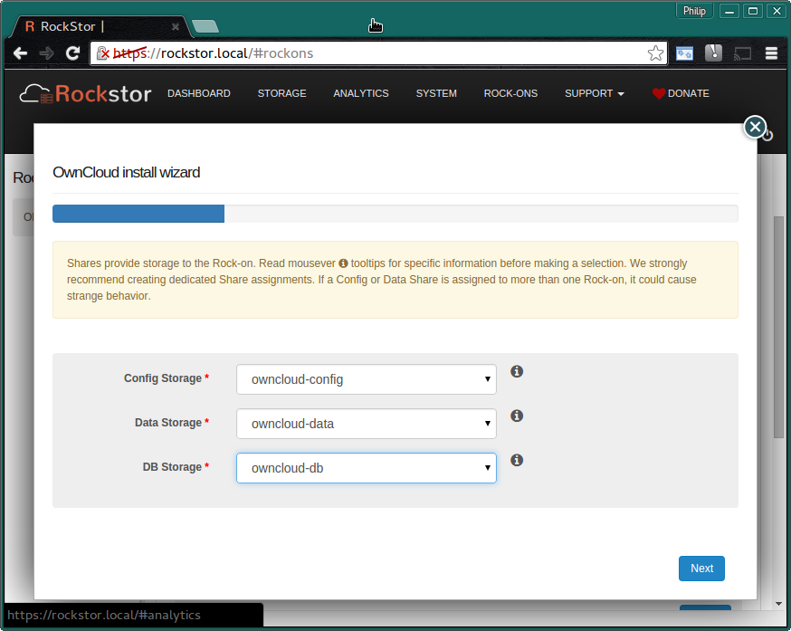
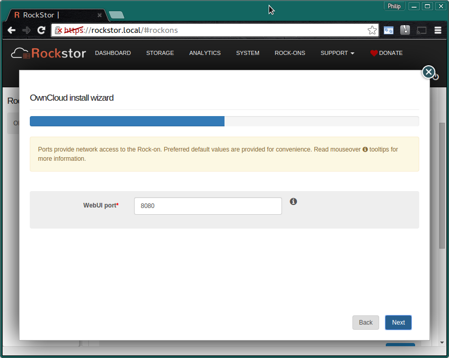
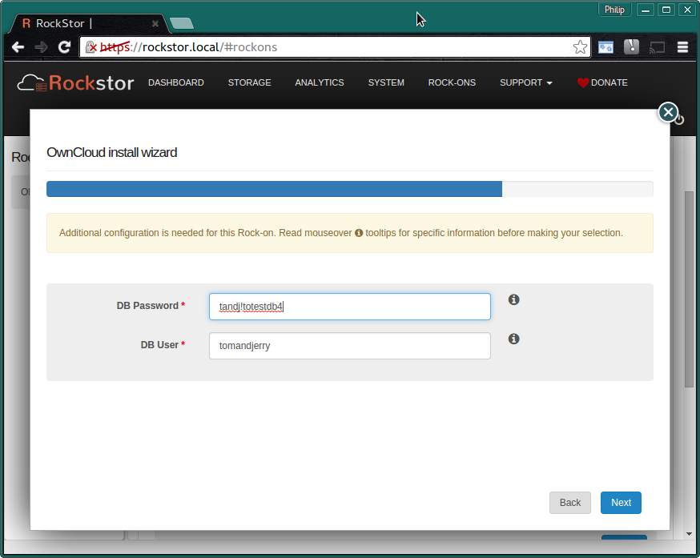
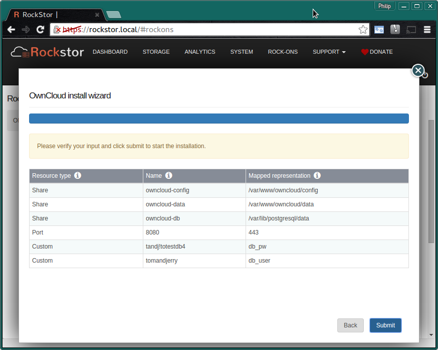
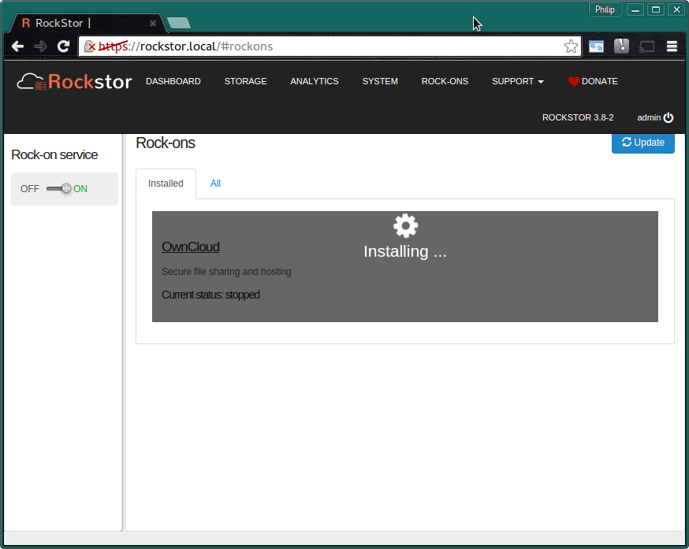
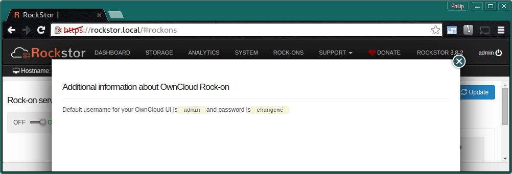
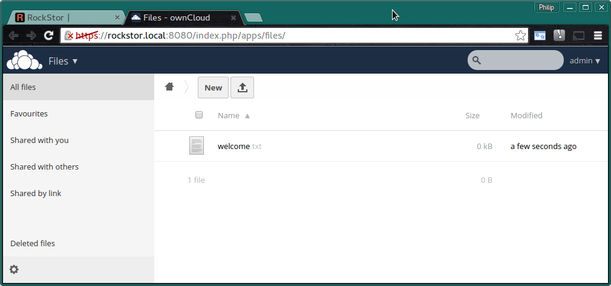

.. _owncloud_rockon:

OwnCloud Rock-on
================

Please be aware of the common prerequisites for all Rockstor :ref:`rockons_intro`;
specifically the :ref:`rockons_preinstall` and :ref:`rockons_root`
requirement.

Our `ownCloud Rock-on forum <http://forum.rockstor.com/t/owncloud-rock-on/182>`_ area.

.. _owncloud_whatis:

What is OwnCloud
----------------

`OwnCloud <https://owncloud.org/>`_ is an Open Source self hosting general cloud services system that is
gaining popularity with those wishing to take greater control of their internet
based services. It's `features <https://owncloud.org/features/>`_ include sync
and share capabilities across devices and users with; files, contacts,
calendars, a news reader, photos management etc.  Is also has a plugins
capability so can be extended via ownCloud *apps*.
An `online demo <https://demo.owncloud.org/>`_ is availalbe.

.. _owncloud_doc:

OwnCloud Documentation
----------------------

OwnCloud's `own documentation page <https://doc.owncloud.org/>`_ is a good
place to start, see also their `Get Started <https://owncloud.org/install/>`_
page and their `FAQ <https://owncloud.org/faq/>`_. Take care to select the
appropriate documentation version appropriate to your install as ownCloud is
rapidly developing. Rockstor 3.8-2 introduced our ownCloud Rock-on which on
release installed version 8.0.4 of ownCloud. Since ownCloud is quite a large
project there is both a
`User Manual <https://doc.owncloud.org/server/8.0/user_manual/>`_
and an
`Administraion Manual <https://doc.owncloud.org/server/8.0/admin_manual/>`_.
These links are for version 8.0.

Installing ownCloud Rock-on
---------------------------
First please consider the pre-requisites for any Rockstor Rockon; these
are linked to at the :ref:`top <owncloud_rockon>` of this document. Note also
that the ownCloud Rock-on will require a Share to share / sync and optionally
(but recommended) another Share on which you store its configurations files.
This makes a total of 3 shares, one for the Rock-on system itself ie
:ref:`rockons_root` that may well already have been made and an additional 1 or 2
shares depending on whether you wish to split your ownCloud config from its data,
this is highly recommended though.

.. image:: owncloud_install.png
   :scale: 80%
   :align: center

Click the **Install** button next to the ownCloud listing on the Rock-ons page.

.. _owncloud_shares:

OwnCloud Shares
^^^^^^^^^^^^^^^

Next we select the **Storage areas** for ownCloud's **data**,
**configuration**, and **data base (DB)**.  Here we are using the
**recommended names**.

* **owncloud-config** - min 1 GB
* **owncloud-data** - room enough for your data and snapshots.
* **owncloud-db** - min 1 GB

If you find that these values are insufficient then please discus this on the
`Rockstor forum <http://forum.rockstor.com/t/owncloud-rock-on/182>`_ so that
this document might be updated and improved.

N.B. to create these Storage areas please see our :ref:`createshare`.

.. _owncloud_ports:

OwnCloud Ports
^^^^^^^^^^^^^^

These are the **Default Ports** and it is unlikely you will have to alter them.

This is the port you will use to access the :ref:`owncloud_ui`.

.. _owncloud_db:

OwnCloud DataBase
^^^^^^^^^^^^^^^^^

We are now required to enter a **password** and **username** that owncloud will
use for it's database administration.

Note the above entries are for illustration purposes only.
Take great care to record this database username and password by your chosen
method.

Now check that the entered details are correct before clicking **Submit**.

Closing the resulting simple *Installation is in progress* dialog and we have:-

and a few minutes later depending on internet and machine speed:-

**The OwnCloud Rock-on is ON**

.. image:: owncloud_on.png
   :scale: 80%
   :align: center

N.B. Notice the **OwnCloud UI** button and the **spanner** to adjust the Rock-on
settings.

Also note that we have an **i icon** and it informs us that:-

Reproduced here for clarity:-

**Additional information about OwnCloud Rock-on**::

   Default username for your OwnCloud UI is admin and password is changeme

.. _owncloud_ui:

OwnCloud UI
-----------

The **Default OwnCloud UI** accessed via the **OwnCloud UI** button on the
Rock-ons page:-

You can now configure your very own ownCloud Rock-on; :ref:`owncloud_doc`

**Remember to change your ownCloud admin user's password.**

**Admin** top right in :ref:`owncloud_ui` and **Users**.
