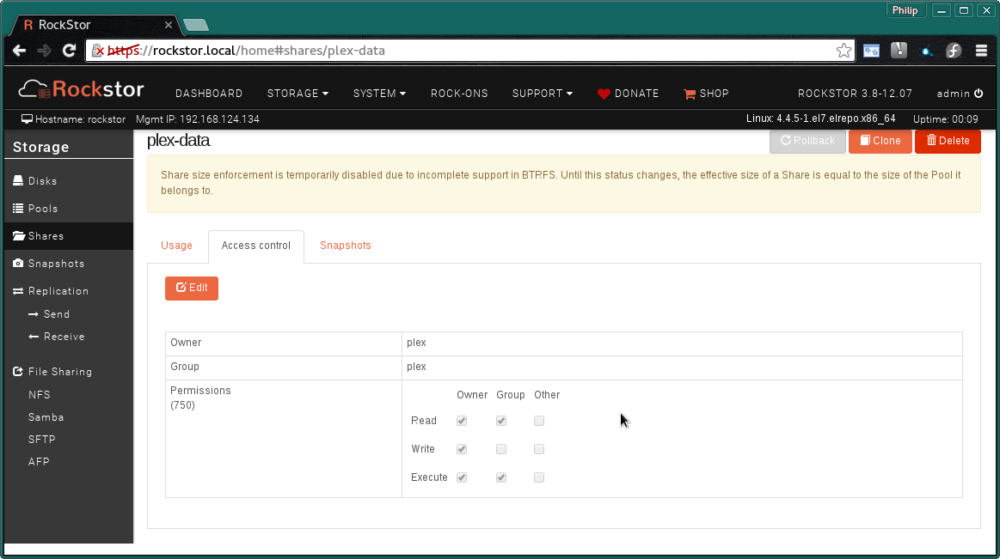
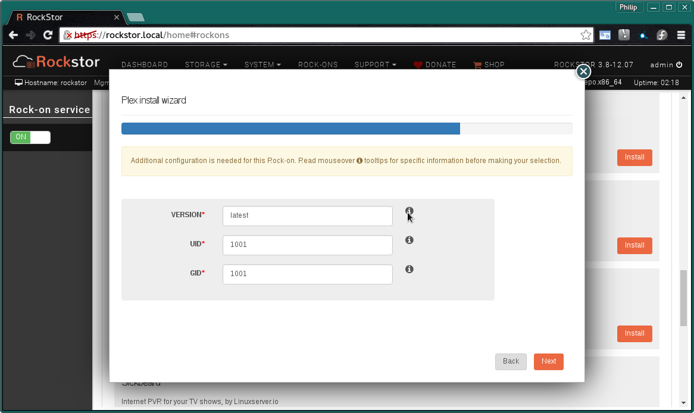

.. _plex_rockon:

Plex Server Rock-on
===================

Please be aware of the common prerequisites for all Rockstor :ref:`rockons_intro`;
specifically the :ref:`rockons_preinstall` and :ref:`rockons_root`
requirement.

Our `Plex Media Server Rock-on forum <http://forum.rockstor.com/t/plex-media-server-rock-on/179>`_ area.

.. _plex_whatis:

What is Plex
------------

`Plex <https://plex.tv/>`_ is a
`centralized <https://support.plex.tv/hc/en-us/articles/200288286-What-is-Plex->`_
domestic media distribution system that acts
both as a `DLNA <https://en.wikipedia.org/wiki/Digital_Living_Network_Alliance>`_
server and as its own more `flexible <https://plex.tv/features>`_ type of
media server and client system.
`Plex client apps <https://plex.tv/downloads>`_ are available on nearly
every platform.  But in order to manage your media with the
Plex system it is first necessary to have a
**Plex Media Server**. This **Rock-on** is **exactly that**; and aims to make the install
and media provisioning of a Plex server as simple as possible.

.. _plex_doc:

Plex Documentation
------------------

Plex's `own documentation <https://support.plex.tv/hc/en-us>`_ is extensive and
well presented and a good kicking off point might well be their `Getting Started
<https://support.plex.tv/hc/en-us/categories/200007268-Getting-Started>`_ guide
that has a thorough
`Step by Step <https://support.plex.tv/hc/en-us/articles/200264746-Quick-Start-Step-by-Step>`_
introductions to the Plex system.  Also note that the Plex Media Server
requires your media to be
`organized <https://support.plex.tv/hc/en-us/categories/200028098-Media-Preparation>`_
in a certain way.

.. _plex_install:

Installing Plex Rock-on
-----------------------
First please consider the pre-requisites for any Rockstor Rock-on; these
are linked to at the :ref:`top <plex_rockon>` of this document. Note also
that the Plex Rock-on will require a Share for your media and optionally
(but recommended) another two more Shares, one to store its configuration files
and one used internally as a temporary working during transcoding.
This makes a total of 4 shares, one for the Rock-on system itself ie
:ref:`rockons_root` that may well already have been made and an additional 1 to
3 shares depending on whether you wish to split your Plex config, data, and
transcoding working area. It is highly recommended that all 3 Plex Rock-on
shares be created as their use and size varies greatly and will help to simplify
upgrades and maintenance in the future; as well as helping to open up further
possibilities for performance tuning, ie ssd for transcoding Share and varying
scrub or de-fragmentation task schedules.

It is also recommended that this Rock-on be run by a dedicated user and that the
above shares be owned by that user. The following :ref:`plex_shares` section
and the later :ref:`plex_uidgidver` section detail the relevant aspects. If you
do not already have a *non-admin non-root* user under which you would like to
run Plex then please first create a **plex** user, see our :ref:`users` section
for instructions.

.. image:: plex_install.png
   :scale: 80%
   :align: center

Click the **Install** button next to the Plex listing on the Rock-ons page.

.. _plex_shares:

Plex Shares
^^^^^^^^^^^

Next we select the **Storage areas** for the Plex Rock-on's **data**,
**configuration**, and **transcode** files. Note that the order of these items
may vary.

Please note that it is best practice to have all these shares owned by a
non-admin non-root user ie *plex*.

* **Config Storage** - minimum 20 GB
* **Data Storage** - room enough for your data and snapshots - minimum 100GB
* **Transcode Storage** - minimum 10 GB

If you find that these values are insufficient then please discus this on the
`Rockstor forum <http://forum.rockstor.com/t/plex-media-server-rock-on/179>`_
so that this document might be updated and improved.

In the following image we are using the **recommended names** for all the
pre-configured shares, the suggested names are provided by the mouse over
*i* icons.

.. image:: plex_shares.png
   :scale: 80%
   :align: center

N.B. to create these Shares or 'Storage areas' please see our
:ref:`createshare`.

The following image illustrates an example *Access Control* setting for the
*plex-data* share; the *plex-config* and *plex-transcode* can be configured
similarly.

Note that the plex user does not exist by default but can be created easily
by following the :ref:`users` part of our documentation.
**Please take a note of the created user's UID and GID** as they will be
required in a later step.

By visiting the **System - Users** page one can see the **UID** and **GID** of
any user.

.. image:: plex_user_info.png
   :scale: 80%
   :align: center

In the above example we see our created **plex** user has UID and GID of 1001,
if you have previously created any other users then your *plex* user may have a
different UID and GID.

.. _plex_port:

Plex Ports
^^^^^^^^^^

These are the **Default Ports** and it is unlikely that you will have to alter
them.

* **DLNA port 1** & **DLNA port 2** - used by DLNA compatible equipment.
* **WebUI port** - This is the port you will use to access the :ref:`plex_ui`.

.. image:: plex_ports.png
   :scale: 80%
   :align: center

In the above we see the default port numbers are automatically entered.

.. _plex_uidgidver:

Plex User, Group, and Version
^^^^^^^^^^^^^^^^^^^^^^^^^^^^^

In this section we select the **UID (User ID)** and the **GID (Group ID)** under
which the Plex server will run. Note that these must be the same as the user who
owns the shares configured in the :ref:`plex_shares` section above. We also get
a chance to stipulate the version of Plex we want to use.

* **VERSION** ie **latest** for latest version or **plexpass** for plexpass use.
* **UID** User ID (number) to run Plex as.
* **GID** Group ID (number) to run Plex as.

Note the order of these options may change.

The next screen is to confirm the details entered so far.

.. image:: plex_verify.png
   :scale: 80%
   :align: center

Now check that the entered details are correct before clicking **Submit**.

Closing the resulting simple *Installation is in progress* dialog and we have:-

.. image:: plex_installing.png
   :scale: 80%
   :align: center

and a few minutes later depending on internet and machine speed:-

**The Plex Media Server Rock-on is ON**

.. image:: plex_on.png
   :scale: 80%
   :align: center

N.B. Notice the **Plex UI** button to visit the installed Plex Web interface
and the **spanner** icon to view the Rock-on settings and add additional
Rockstor Shares.

.. _plex_addshares:

Adding Shares to Plex
---------------------
This facility is only required if you wish to have the Plex Rock-on access more
than one Rockstor Share.  It is not uncommon for all of a Plex Media Server's
data to reside on a single Share.  N.B. the Shares are not the same as the
Libraries within Plex, ie one can have multiple Plex libraries on a single
Rockstor Share. Plex Libraries are configured from within the :ref:`plex_ui`
and represent how the Plex Server organizes and shares your media. An example
of requiring more than one Rockstor Share to be mapped into the Plex Rock-on
is if you have all your Movies in one Share and all you Music in another Share.

From the information dialog **i icon** on the Plex Rock-on listing we get:-

.. image:: plex_info.png
   :scale: 80%
   :align: center

Reproduced here for clarity:-

**Additional information about Plex Rock-on**::

   Adding more media to Plex.

   You can add more Shares (with media) to Plex from the settings wizard of
   this Rock-on. Then, from Plex WebUI, you can update and re-index your library.

The **settings wizard** is accessed via the **spanner** icon on the Plex
entry on the Rock-ons page.

.. image:: plex_spanner.png
   :scale: 80%
   :align: center

As can be seen here there is an **Add Storage** button on the spanner dialog.

.. _plex_ui:

Plex UI
-------
The **Default Plex UI** accessed via the **Plex UI** button on the
Rock-ons page:-

.. image:: plex_ui.png
   :scale: 80%
   :align: center

You can now configure and populate your Plex Media Server Rock-on; :ref:`plex_doc`
