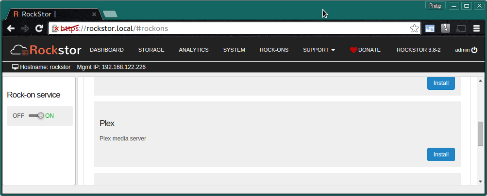
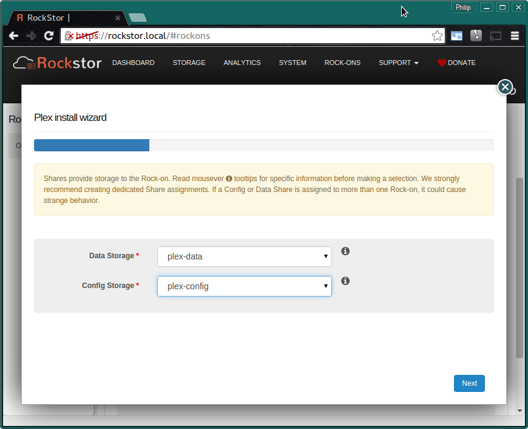
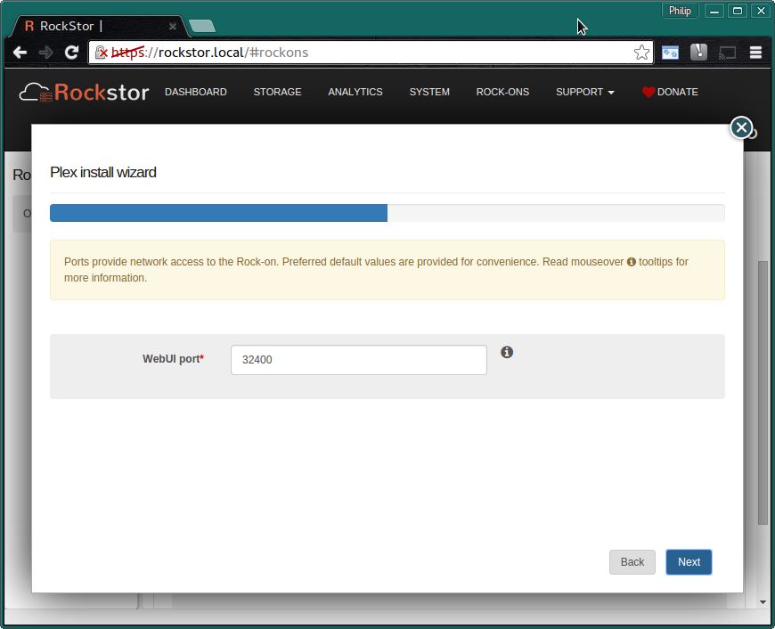
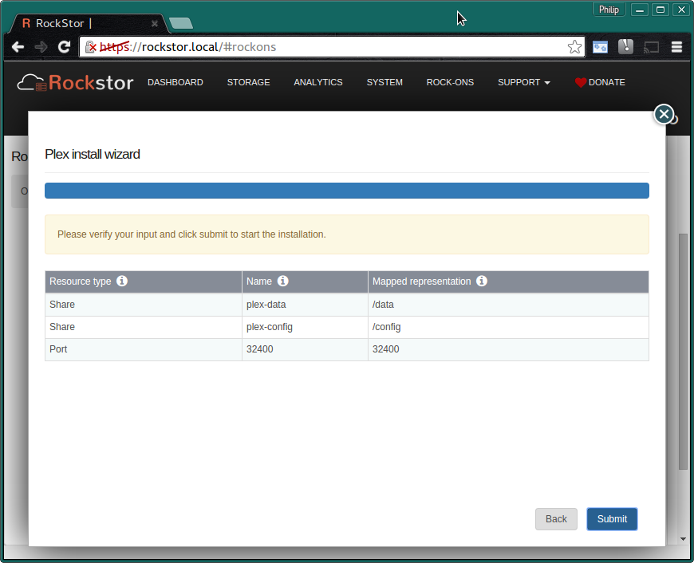
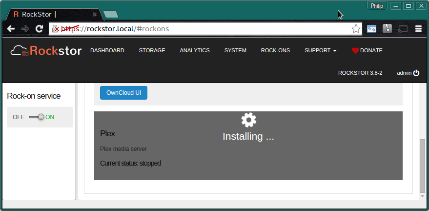
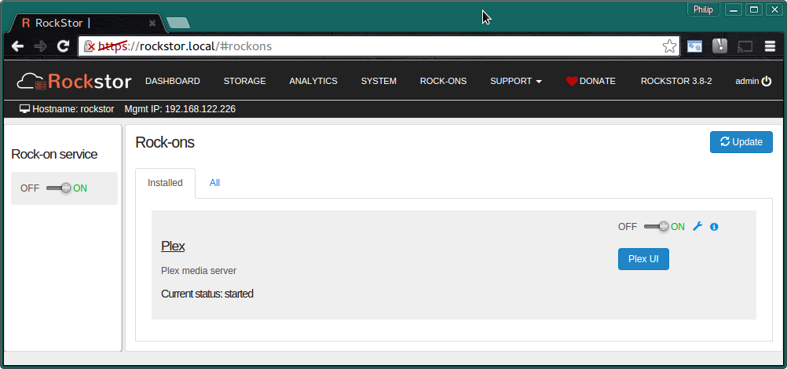
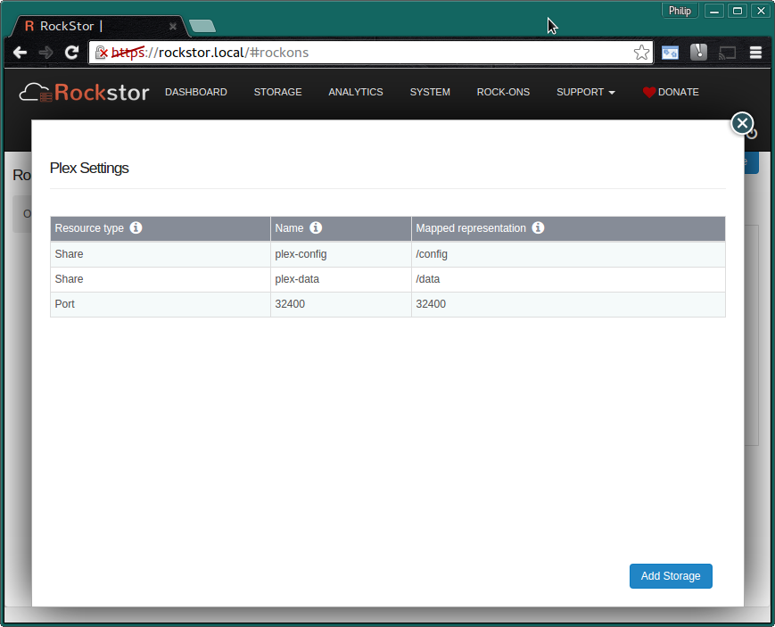
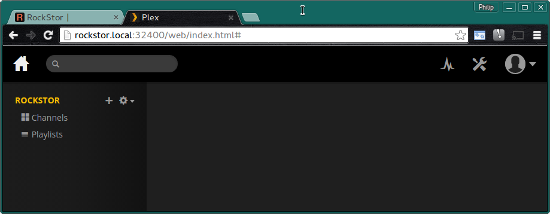

.. _plex_rockon:

Plex Server Rock-on
===================

Please be aware of the common prerequisites for all Rockstor :ref:`rockons_intro`;
specifically the :ref:`rockons_preinstall` and :ref:`rockons_root`
requirement.

Our `Plex Media Server Rock-on forum <http://forum.rockstor.com/t/plex-media-server-rock-on/179>`_ area.

.. _plex_whatis:

What is Plex
------------

`Plex <https://plex.tv/>`_ is a
`centralized <https://support.plex.tv/hc/en-us/articles/200288286-What-is-Plex->`_
domestic media distribution system that acts
both as a `DLNA <https://en.wikipedia.org/wiki/Digital_Living_Network_Alliance>`_
server and as its own more `flexible <https://plex.tv/features>`_ type of
media server and client system.
`plex client apps <https://plex.tv/downloads>`_ are available on nearly
every platform.  But in order to manage your media with the
Plex system it is first necessary to have a
**Plex Media Server**. This **Rock-on** is **exactly that**; and aims to make the install
and media provisioning of a Plex server as simple as possible.

.. _plex_doc:

Plex Documentation
------------------

Plex's `own documentation <https://support.plex.tv/hc/en-us>`_ is extensive and
well presented and a good kicking off point might well be their `Getting Started
<https://support.plex.tv/hc/en-us/categories/200007268-Getting-Started>`_ guide
that has a thorough
`Step by Step <https://support.plex.tv/hc/en-us/articles/200264746-Quick-Start-Step-by-Step>`_
introductions to the Plex system.  Also note that the Plex Media Server
requires your media to be
`organized <https://support.plex.tv/hc/en-us/categories/200028098-Media-Preparation>`_
in a certain way.

.. _plex_install:

Installing Plex Rock-on
-----------------------
First please consider the pre-requisites for any Rockstor Rock-on; these
are linked to at the :ref:`top <syncthing_rockon>` of this document. Note also
that the Plex Rock-on will require a Share for your media and optionally
(but recommended) another Share on which you store its configurations files.
This makes a total of 3 shares, one for the Rock-on system itself ie
:ref:`rockons_root` that may well already have been made and an additional 1 or 2
shares depending on whether you wish to split your Plex config from its data;
this is highly recommended though.

Click the **Install** button next to the Plex listing on the Rock-ons page.

.. _plex_shares:

Plex Shares
^^^^^^^^^^^

Next we select the **Storage areas** for the Plex Rock-on's **data** and
**configuration** files.  Here we are using the **recommended names**.

* **plex-data** - room enough for your data and snapshots.
* **plex-config** - min 1 GB

If you find that these values are insufficient then please discus this on the
`Rockstor forum <http://forum.rockstor.com/t/plex-media-server-rock-on/179>`_
so that this document might be updated and improved.

N.B. to create these Storage areas please see our :ref:`createshare`.

.. _plex_port:

Plex Port
^^^^^^^^^

This is the **Default Port** and it is unlikely that you will have to alter it.

This is the port you will use to access the :ref:`plex_ui`.

Now check that the entered details are correct before clicking **Submit**.

Closing the resulting simple *Installation is in progress* dialog and we have:-

and a few minutes later depending on internet and machine speed:-

**The Plex Media Server Rock-on is ON**

N.B. Notice the **Plex UI** button and the **spanner** to view the Rock-on
settings and add additional Rockstor Shares.

.. _plex_addshares:

Adding Shares to Plex
---------------------
This facility is only required if you wish to have the Plex Rock-on access more
than one Rockstor Share.  It is not uncommon for all of a Plex Media Server's
data to reside on a single Share.  N.B. the Shares are not the same as the
Libraries within Plex, ie one can have multiple Plex libraries on a single
Rockstor Share. Plex Libraries are configured from within the :ref:`plex_ui`
and represent how the Plex Server organizes and shares your media. An example
of requiring more than one Rockstor Share to be mapped into the Plex Rock-on
is if you have all your Movies in one Share and all you Music in another Share.

From the information dialog **i icon** on the Plex Rock-on listing we get:-

.. image:: plex_info.png
   :scale: 80%
   :align: center

Reproduced here for clarity:-

**Additional information about Plex Rock-on**::

   Adding more media to Plex.

   You can add more Shares (with media) to Plex from the settings wizard of
   this Rock-on. Then, from Plex WebUI, you can update and re-index your library.

The **settings wizard** is accessed via the **spanner** icon on the Plex
entry on the Rock-ons page.

As can be seen here there is an **Add Storage** button on the spanner dialog.

.. _plex_ui:

Plex UI
-------
The **Default Plex UI** accessed via the **Plex UI** button on the
Rock-ons page:-

You can now configure and populate your Plex Media Server Rock-on; :ref:`plex_doc`
