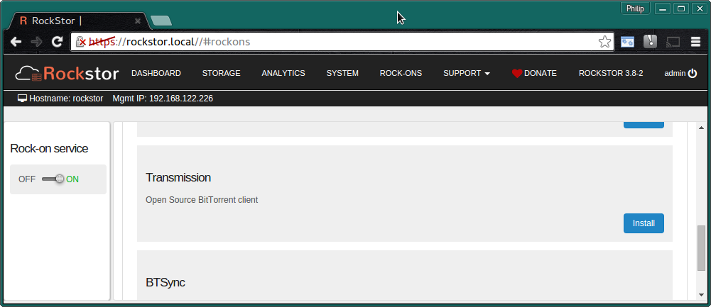
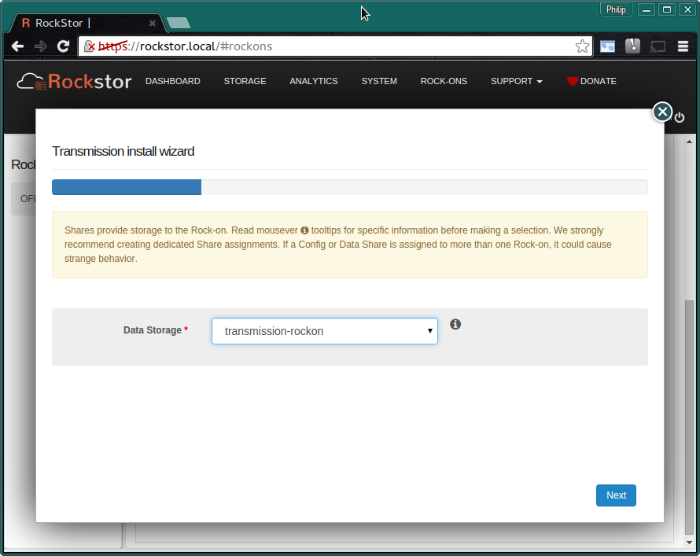
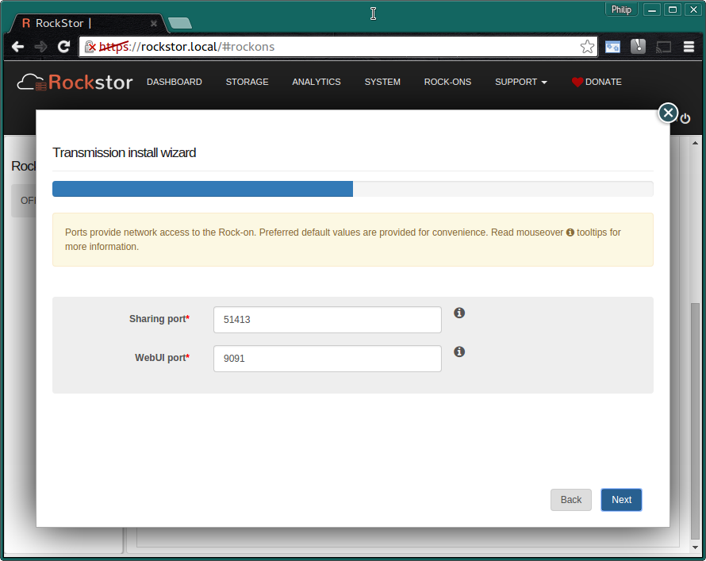
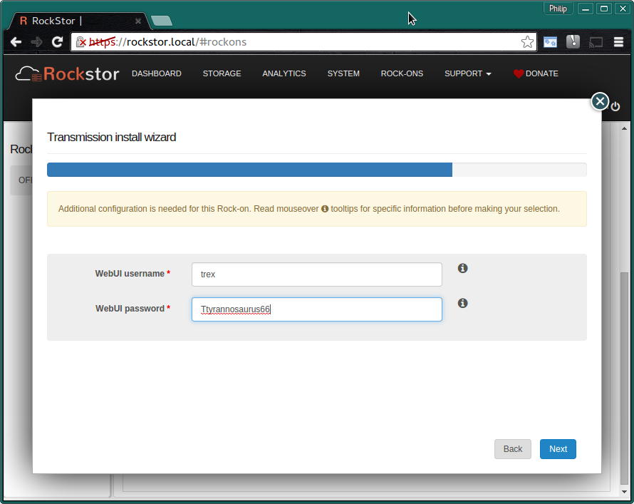
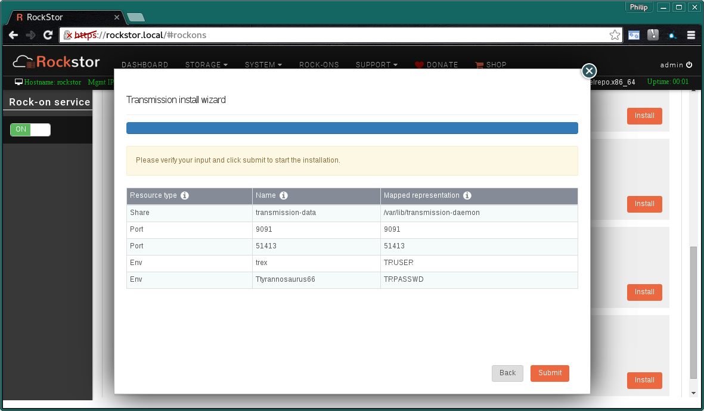
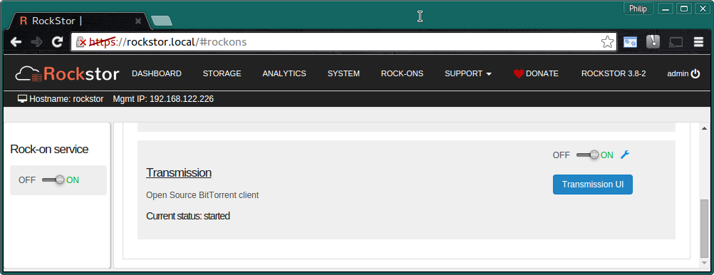
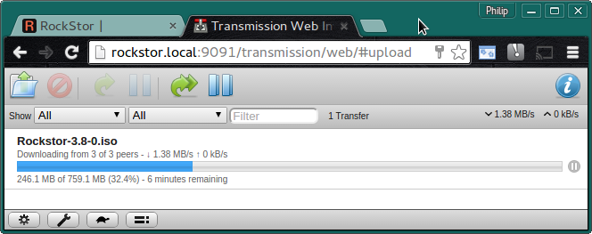

.. _transmission_rockon:

Transmission Rock-on
====================

Please be aware of the common prerequisites for all Rockstor :ref:`rockons_intro`;
specifically the :ref:`rockons_preinstall` and :ref:`rockons_root`
requirement.

Our `Transmission Rock-on forum <http://forum.rockstor.com/t/transmission-bittorrent-client-rock-on/181>`_ area.

.. _transmission_whatis:

What is Transmission
--------------------

`Transmission <http://www.transmissionbt.com/>`_ is a cross platform Open
Source BitTorrent client; is is know for its easy of use. It also has a
:ref:`WebUI <transmission_ui>` making it a good fit with Rockstor.

.. _transmission_doc:

Transmission Documentation
--------------------------

Transmission's `about <http://www.transmissionbt.com/about/>`_ page has a number
of useful links that should serve as a starting point.

.. _transmission_install:

Installing Transmission Rock-on
-------------------------------
First please consider the pre-requisites for any Rockstor Rock-on; these
are linked to at the :ref:`top <transmission_rockon>` of this document. Note also
that the Transmission Rock-on will require a Share to store it's torrents.
Note that this is in addition to the
:ref:`rockons_root` that may well already have been made.

Click the **Install** button next to the Transmission listing on the Rock-ons page.

.. _transmission_share:

Transmission Share
^^^^^^^^^^^^^^^^^^

Next we select the **Storage area** for Transmission's files.  Here we are
using the **recommended Share name**.

* **transmission-rockon** - room enough for your data and snapshots.

N.B. to create this storage area please see our :ref:`createshare`.

.. _transmission_port:

Transmission Ports
^^^^^^^^^^^^^^^^^^

These are the **Default Ports** and it is unlikely you will have to alter them.

Next configure the Transmission **User** and **Password** for the
:ref:`transmission_ui`

Note that these are examples only, you can use whatever username and password
you like but don't use spaces.

Check that the entered details are correct before clicking **Submit**.

Closing the resulting simple *Installation is in progress* dialog and we have:-

**The Transmission Rock-on is ON**

N.B. Notice the **Transmission UI** button and the **spanner** to see the
Rock-on settings.

.. _transmission_ui:

Transmission UI
---------------

We now have the **Default Transmission UI** with a Rockstor torrent in progress:-

You can now trial your Transmission Rock-on using a
`Rockstor Torrent <http://rockstor.com/download.html>`_;
:ref:`transmission_doc`