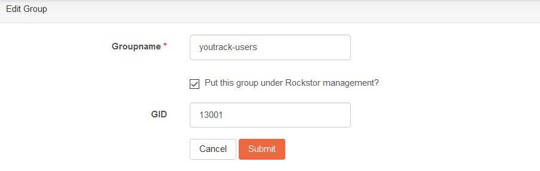
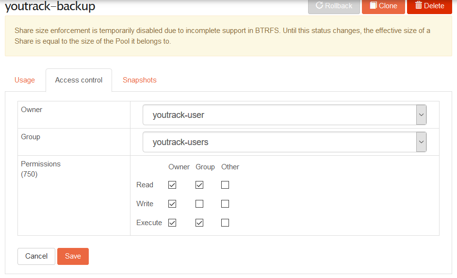
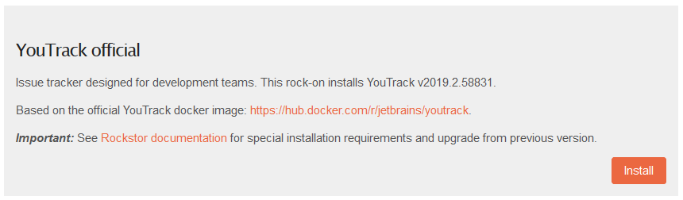
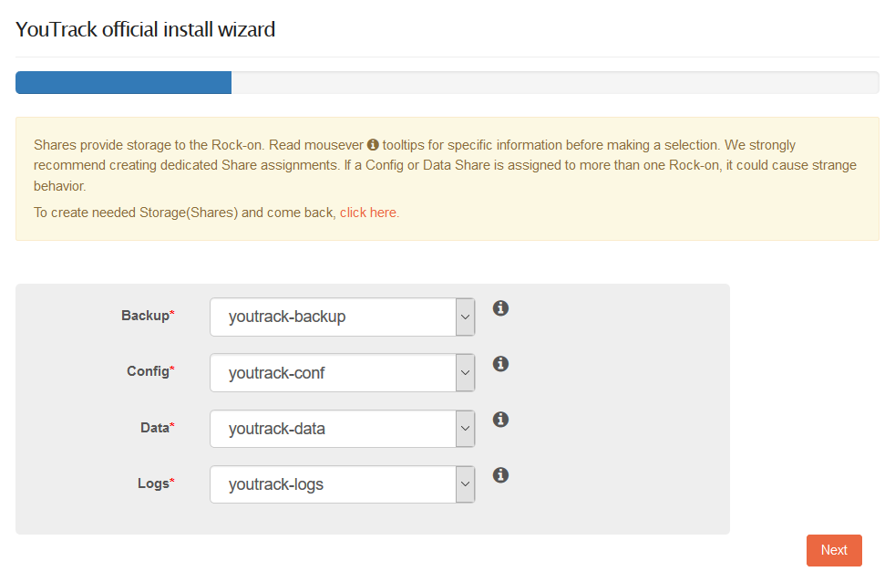
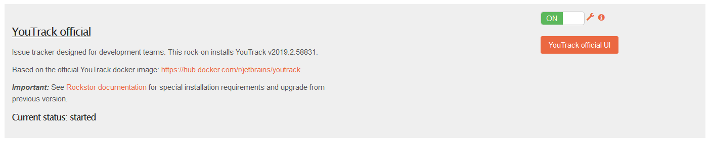
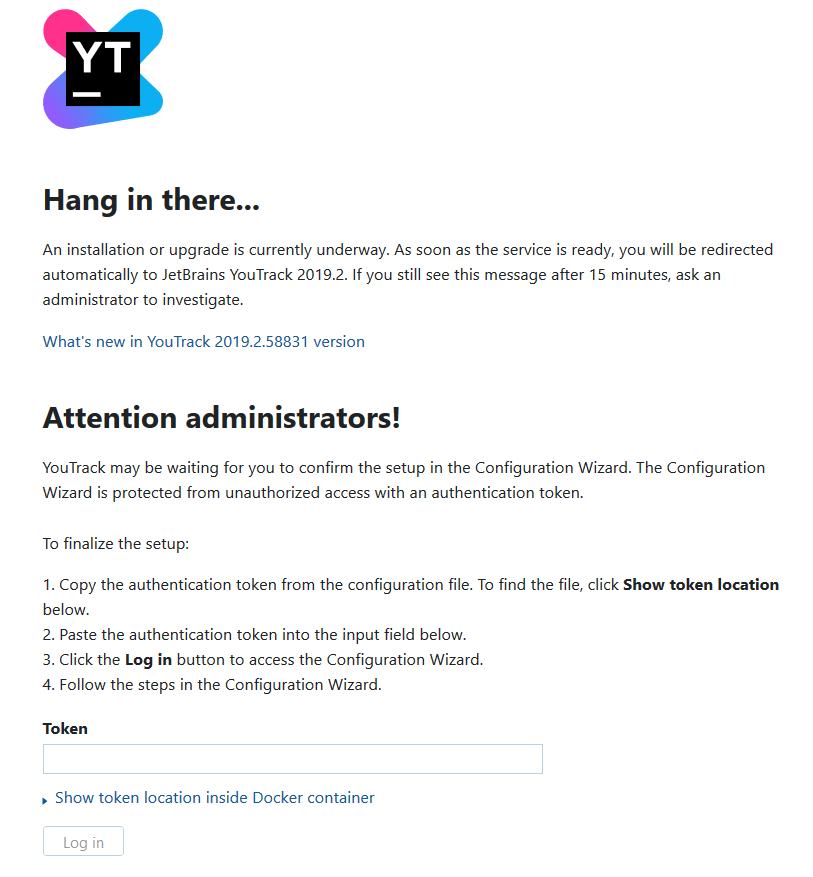

.. _youtrack_rockon:

YouTrack Rock-on
=================

Please be aware of the common prerequisites for all Rockstor :ref:`rockons_intro`;
specifically the :ref:`rockons_preinstall` and :ref:`rockons_root`
requirement.

.. _youtrack_whatis:

What is YouTrack
-----------------

YouTrack is a project management tool developed by `JetBrains <https://www.jetbrains.com/>`_ 
and aimed at providing development teams with a fully-featured issue tracker. A full 
list and demonstration of each feature can be found on the `project's main page 
<https://www.jetbrains.com/youtrack/features/>`_. 

.. _youtrack_doc:

YouTrack Documentation
-----------------------

YouTrack's `online documentation <https://www.jetbrains.com/youtrack/documentation/>`_ 
is a good place to start along with their `complete manual 
<https://www.jetbrains.com/help/youtrack/index.html>`_ and their `Blog 
<https://blog.jetbrains.com/youtrack/>`_.

.. _youtrack_preinstall:

Pre-install requirements
-------------------------
First please consider the pre-requisites for any Rock-on; these are linked to
at the :ref:`top <youtrack_rockon>` of this document. In addition, however, please note
that the YouTrack Rock-on will require setting up a dedicated **user** as well as 
**four dedicated shares**. Note that this is in addition to the :ref:`rockons_root` 
that may well already have been made.

.. _youtrack_preinstall_shares:

Create dedicated shares
^^^^^^^^^^^^^^^^^^^^^^^^
The YouTrack rock-on requires four dedicated shares (see :ref:`createshare` for more help), 
which can be created as follows:

- **Configuration**:  a directory where YouTrack will store configuration files that contain environment settings, JVM options, YouTrack integration settings, and so on. Create a share named `youtrack-conf`, for instance. 
- **Data storage**: directory where YouTrack will store its database. Create a share named `youtrack-data`, for instance. This directory **must** be empty.
- **Logs**: a directory where YouTrack will store its log files. Create a share named `youtrack-logs`, for instance.
- **Backups**: a directory where YouTrack will store its backups. Create a share named `youtrack-backup`, for instance.

.. _youtrack_preinstall_user:

Create a dedicated user
^^^^^^^^^^^^^^^^^^^^^^^^
The YouTrack rock-on uses a specific user account to run the YouTrack service inside 
the container (for more information, see `YouTrack's documentation 
<https://www.jetbrains.com/help/youtrack/standalone/youtrack-docker-installation.html#create-and-configure-directories>`__).
While the name of this user account is up to the user's preference, its UID and GID
must be as follows:

- **UID**: 13001
- **GID**: 13001

To create such user account from Rockstor webUI, first navigate to *System* > *Groups*, 
and click on **Add Group**. Then, create a new group with the following options:  

Please note that while the group *name* can be set to any name, the **GID must be 13001**. 
Similarly, the option to "*Put this group under Rockstor management*" is optional and can 
thus be left unchecked if preferred.

Now that we have created the appropriate *group*, we can create proceed with the creation
of the *user*. To do so, navigate to *System* > *Users*, and click on **Add User**. Then,
create a new user with the following options:

.. image:: youtrack_users_create.png
    :scale: 80%
    :align: center

As mentioned above, all settings *except* the **UID** and **Group** can be chosen as desired.
Indeed, the latter two must be as follows:

- **UID**: 13001
- **Group**: the same as created above (*youtrack-users* in our case)

Finally, we need to set this user as owner of **all four dedicated shares** created 
above. To do so, open each share's detail page (see :ref:`shares` section), navigate
to the "`Access control`" tab, click "`Edit`", and set the user we just created 
as **owner**. See, for instance, the screenshot below in which we set the ownership
of the *youtrack-backup* share.

Please note in the screenshot above that we also changed the *Permissions* to **750**
by unchecking the *Read* and *Write* permissions for *Others*. While this is not 
necessary to YouTrack's function, it provides enhanced security and is the 
recommended setting in `YouTrack's documentation 
<https://www.jetbrains.com/help/youtrack/standalone/youtrack-docker-installation.html#create-and-configure-directories>`__.

.. _youtrack_install:

Installing YouTrack Rock-on
----------------------------

Before proceeding with the YouTrack rock-on installation, please ensure all 
steps described above have been completed (see :ref:`youtrack_preinstall` ). 
Failure to do so will lead the rock-on to a continuous "restart loop" that may 
be difficult to correct from Rockstor webUI.

Click the **Install** button next to the YouTrack listing on the Rock-ons page.
You will first be asked to choose a dedicated share for each volume. You can thus
choose all four shares that we created previously with the correct ownership.

Next, you can simply leave the default port for the webUI as pre-filled by Rockstor.
On the next window, verify all settings are correct and click "*Submit*". Following 
the settings above, we have the following:

.. image:: youtrack_install_summary.png
    :scale: 80%
    :align: center

.. _youtrack_first_boot:

First access to YouTrack UI
----------------------------

Upon first installation, the YouTrack rock-on will proceed with its initialization 
and configuration. While most of this is automated and completed through an 
easy-to-use interface, a token generated during installation needs to be retrieved. 
This can be done with:

     # cat /mnt2/youtrack-conf/internal/services/configurationWizard/wizard_token.txt

We can now click on the **YouTrack UI** button and start the initialization process. 

First, the YouTrack initialization and configuration will ask for the token we just 
gathered above.

.. pull-quote::
    Note that the initialization process at first install can take quite some time.
    Fortunately, the YouTrack UI will greet you with a proper screen informing you 
    as such. The screen will update automatically once it is ready to proceed.

After clicking the **Log in** button, you can then proceed with the rest of YouTrack's
configuration process as desired.

.. _youtrack_upgrade:

Upgrading from a previous version
----------------------------------

While upgrading from a previous installation of YouTrack is possible (see 
`YouTrack's documentation <https://www.jetbrains.com/help/youtrack/standalone/upgrade-with-docker-image.html#upgrading-docker-image>`__), it
is recommended to follow the *Backup* / *Restore* procedure as detailed in 
YouTrack's documentation. We refer the user to the `YouTrack's documentation 
<https://www.jetbrains.com/help/youtrack/standalone/upgrade-with-docker-image.html#youtrack-zip-msi-to-docker>`__, 
which provides detailed step-by-step instructions.
