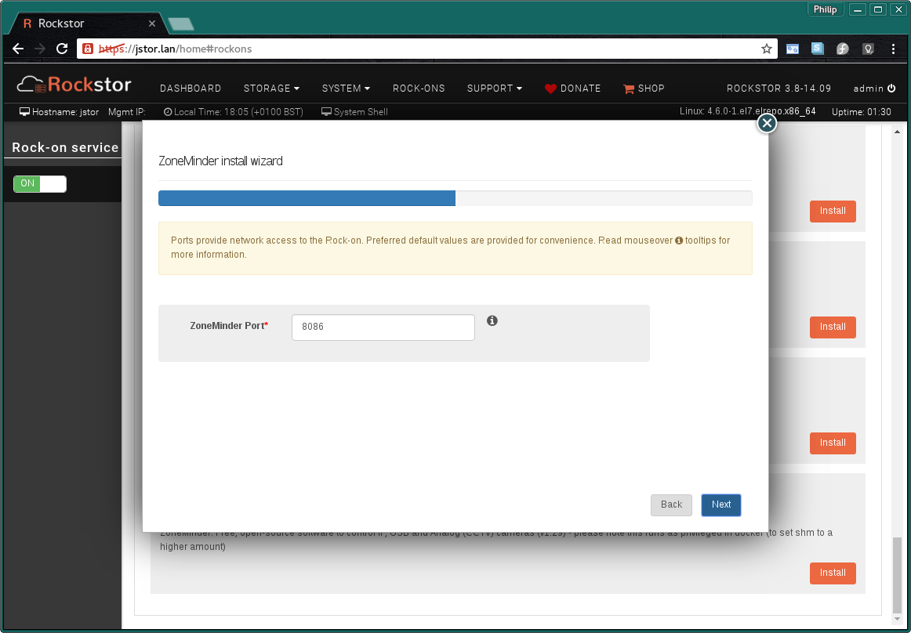
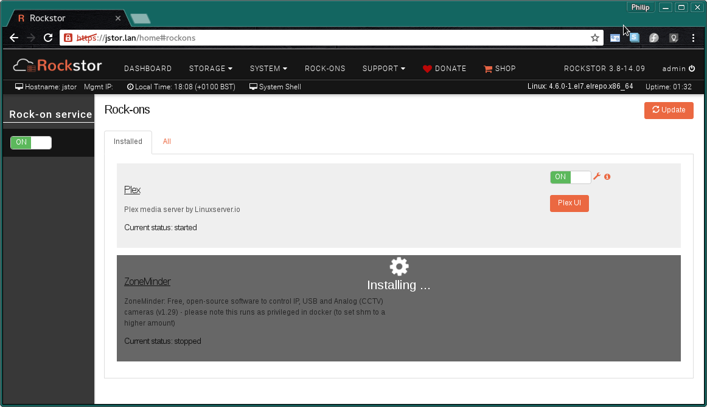
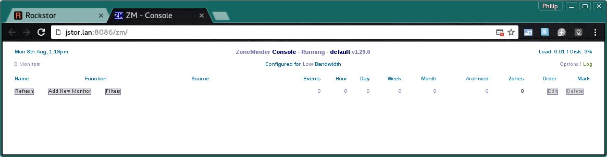
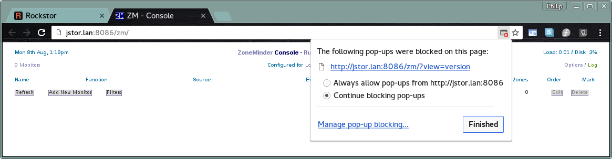
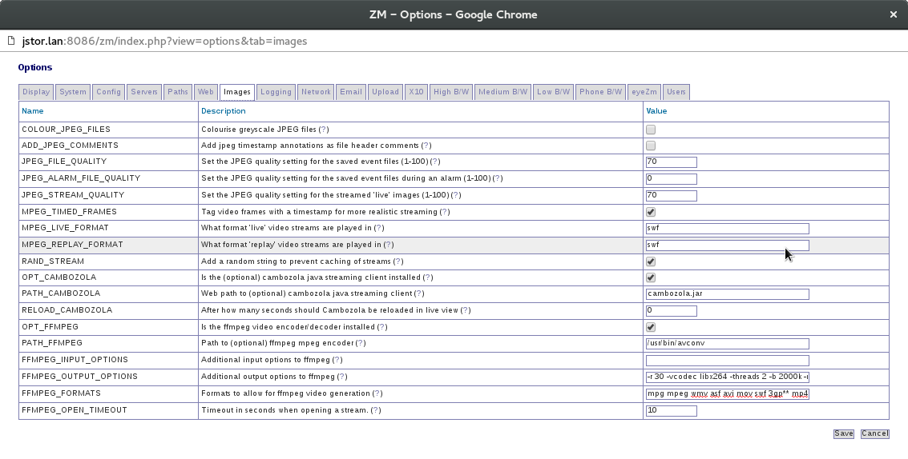
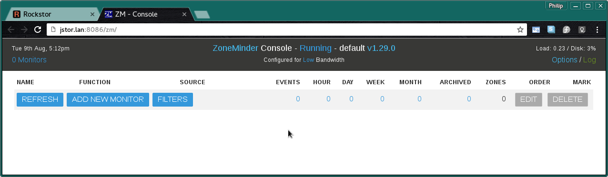

.. _zoneminder_rockon:

ZoneMinder Rock-on
==================

Please be aware of the common prerequisites for all Rockstor :ref:`rockons_intro`;
specifically the :ref:`rockons_preinstall` and :ref:`rockons_root`
requirement.

Our `ZoneMinder Rock-on forum <https://forum.rockstor.com/t/zoneminder-rock-on/1899>`_ area.

.. _zoneminder_whatis:

What is ZoneMinder
------------------

`ZoneMinder <https://zoneminder.com/>`_ is a full-featured and open source video
surveillance software system. Licenced as GPLv2 or later. Capabilities include
the use of pretty much any camera, either directly connected or IP-enabled, and
the capability to run on general purpose hardware. The source code can be found
on their `GitHub page <https://github.com/ZoneMinder/ZoneMinder/>`_.
The web interface is mobile capable but there are also Android and IOS apps
available that interface with the open third-party friendly APIs. The
`zmNinja app <https://pliablepixels.github.io/>`_ is one such example and is
featured on the ZoneMinder main page; this app is also
`open source and on GitHub <https://github.com/pliablepixels/zmNinja>`_
with a `dual licenced <https://github.com/pliablepixels/zmNinja/blob/master/LICENSE>`_
source code (CC BY-NC-SA/4.0 and commercial). This app is written with the aid
of the ionic framework and so should mimic native behaviour.

.. _zoneminder_doc:

ZoneMinder Documentation
------------------------

Zoneminders `own documentation <https://zoneminder.readthedocs.io/en/latest/index.html>`_
is extensive and well presented. A good place to start from a Rockstor
Zoneminder Rock-on perspective would be the
`Getting Started <https://zoneminder.readthedocs.io/en/latest/userguide/gettingstarted.html>`_
section of the `User Guide <https://zoneminder.readthedocs.io/en/latest/userguide/index.html>`_
as the Installation Guide is redundant given that the below instructions guide
you though the Rock-on install which effectively install a docker based version
of ZoneMinder for you.

.. _zoneminder_install:

Installing ZoneMinder Rock-on
-----------------------------

First please consider the pre-requisites for any Rockstor Rock-on; these
are linked to at the :ref:`top <zoneminder_rockon>` of this document. Note also
that the ZoneMinder Rock-on will require two shares. One for the main storage of
configuration and event recording data, and another for the database used by
ZoneMinder to tie everything together. As databases can present a special work
load to btrfs (the underliying filesystem used by Rockstor) this share has been
kept separate. This then affords the possibility of differing filesystem
maintenance schedules for the two shares and for additional performance tunning
if that becomes necessary. Note that this does not include the pre-required
share to enable Rock-ons in the first place ie the previously referenced
:ref:`rockons_root`.

.. image:: zoneminder_install.png
   :scale: 80%
   :align: center

Click the **Install** button next to the ZoneMinder listing on the Rock-ons page.

.. _zoneminder_shares:

ZoneMinder Shares
^^^^^^^^^^^^^^^^^

Next we select the **Storage areas** for the ZoneMinder Rock-on's
**Config Storage** and **MySQL Storage** files. Note that the order of these
items may vary.

* **Config Storage** - room for all video events and configuration - minimum 50 GB
* **MySQL Storage** - sufficient to house the MySQL database - minimum 5GB

If you find that these values are insufficient then please discus this on the
`Rockstor forum <https://forum.rockstor.com/t/zoneminder-rock-on/1899>`_
so that this document might be updated and improved.

In the following image we are using the example names of **zm-data** and
**zm-mysql**.

.. image:: zoneminder_shares.png
   :scale: 80%
   :align: center

N.B. to create these Shares or 'Storage areas' please see our
:ref:`createshare`.

.. _zoneminder_port:

ZoneMinder Port
^^^^^^^^^^^^^^^

This is the **Default Port** and it is unlikely that you will have to alter it.

* **WebUI port** - This is the port you will use to access the :ref:`zoneminder_ui`.

In the above we see the default port number of 80 was over ridden and
another port was automatically inserted. This can happen when other
Rock-ons have already taken the default port settings and is not generally a
problem.

The next screen is to confirm the details entered so far.

.. image:: zoneminder_verify.png
   :scale: 80%
   :align: center

Now check that the entered details are correct before clicking **Submit**.

Closing the resulting simple *Installation is in progress* dialog and we have:-

and a few minutes later depending on internet and machine speed:-

**The ZoneMinder Media Server Rock-on is ON**

.. image:: zoneminder_on.png
   :scale: 80%
   :align: center

N.B. Notice the **ZoneMinder UI** button to visit the installed ZoneMinder Web
interface and the **spanner** icon to view the Rock-on settings and add
additional Rockstor Shares if required (advanced configurations).

.. _zoneminder_ui:

ZoneMinder UI
-------------

On first accessing the ZoneMinder UI via the **ZoneMinder UI** button on the
Rock-ons page you should be greeted with the following page:

Notice that in the URL (address) bar of our browser (chrome in this case) we
have a red notification. This is to indicate that popups are blocked:

**It is required by the ZoneMinder Web-UI that popups be allowed**

**Select "Always allow pop-ups from ..."**. Assuming the address listed
matches that shown in your url (address) bar.

.. _zoneminder_config:

Post Install Configuration
--------------------------

Given ZoneMinder is extremely versatile it is inevitable that it has a
significant number of options. The default configuration may well server but it
is advised that the following initial changes be made to improve the base
capabilities.

Initial Configuration
^^^^^^^^^^^^^^^^^^^^^

The suggested initial configuration changes are detailed within the **i icon**
dialog.

.. image:: zoneminder_info.png
   :scale: 80%
   :align: center

Reproduced here for clarity:-

**Additional information about ZoneMinder Rock-on**::

   Tips and Setup Instructions:

   This container includes avconv (ffmpeg variant) and cambozola but they need
   to be enabled in the options. In the WebUI, click on Options in the
   top right corner and go to the Images tab.
   Click on the box next to OPT_Cambozola to enable.
   Click on the box next OPT_FFMPEG to enable ffmpeg.
   Enter the following for ffmpeg path: /usr/bin/avconv.
   Enter the following for ffmpeg output options:
   -r 30 -vcodec libx264 -threads 2 -b 2000k -minrate 800k -maxrate 5000k
   (you can change these options to your liking)
   Next to ffmpeg_formats, add mp4 (you can also add a star after mp4
   and remove the star after avi to make mp4 the default format)

   Hit save

   Now you should be able to add your cams and record in mp4 x264 format.
   Important:
   The web gui will be available at http://serverip:port/zm
   On first start, open zoneminder options, go to the Paths tab and enter
   the following for PATH_ZMS: /zm/cgi-bin/nph-zms

   The default timezone for php is set as America/New_York if you would like
   to change it, edit the php.ini in the config folder.
   Here's a list of available timezone options: http://php.net/manual/en/timezones.php"

It is only required that you do the PATH_ZMS change but all the other changes
are optional but should enhance your experience.

The following shows the **Images tab** within the **Options** popup with the
above suggestions applied.

and the following shows the **Paths tab** within the **Options** popup with the
above suggestions applied.

.. image:: zoneminder_options_path_change.png
   :scale: 80%
   :align: center

Note that this addition is the required one and simply involves adding **/zm**
to the beginning of what is already there.

After making the above path change you will be informed that this change needs
a restart in order to take effect.

.. image:: zoneminder_path_change_restart_message.png
   :scale: 80%
   :align: center

Restart message after above Path change, **OK** the message and restart the
ZoneMinder Rock-on.

To achieve this restart simply Turn the Zoneminder Rockon-on **OFF** then **ON**
again on the Rock-ons page, each action should take around 10 seconds.

.. _zoneminder_auth:

Enabling Authentication
^^^^^^^^^^^^^^^^^^^^^^^

The previously referenced `Getting Started <https://zoneminder.readthedocs.io/en/latest/userguide/gettingstarted.html>`_
has this information as it's first section. Please follow the instructions there
if you wish your ZoneMinder to be more secure.

.. _zoneminder_theme:

Nicer Theme
^^^^^^^^^^^

The `Getting Started <https://zoneminder.readthedocs.io/en/latest/userguide/gettingstarted.html>`_
project document also explains how to improve on the rather stark initial theme.

The initial ZoneMinder Web-UI page with the suggested **Flat** theme.

Much nicer

.. _zoneminder_timezone:

Time-Zone Trickery
^^^^^^^^^^^^^^^^^^

Unfortunately there is no **time zone** setting in Zoneminder and as per the
above 'Tips and Tricks' we have to change the contents of a file by hand.

If the default of **America/New_York** is in appropriate then you will first
need to lookup you required *PHP* recognized time zone name in the following
page: http://php.net/manual/en/timezones.php

So for the example of **Europe/London** we can apply this change with the
following 3 commands, assuming you have a ssh client program installed
(included by default on Linux and OSX)::

   ssh root@rockstor-ip
   sed -i -e 's/America\/New_York/Europe\/London/g' /mnt2/zm-data/php.ini
   exit

Note that after the first command you will be required to enter the root user's
password, setup during the initial install of Rockstor.

Also note that the backslash in the middle of your chosen timezone will have to
be *escaped* by adding a \\ character as in the example. Also note that this
example assumes your **Data Storage** share was named **zm-data** as in this
guide.

A ZoneMinder Rock-on restart is required for this new time zone setting to take
effect.

.. _zoneminder_camera:

Adding a Camera
^^^^^^^^^^^^^^^

In ZoneMinder terminology each camera is a **Monitor**. Until at least one
camera (monitor) is add there are parts of the Web-UI that are inaccessible as
they only show up once at least one camera is added. Please see the projects
`Getting Started <https://zoneminder.readthedocs.io/en/latest/userguide/gettingstarted.html>`_
Guide for all info and specifically the
`Understanding the Web Console <https://zoneminder.readthedocs.io/en/latest/userguide/gettingstarted.html#understanding-the-web-console>`_
and the
`Adding Monitors <https://zoneminder.readthedocs.io/en/latest/userguide/gettingstarted.html#adding-monitors>`_
sections.

You are now free to add as many cameras as your hardware allows and name their
respective **Monitors** to fit their location.
