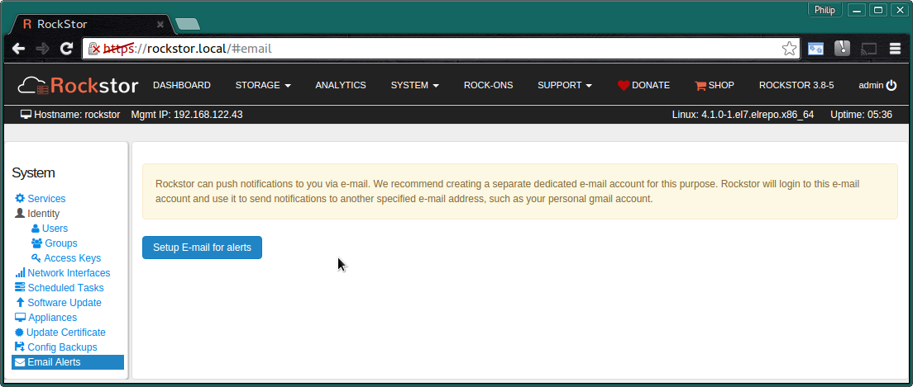
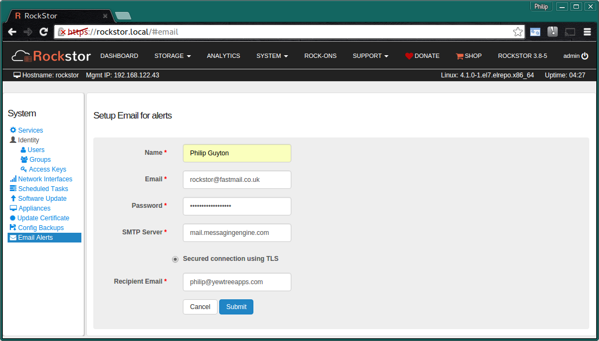
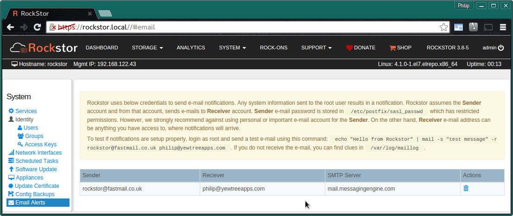
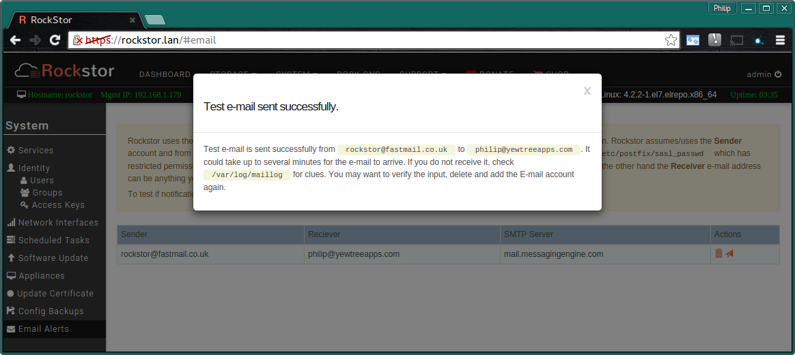

.. _email_notifications:

Email Notifications
===================

Rockstor integrates an easy to use e-mail/postfix configuration section that
enables e-mail notifications.  By default all local root (system) e-mail will
be forwarded to a specified e-mail address.  This is accomplished by using a
dedicated (configurable) e-mail account that Rockstor can login too and send
e-mail from.

.. _email_setup:

Initial Email Setup
-------------------

Navigate to the **Email Alerts** section of the **System** page:-

Press the **Add an E-Mail account** button to begin.

Complete the following required fields

* **Name** - associated with this email ie firstname lastname
* **Email** - of the dedicated Rockstor sending account
* **Password** - for the above account
* **SMTP Server** - sending email server name for the above account
* **TLS** - use Transport Layer Security, most email servers support this
* **Recipient email** who is to receive the notification emails from Rockstor

**Submit** button when done

..  _email_current:

Current Email Configuration
---------------------------

Upon submitting the desired configuration the following is displayed
summarizing the previously entered / current information and advising on how
this configuration might be tested.

**Email Alerts** section of the **System** page with existing configuration.

Note **the Bin icon** to remove the configuration and start
over, and the **small arrow icon** to **test** the configuration.

.. _email_test:

Testing Email
-------------

A test email containing the appliance id, a UUID generated during install, can
be sent using the **small arrow icon** next to the **Bin icon**. Upon a test
email having been sent the following screen should be visible:

**Please note that the appliance id sent in this email is used to identify
this particular install and it's update channel registration**