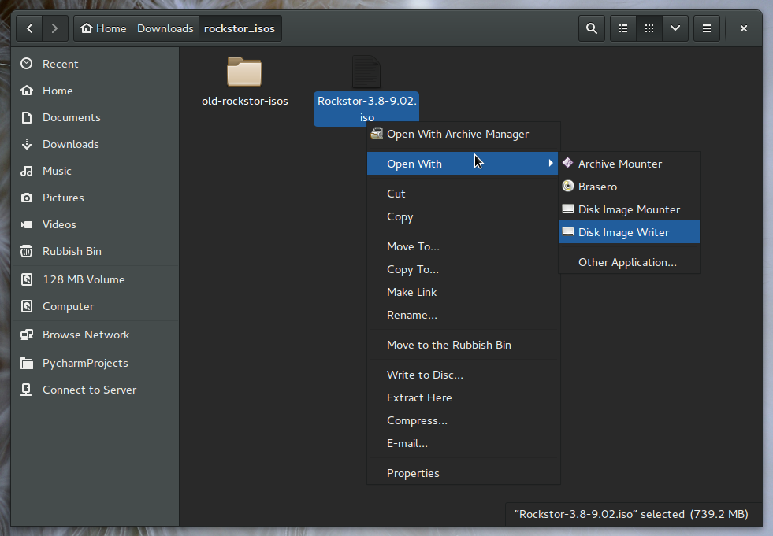
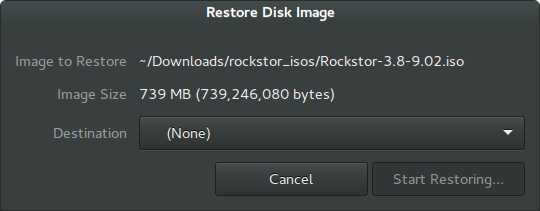
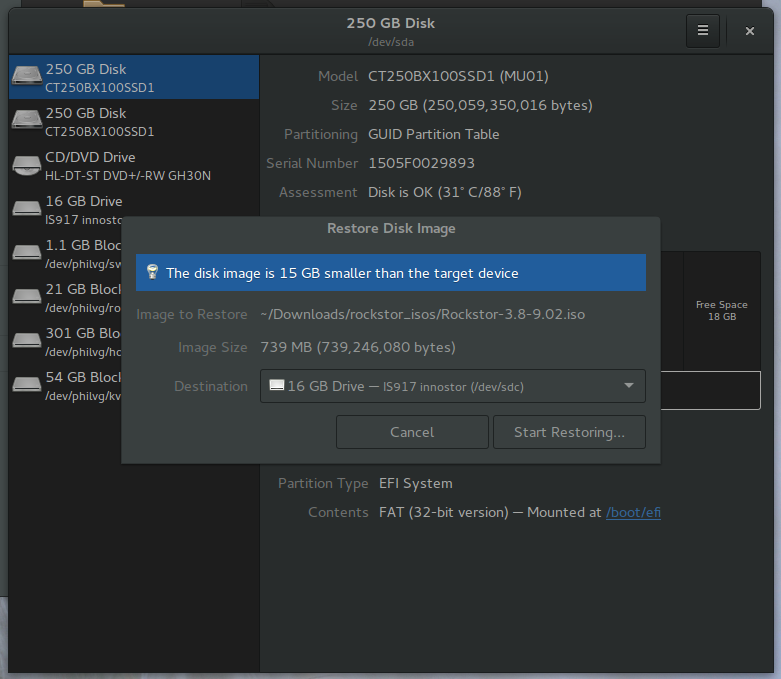
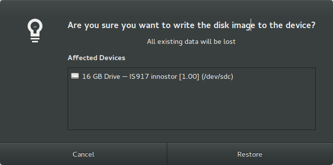
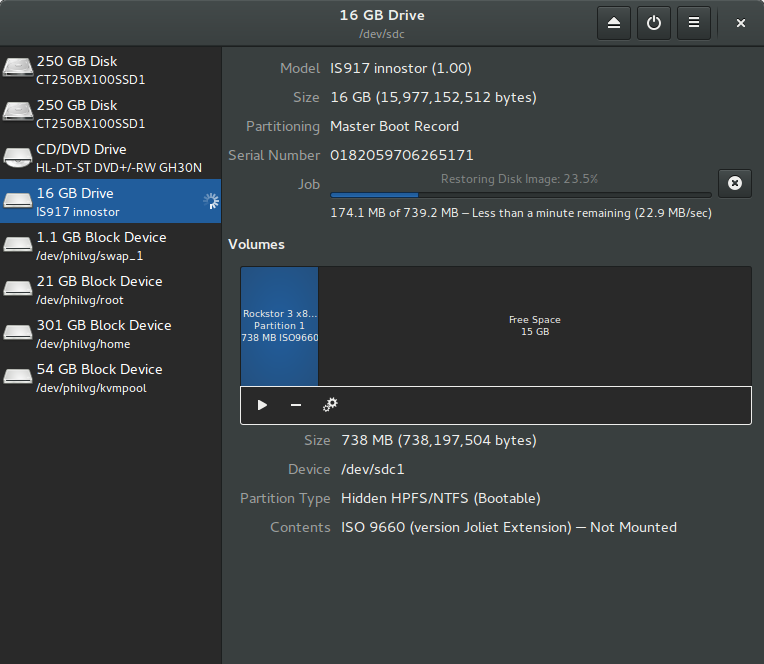

..  _gnome_disks_howto:

Rockstor USB install disk using Gnome Disks
===========================================

Many popular linux desktop distributions including
`Ubuntu <http://www.ubuntu.com/desktop>`_,
`Fedora <https://getfedora.org/>`_, and many others, include the
gnome-disks program by default and as such have a build-in graphical way to
create a Rockstor USB install disk from the downloadable iso file. What follows
is a step by step guide of this process.

Steps required
--------------

First download the latest
`Rockstor iso image <http://rockstor.com/download.html>`_ then **insert your
USB key**.

* In Nautilus (the file manager) **Right Click** on the Rockstor iso file and navigate to **Open With** then **Disk Image Writer**
* Select the USB key as the **Destination**.
* Double check you selection of destination device and **Click Start**

The following images and notes indicate the above steps in more detail.

From within **Nautilus** the file manager **Right click** on the
**Rockstor iso** to invoke the **Disk Image Writer**.

Select **Disk Image Writer** from the right click menu.

Here we see the **Restore Disk Image** dialog, we need to select our USB key.

Note that this dialog is part of the Disks program that was automatically
started, this can be seen in the next image.

Below a 16 GB innostor device was selected from the **Destination** drop down.
Notice that we receive an indication of the destination device being larger
than the source image; this is for information only and is not a problem.

The **Start Restoring** button should now be available.

A confirmation dialog should now be displayed

Note the **Affected Devices** information and size in the warning before
proceeding with the *Restore*

Depending upon your choice of USB disk and port capability the restore process
may take anywhere from a few seconds to several minutes. A progress bar is
displayed along with an estimate of the time remaining.

**Upon completion safely eject / remove / unmount the USB device before
removing it, although it may very well not be mounted.**
