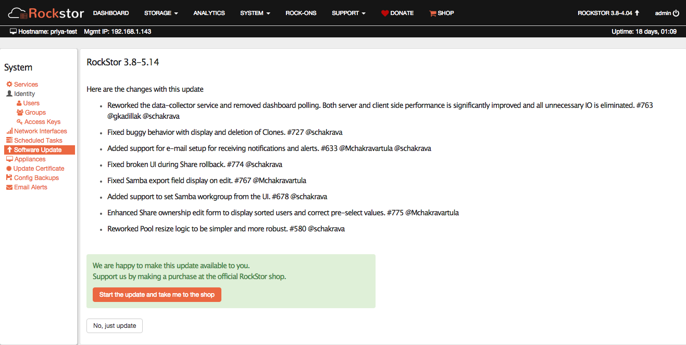

.. _installation:

Installation
============

Installation of Rockstor is a short and straight forward process. For all types
of installations, see :ref:`quickstartguide` to get started. Please also note
that we have a :ref:`pre_install`.

.. _quickeval:

Quick evaluation using a virtual environment
--------------------------------------------

Rockstor can also be evaluated quickly using a virtual machine, see our  :ref:`kvmsetup`.

See YouTube `VirtualBox Rockstor install demo <https://www.youtube.com/watch?v=00k_RwwC5Ms>`_.

Before proceeding with a serious installation that may require hardware
procurement, you can evaluate Rockstor on Amazon AWS.

See YouTube `Rockstor on ec2 <https://www.youtube.com/watch?v=ys_8FLVov2U>`_.

Hardware recommendations
-------------------------

There is nothing about Rockstor that requires special hardware. It's Linux, and
specifically a CentOS/Fedora fork, so it can be installed on a wide range of
commodity hardware. See :ref:`minsysreqs` for basic requirements.

Over time, the Rockstor developers and community at large share hardware specs
that are known to work with Rockstor. Below is a list of these recommendations.

Complete Builds for Home and small organizations
^^^^^^^^^^^^^^^^^^^^^^^^^^^^^^^^^^^^^^^^^^^^^^^^

1. This is `one of the first <http://rockstor.com/blog/uncategorized/8tb-rockstor-diy-nas>`_
   builds assembled by Rockstor developers and works great. It is
   a production server of Rockstor team for several purposes. You can get a
   `boot drive
   <http://shop.rockstor.com/collections/diy-accessories/products/pcie-msata-boot-drive>`_
   for the OS and have up to 4 additional hard drives for your data.

2. You can get the same build as above but with a different mini ITX
   motherboard with 6 SATA ports as the case can accommodate two additional
   2.5" hard drives.

3. Another build that is used by Rockstor developers and at least some known
   community members uses `ASRock C2550D4I
   <http://www.asrockrack.com/general/productdetail.asp?Model=C2550D4I#Specifications>`_
   with `this memory
   <http://www.kingston.com/us/memory/search/?partid=kvr16le11/8>`_. The
   motherboard provides 12 SATA ports, so `this
   <http://www.silverstonetek.com/product.php?pid=452>`_ is a recommended tower
   case to hold up to 12 hard drives.

4. Yet another recommendation used by Rockstor team is `HP Microserver
   <http://www8.hp.com/us/en/products/proliant-servers/product-detail.html?oid=5379860>`_. Note
   that the link refers to gen8 which may be in use by some community members,
   but gen7 is the one in use by the Rockstor team.

Small plug-and-play builds for Home
^^^^^^^^^^^^^^^^^^^^^^^^^^^^^^^^^^^

The following are off the shelf products that require very little DIY work, if
any. They provide USB 3.0, making it convenient to use external USB drives with
impressive speeds.

1. Intel NUC. To find out more, see `Garrett's blog post
   <http://rockstor.com/blog/tutorials/rockstor-on-the-intel-nuc/>`_.

2. ASUS VivoPC. To find out more, see `Amir's blog post
   <http://rockstor.com/blog/personal-cloud/rockstor-on-asus-vivopc/>`_.

Upgrading Rockstor
------------------
Rockstor is under continuous development and we push tested updates in small batches. These updates are easy to install. While we roll-out major releases that require complete OS install, we try to make these releases as infrequent as possible. We strive to make most updates non-disruptive.

Rockstor updates can be installed in two ways :

1. Install updates from the Web-UI : On the Rockstor Web-UI, on the top-right side of the navigation bar, you will see an upward facing arrow. If you click on that arrow, and if there is an update available, you will see *Software Update* highlighted, with details on the screen.

See YouTube `How to keep Rockstor upto date <https://www.youtube.com/watch?v=srn6vgQNkbc>`_.

2. Install updates from the CLI : You can safely update Rockstor anytime with the
following command::

    [root@localhost ~]# yum update rockstor

If an update is disruptive, the update process prompts for user action and
provides the necessary information to choose to update or not. You can safely
decide not to update if that makes sense for your environment.
