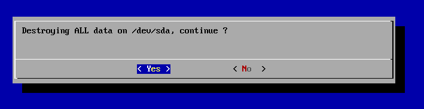
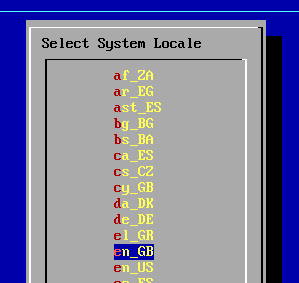
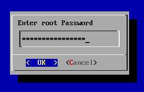
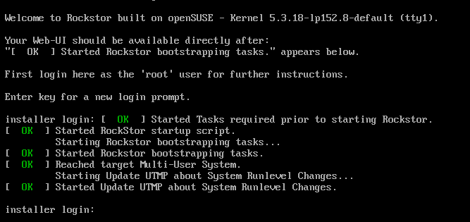
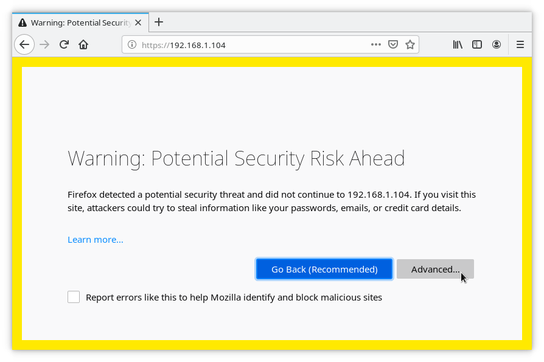
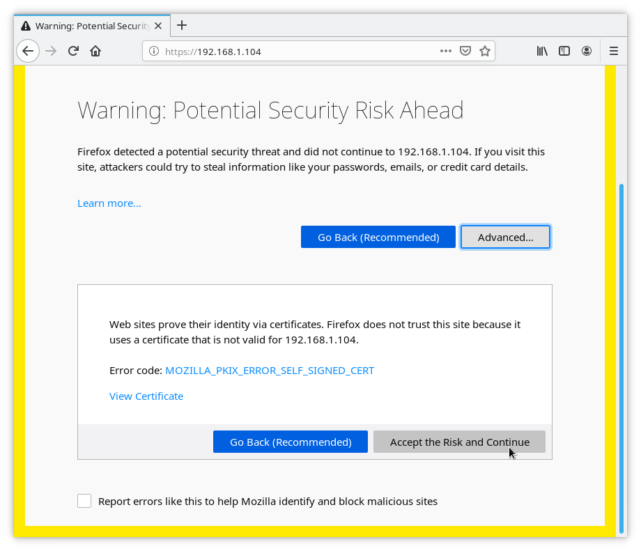
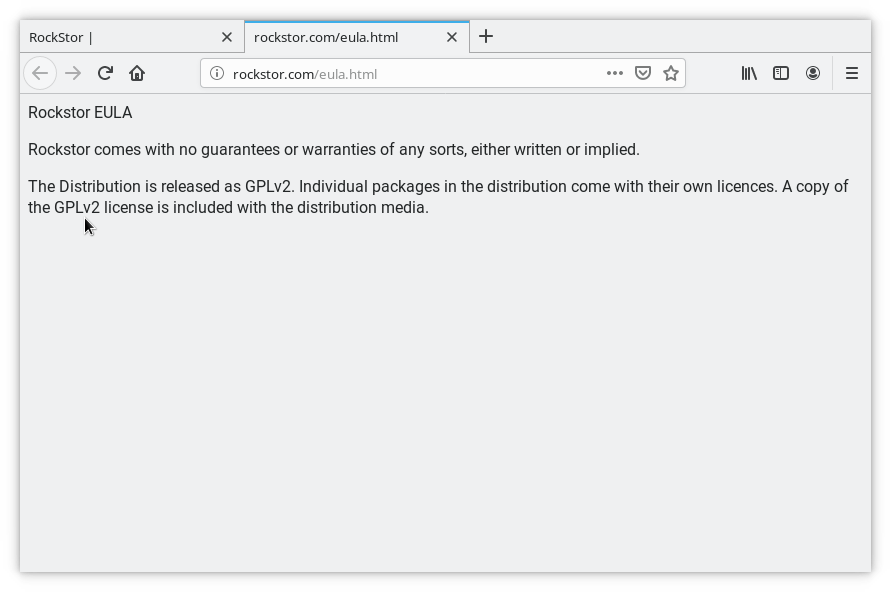

.. _installer_howto:

Rockstor’s “Built on openSUSE” installer - Beta release
=======================================================

.. _installer_thanks:

Thanks
------

Rockstor’s developers would like to thank the entire OSS community for making any of this possible.
Specifically with our fledgling move / rebase on openSUSE Leap15.2 our thanks go to the openSUSE/SuSE organisations
and the larger community for the extreme generosity we all benefit from in a myriad of seen and unseen ways.

**Please note: Rockstor is in no way affiliated with openSUSE / SuSE and does not wish, under any circumstances, to misrepresent these organisations.**
*Any errors you encounter are most likely our fault and we try, on a current volunteer basis, to support our users via our* `friendly forum: <https://forum.rockstor.com/.>`_.

It is hoped that Rockstor’s ongoing small contribution back to the larger community is of value,
and if this is so for you please consider either subscribing to our Stable Channel updates or taking part in our developer orientated Testing Channel.
Details of these Rockstor package update services are available in our `Official Docs <http://rockstor.com/docs/>`_ subsection `Update Channels <http://rockstor.com/docs/update-channels/update_channels.html>`_.
Rockstor’s ongoing development is wholly dependent on community support via either of these channels and by positively participating in our forum, linked above.
It is hoped that in time we can contribute back more significantly, and possibly financially, as our own community and Stable Channel subscriptions grow.
Also note that irrespective of Rockstor update channel selection or otherwise, upstream updates are available by normal command line means and via our Web-UI.
See :ref:`dash_and_updates` later in this guide for the details.

.. _our_kiwi_ng_installer:

Our "Built on openSUSE" Wiki-ng created installer
-------------------------------------------------

The existence of this installer, and those of many Linux distributions, is down in a major part to the Kiwi installer creation tool.
I would specifically like to thank `Marcus Schafer <https://github.com/schaefi>`_ and David `Cassany Viladomat <https://github.com/davidcassany>`_
of openSUSE/SuSE for their timely and rapid oem, partition, swap, and btrfs related fixes that were required for our initial version of this installer.
Please contribute to this important multi-distribution upstream project if you have the means and/or talent `KIWI - Next Generation <https://github.com/OSInside/kiwi>`_.

Initial Selection Screen
^^^^^^^^^^^^^^^^^^^^^^^^

Select the "Install Rockstor- ..." option.
The default is "Boot from Hard Disk".

.. image:: initial_screen.png
   :scale: 80%
   :align: center

Use cursor keys to highlight, then the "Enter" key to select.
Only use Failsafe if the 'Install ...' option fails, i.e. the screen goes blank and does not return.

Select Installation Disk
^^^^^^^^^^^^^^^^^^^^^^^^

This will usually be your smallest disk: dedicated to system only use.
If unsure do not proceed and select <Cancel> via Tab key and then Enter.

.. image:: select_installation_disk.png
   :scale: 80%
   :align: center

Use cursor keys to highlight, then the "Enter" key to select.
Only devices less than 500 GB are shown. Larger disks are assumed to be data disks.

Destroying ALL data on ..., continue ?
^^^^^^^^^^^^^^^^^^^^^^^^^^^^^^^^^^^^^^
Do not proceed if at all unsure. This will wipe the entire contents of the indicated drive.

There will be a short period of scrolling text after this screen.

Loading Rockstor ...
^^^^^^^^^^^^^^^^^^^^

This step may take a while, please be patient.

.. image:: loading-rockstor.png
   :scale: 80%
   :align: center

After 100% there will be more scrolling text that may pause for a few minutes depending on computer and selected drive speed.

Select Locale
^^^^^^^^^^^^^

Use cursor keys to highlight, then the "Enter" key to select.

Select Keyboard Layout
^^^^^^^^^^^^^^^^^^^^^^

.. image:: select_keyboard.png
   :scale: 80%
   :align: center

Use cursor keys to highlight, then the "Enter" key to select.

GPLv2 & openSUSE based Rockstor License Agreement
^^^^^^^^^^^^^^^^^^^^^^^^^^^^^^^^^^^^^^^^^^^^^^^^^
Rockstor is "Built on openSUSE" and so our installer and the consequent installs are considered modified copies of the indicated openSUSE variant.

.. image:: gplv2_license_agreement.png
   :scale: 80%
   :align: center

Use cursor keys or Page-up / Page-down (space bar) to view the entire agreement.
There are about 3 pages: Enter key to 'Exit' & 'Agree', or cursor keys to select 'No' in pop up.

Select Time Zone
^^^^^^^^^^^^^^^^

.. image:: select_time_zone.png
   :scale: 80%
   :align: center

Use cursor keys to highlight, then the "Enter" key to select.

Enter Desired root User Password
^^^^^^^^^^^^^^^^^^^^^^^^^^^^^^^^

Confirm root User Password
^^^^^^^^^^^^^^^^^^^^^^^^^^

.. image:: confirm_root_password.png
   :scale: 80%
   :align: center

Wait for the "Rockstor bootstrapping tasks"
^^^^^^^^^^^^^^^^^^^^^^^^^^^^^^^^^^^^^^^^^^^

The Rockstor tasks may take a few minutes to appear, depending on computer and selected drive speed.
But will normally appear in less than 2 minutes.

Press the Enter key to show the login prompt again.

Login as the 'root' user
^^^^^^^^^^^^^^^^^^^^^^^^

This one-off login is required to find the Web-UI's address for use in your browser.

.. image:: root_login_myip.png
   :scale: 80%
   :align: center

Enter your systems' https://.. address into your browser, Chrome/Firefox/.., for the Web-UI.

Visit Rockstor's Web-UI
^^^^^^^^^^^^^^^^^^^^^^^

Rockstor defaults to a self signed https certificate.

Although more secure than 'http' (no 's') your browser will still present a warning:

As your Rockstor is on your Local Area Network (LAN) you can add an exception for this address.
Click Advanced:

Then "Accept the Risk and Continue".
*Do not do this for any site on the internet.*
You can use a 'real' domain certificate with Rockstor but this is an advanced topic beyond the scope of this installer guide.

Rockstor Setup and EULA
^^^^^^^^^^^^^^^^^^^^^^^
The following shows example entries for this initial Web-UI setup screen, they are blank by default.

.. image:: initial_rockstor_setup_screen.png
   :scale: 80%
   :align: center

Note the required "license agreement".
This link opens an additional tab shown below:

Welcome banner
^^^^^^^^^^^^^^

Directly after the initial Rockstor setup the following welcome banner introduces the Rockstor package Update Channels.
A link to our documentation explaining these channels is included:

.. image:: initial_welcome_banner.png
   :scale: 80%
   :align: center

.. _dash_and_updates:

Dashboard and System updates
^^^^^^^^^^^^^^^^^^^^^^^^^^^^

As the GPLv2 + licensed "rockstor" package stands on the shoulders of numerous OSS giants,
it is possible to update all upstream, read openSUSE/SuSE, provided/curated packages
via the flashing ico to the left of the "Uses openSUSE ..." text in the top right of the Web-UI:

.. image:: dashboard.png
   :scale: 80%
   :align: center

Your Rockstor installation is now up and running and ready to be configured.

Update Channel reminder banner
^^^^^^^^^^^^^^^^^^^^^^^^^^^^^^

Until an Update Channel selection has been made, a reminder banner appears whenever the dashboard is visited:

.. image:: update_channel_reminder_banner.png
   :scale: 80%
   :align: center

Enjoy your Rockstor DIY NAS 'Built on openSUSE'
^^^^^^^^^^^^^^^^^^^^^^^^^^^^^^^^^^^^^^^^^^^^^^^

All upstream (openSUSE) updates, at time of installer creation, are pre-applied.
The following repositories are included and enabled in the resulting install.

`OSS <https://en.opensuse.org/Package_repositories#OSS>`_ (open source software only)

`Update <https://en.opensuse.org/Package_repositories#Update>`_ (security and bugfix updates for OSS packages)

`shells <https://build.opensuse.org/project/show/shells>`_ (An OBS repo to provide our Web-UI integrated shell via shellinabox)

`NetTime <https://build.opensuse.org/project/show/network:time>`_ (to address a chrony Network-Manager related bug)

**No Rockstor package update repository is configured until an Update Channel is selected.**