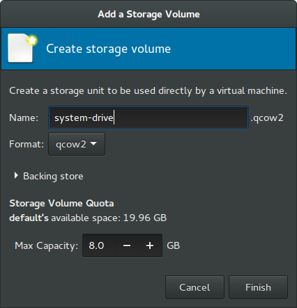
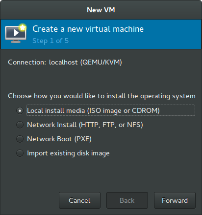
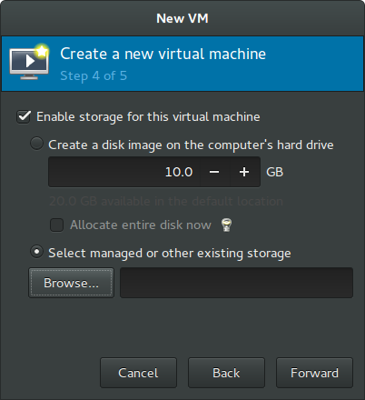
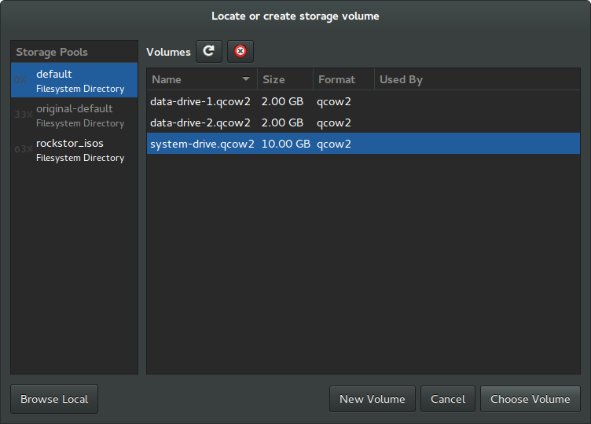
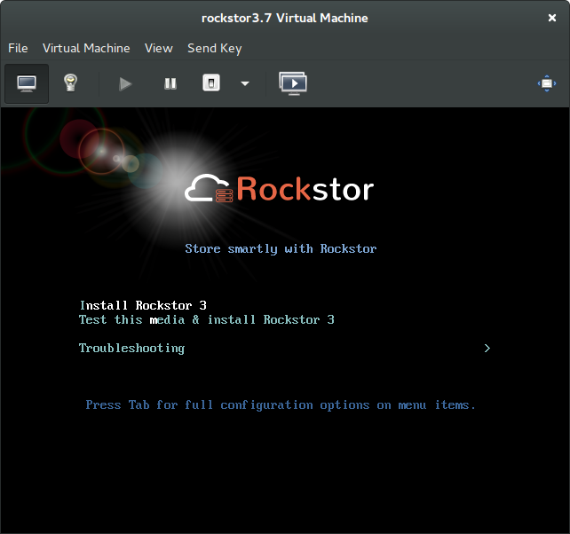
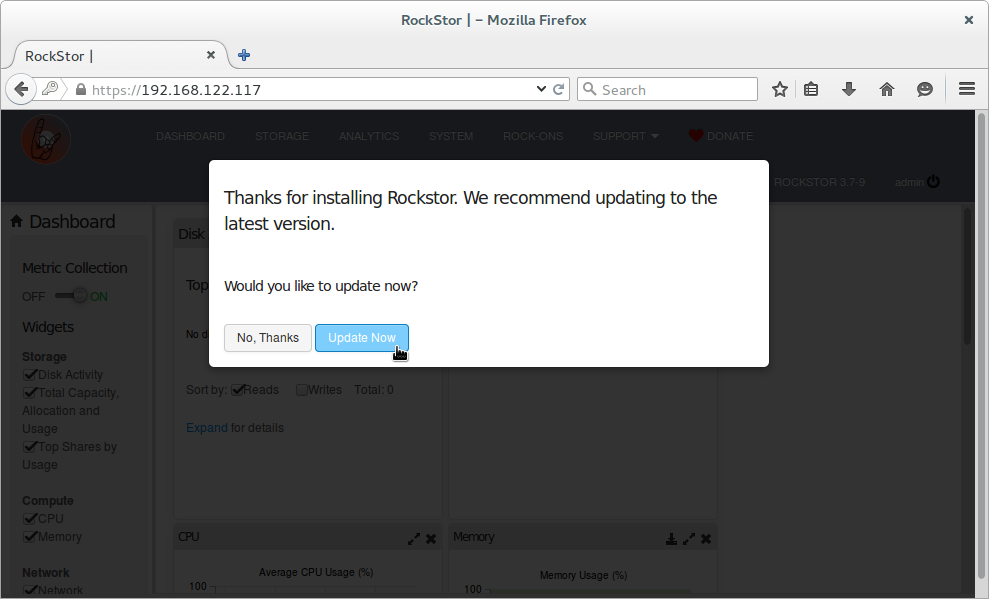

Rockstor in a GNU/Linux Kernel Virtual Machine (KVM)
====================================================
A quick and easy way to evaluate Rockstor is by using a virtual machine. A virtual machine instance of Rockstor is also invaluable as part of a build environment.

If you are using a Linux desktop you have the option to use the GNU/Linux KVM and its associated GUI Virtual Machine Manager.  This can be more efficient than the more well know Oracle VirtualBox.

Can I run the Linux KVM?
-----------------------
This depends on you CPU having the appropriate capabilities; to find out on an ubuntu desktop you can install the cpu-checker program with the following command::

    sudo apt-get install cpu-checker

Once this program is installed you can execute in a terminal the following command::

    kvm-ok

The response should indicate if KVM is possible. Another less friendly but more portable way to establish KVM capability is::

    egrep -c '(svm|vmx)' /proc/cpuinfo

A non zero response from the above command should indicate KVM possibility.

Installing KVM and its GUI
--------------------------
This is Ubuntu specific but may well work on other debian derivatives::

    sudo apt-get install qemu-kvm libvirt-bin bridge-utils virt-manager

N.B. it is required that one logs out and then back in again after the above installs as then your linux user is able to acquire their new group privileges.

Setting up a KVM for Rockstor
-----------------------------
The easiest way to do this is by using the KVM GUI "Virtual Machine Manager" or virt-manager via command line.

.. image:: VMM.png
    :scale: 100%
    :align: center

This graphical assistant is fairly intuitive and can get a virtual machine up and running by just following the built in "Create a new virtual machine" however if you like to be able to name your drives/volumes then creating them first will be necessary.

Creating the virtual drives / disks
^^^^^^^^^^^^^^^^^^^^^^^^^^^^^^^^^
Double click on the localhost (QEMU) and select the storage tab

.. image:: VMM_add_volumes.png
    :scale: 100%
    :align: center

Click on the New Volume button and create the system drive eg

In the above we used the provided defaults but named our volume system-drive. The 8GB size coincides with the suggested minimum for Rockstor's install drive.

Using the same procedure we can add additional drives for use by Rockstor as it's data drives.  The following illustrates the result of adding another two data drives each of 2GB.

.. image:: VMM_drives_created.png
    :scale: 100%
    :align: center

Close the above dialog and return to main window of Virtual Machine Manager to creating the virtual machine that will use the storage / drives we have now defined.

Creating the Virtual Machine
^^^^^^^^^^^^^^^^^^^^^^^^^^^^
Starting the "Create a new virtual machine" wizard either from the File menu or the icon bar should show the first of 5 configuration dialogs.

Step 1 - Method of install ie via **iso**

Step 2 - Select our install media; in this case the **Rockstor-#.#-#.iso**

.. image:: VMM_iso_os_step2.png
    :scale: 100%
    :align: center
N.B. In the above dialog we must also select OS type **Linux** and Version **Red Hat Enterprise Linux 7 (or later)**

Step 3 - Set the RAM / memory (minimum **2048MB**) and **CPU count** eg 1 or 2 on a quad core host

.. image:: VMM_ram_step3.png
    :scale: 100%
    :align: center

Step 4 - Set the **system drive** to install Rockstor on. As we have already created our named volumes tick **Select managed or other existing storage.** Then click the **Browse** button.

We should then be presented with the following dialog where we can select our pre-prepared **system-drive**

Step 5 - Set our virtual machine's **Name** and **tick "Customise configuration before install"**

.. image:: VMM_customise_tick_step5.png
    :scale: 100%
    :align: center
As we ticked customize we get the chance to modify our virtual machine prior to its first launch

.. image:: VMM_system_disk_sata.png
    :scale: 100%
    :align: center
N.B. in the above we have changed what was **Disk 1** to the required **SATA Disk 1** by changing its "Disk bus" in **Advanced options** to **SATA** and then clicking on Apply.
This is necessary as otherwise the Red Had Kickstarter semi automated installer process can fail to identify the default KVM drive type of vda (a virtio block device).

If during Rockstor installation you receive a "Specified nonexistent disk sda in ignoredisk command" then look to this last setting.

Virtual Machine Creation Summary
^^^^^^^^^^^^^^^^^^^
So in the above example we have added a single system drive/disk to our virtual machine; the system-drive.
This is good practice and can simplify the install; as well as removing the possibility of accidentally installing onto existing data drives.

The Rockstor Install
^^^^^^^^^^^^^^^^^^^^
It only remains for you to boot the above configured virtual machine via the **Begin Installation** button in the top left of the last dialog.

Selecting the **Install Rockstor 3** option via the **Return Key** should result in

.. image:: VMM_Installation_summary_screen.png
    :scale: 100%
    :align: center

N.B. If you do not see the whole of the graphical install screen like in the above image you can select **View** and then **Resize to VM**

Following the graphical installers prompts should result in a problem free install and once complete the virtual system should rebooted and the initial minimal configuration can be done.

Note that the installation media will be automatically removed in this first reboot; there by avoiding booting from the iso image again.

Initial "first boot configuration"
^^^^^^^^^^^^^^^^^^^^^^^^^^^^^^^^^^
The rest of Rockstor's configuration is done via it's Web GUI interface; simply point you browser as the indicated ip address. The resulting page should look something like the following

.. image:: Rockstor_first_login_page.png
    :scale: 100%
    :align: center

Note that getting to the above page may first require adding an exception in the browser for the default self signed certificate used. It is possible to add a certificate later once the initial setup is complete.

In the above image the hostname has been entered as well as the user (admin) and their associated password.

Next we are greeted with the following:

Going with the default of **Update Now** gets us to:

.. image:: Rockstor_auto_update_page.png
    :scale: 100%
    :align: center

And finally the dashboard, prior to adding the data drives

.. image:: Rockstor_dashboard_no_drives.png
    :scale: 100%
    :align: center

Adding the data drives / disks to the Rockstor VM
^^^^^^^^^^^^^^^^^^^^^^^^^^^^^^^^^^^^^^^^^^^^^^^^^
Although Rockstor can make use of the unused space on the system drive (by creating shares within the rockstor_rockstor pool) this is strongly discouraged and limits what btrfs options are available; ie resize, compression, and deletion are not allowed.

So we need to add the data-drive volumes we created earlier to the newly created virtual machine.  In some KVM configurations it is possible to hot-plug additional drives but this was not an option for me; so shutting down your Rockstor virtual machine first is advisable.

Start by **double clicking** on the **Rockstor VM** listing within the main window of Virtual Machine Manager:

.. image:: VMM_rockstor_listing.png
    :scale: 100%
    :align: center

The resulting dialog once you select **View** then **Details** or clicking on the **lightbulb** icon will be similar to:

.. image:: VMM_rockstor_details_system_drive_only.png
    :scale: 100%
    :align: center

To add our previously prepared data volumes as virtual drives we **Add Hardware** and go through the same process as when we added the system-drive; only this time we select our data-drive-1 and data-drive-2 volumes, each in turn.

.. image:: VMM_add_data_drive_1.png
    :scale: 100%
    :align: center

The above image shows where **Select managed or other existing storage** has been selected and the **Browse** button has facilitated the selection of **data-drive-1**.
N.B. it is important to select **Bus type** of **SATA** as then our drives appear as regular sata drives to Rockstor, virtio drives, although more efficient, are currently not supported.

Once both drives have been added our virtual machine details should look something like:

.. image:: VMM_added_the_data_drives_sata.png
    :scale: 100%
    :align: center

We can now boot our VM with its two shiny new 2GB virtual SATA drives for experimental / developmental purposes.

