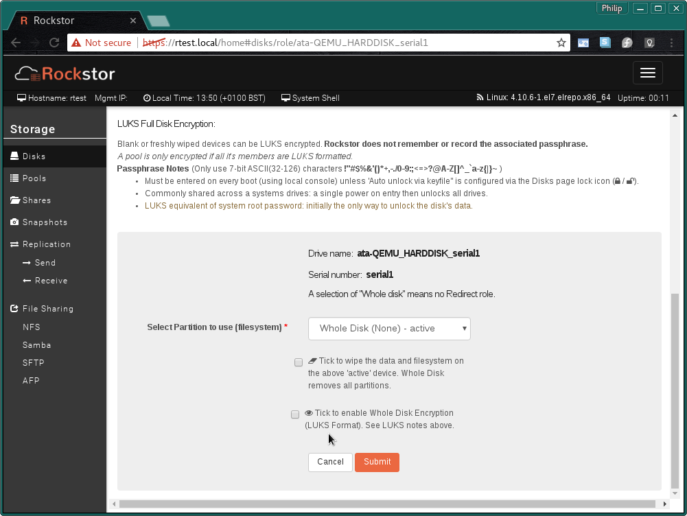
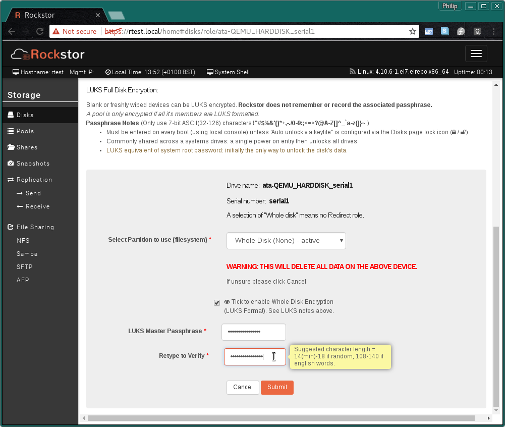
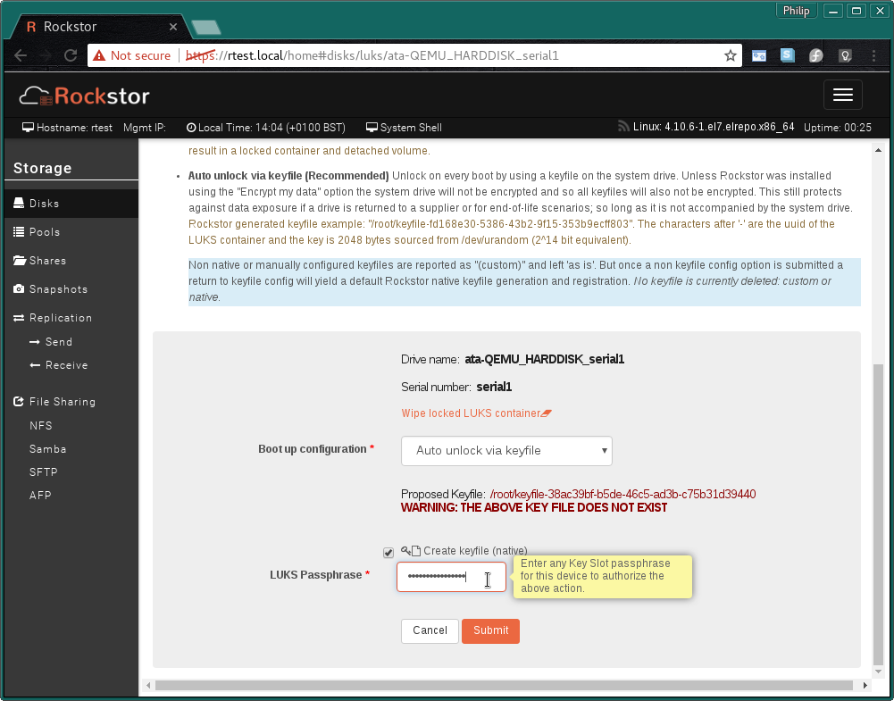
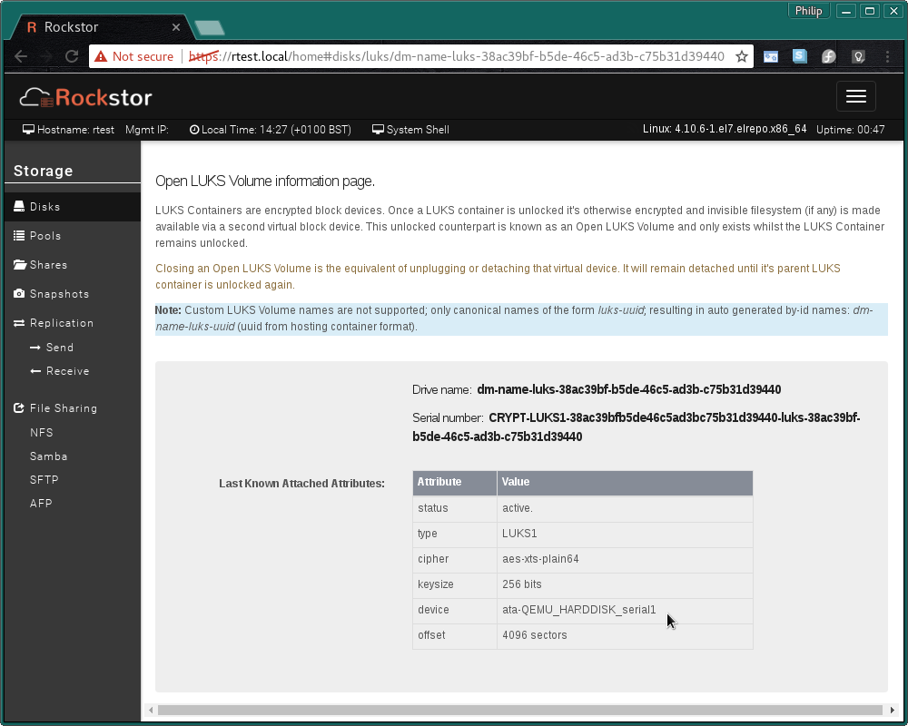

.. _luks:

LUKS Full Disk Encryption
=========================

LUKS `(Linux Unified Key Setup) <https://gitlab.com/philipg/cryptsetup/blob/master/README.md>`_
is a cross distribution, kernel based disk encryption standard. A central
component of which is that all necessary setup information is stored within
the format header; giving full decryption portability.

Rockstor adds user interface components to aid in the setup and configuration
of **Full disk LUKS Encryption** although the LUKS system itself can work
within partitions, Rockstor's UI does not support it. This helps to keep things
simple and in line with a 'single disk single use' remit.

.. _basic_luks_concepts:

Basic LUKS concepts
-------------------

Essentialy LUKS, at it base level, comprises a disk format. Once a disk is
**LUKS formatted** the system identifies the device as a LUKS Container, this
is indicated by a **lock/unlock icon** next to the associated disk. The
consequence of an unlocked container is a **counterpart Open LUKS Volume**
which is identified by an **open eye icon**. It is
this LUKS Volume that presents the contents (if any) of a LUKS Container.
The Volume itself only exists while it's container remains unlocked. In
Rockstor terms this means that a previously open LUKS Volume will become
detached (as in a previously attached/seen device) if it's container is not
opened on a subsequent boot.

Currently Rockstor provides no means by which any pool or volume is opened
or closed bar that established automatically at boot. Although all pools are
opened automatically, this is not the case by default with LUKS containers.
This is a design decision intended to allow flexibility and to promote
understanding of the mechanisms at play. Consequently using LUKS Full Disk
Encryption within Rockstor is a multi stage process.

.. _luks_in_two_steps:

LUKS in two steps
-----------------

To make use of LUKS within Rockstor one must first LUKS format a disk and then
configure the consequent container to be automatically opened during boot,
although manual options are catered for but not recommended).

.. _luks_format:

Step 1: LUKS Format
^^^^^^^^^^^^^^^^^^^

The **(LUKS Format)** option is located next to the **Tick to wipe..** option
on the *Configure drive Role / Wipe existing Filesystem / LUKS Format Whole
Disk.* page which is arrived at via the **? icon** next to blank devices:

Click the **? icon** - Assign an optional Whole Disk Role:

.. image:: assign_whole_disk_role.png
   :scale: 80%
   :align: center

The resulting *Role / Wipe / LUKS* page (only bottom half shown):

Ensure *Whole Disk (None)* is the active configuration.

Tick to enable Whole Disk Encryption (LUKS Format):

And enter your chosen **LUKS Master Passphrase**.
**Rockstor does not remember or record the associated passphrase**
If this passphrase is forgotten and you haven't competed
:ref:`luks_boot_up_config`, using the recommenced keyfile option, it will no
longer be possible to unlock you container and all data there in will be lost.

The resulting LUKS Containers (LUKS formatted disk) in the Disk Page:

.. image:: luks_container_icon.png
   :scale: 80%
   :align: center

The **lock icon** indicating a **LUKS Container**. Click this icon to set
the the Boot options for unlocking this container.

.. _luks_boot_up_config:

Step 2: Boot up Configuration
^^^^^^^^^^^^^^^^^^^^^^^^^^^^^

As the contents of a LUKS container is not available until it has been
unlocked and given Rockstor currently does all mounts and LUKS container
unlocks at boot time we must enable a means to unlock our container before it
can be used as a pool member.

The LUKS container configuration page has a description of all the available
options. But the recommended option is **Auto unlock via keyfile** as this
enables Rockstor to re-open the container upon boot without user intervention,
or a locally attached keyboard and screen, and also enable the re-opening of
LUKS volumes that have been freshly wiped.

The text against this option within the Web UI is repeated here for
convenience:

   **Auto unlock via keyfile (Recommended)** Unlock on every boot by using a keyfile
   on the system drive. Unless Rockstor was installed using the "Encrypt my data"
   option the system drive will not be encrypted and so all keyfiles will also
   not be encrypted. This still protects against data exposure if a drive is
   returned to a supplier or for end-of-life scenarios; so long as it is not
   accompanied by the system drive.
   Rockstor generated keyfile example:
   "/root/keyfile-fd168e30-5386-43b2-9f15-353b9ecff803". The characters after
   '-' are the uuid of the LUKS container and the key is 2048 bytes sourced from
   /dev/urandom (2^14 bit equivalent).

**Note that all members of a pool must share the same Boot up Configuration.**
Otherwise only some members will be unlocked and the pool will fail to mount.

.. image:: luks_boot_up_config_page.png
   :scale: 80%
   :align: center

Select the **Boot up Configuration** that best matches your use case.

When selecting the recommended **Auto unlock via keyfile**:

You must re-enter the LUKS Master passphrase you created in :ref:`luks_format`
or for advanced users, any other keyslot passphrase. This authorizes the
creation and registration of the proposed keyfile.

There after the UI returns to the :ref:`disks` page.

.. image:: open_luks_volume.png
   :scale: 80%
   :align: center

Once the *Boot up configuration* has been set and a reboot has taken place
the **Open LUKS Volume virtual block device** should appear with it's own
**eye icon** for a dedicated information page.

**Note:** Currently this device is auto started by systemd in the background
but only if *Auto unlock via keyfile* has been configured; it can take
up to 30 minutes to appear. This is a known inelegance and is slated to be
sorted shortly (ie to open the volume directly after the keyfile config is
applied). Please see the bold note at the base of this page.

Clicking on the **eye icon** next to the **Open LUKS Volume** opens the
**Open LUKS Volume information page:**.

Note the device indicated is that of the container, ie the drive 'LUKS
formatted' in :ref:`luks_format`.

.. _luks_pool_member:

LUKS Pool Member
----------------

The newly available *Open LUKS Volume* is now seen as any other blank
device and can similarly be used as a :ref:`pools` member.

**Remember that for a Pool to be encrypted all of it's members must be LUKS
volumes. It is not sufficient to have only a subset of a pool's members be
LUKS formatted.**

.. image:: luks_volume_indication_create_pool.png
   :scale: 80%
   :align: center

An example of how each Open LUKS Volume is also accompanied by it's
**eye icon** in all pool tables.

.. image:: luks_volume_indication_pools_page.png
   :scale: 80%
   :align: center

The pools page main table also indicates those members that are Full Disk
Encrypted.

And finally we see the **Whole drive is mapped to a pool** icon in our Disks
page:

.. image:: open_luks_volume_mapped.png
   :scale: 80%
   :align: center

**Please we aware that the LUKS UI components within Rockstor hide quite a
bit of complexity and are currently in the early stages of development. But
the LUKS system itself is stable.** If you experience any difficulties please
visit `our forum <http://forum.rockstor.com/>`_ and ask away.
