..  _mdraid_bootdrive_howto:

Mirroring Rockstor OS using Linux Raid
======================================

This howto represents an advanced install scenario and should not be required
for regular Rockstor use; but is provided as a guide on how to accomplish the
specific install arrangement of a redundant system disk install using the more
established technology of mdraid, the Linux software raid subsystem. Regular
install requirements are met by the default install process covered in
:ref:`quickstartguide` as this howto is specifically for an mdraid system disk
install.

Rockstor uses Anaconda, the CentOS default installer. Although there are many
gains to using an upstream installer our specific requirement in this howto of
btrfs root on top of mdraid is not catered for. Adding this ability to upstream
may well be possible but may also compromise Anaconda's usability. This is due
to the assumption in the installer that if one is using btrfs one will not be
using mdraid; due most likely to the redundancy of this option given btrfs has
raid capability build in. However, due to the btrfs filesytem's current maturity
level there are still arguments for using mdraid instead of btrfs's raid for the
system disk/disks.

That is the context of this howto and in part explains it's multi step
requirement / complexity but if all steps are followed in order then a working
system should result. That system however will require expert administration in
the event of a system drive failure.

Why mdraid for the OS
---------------------

It's a common and recommended practice to setup redundancy for the OS bits
while installing a mission critical Rockstor server. The idea is to combine two
Hard Disk Drives (HDDs) in a mirror configuration to house the OS. If one of the
HDDs fails, it can simply be swapped out with a new drive saving us from a
re-install or downtime.

In this howto we will use `Linux Raid
<https://raid.wiki.kernel.org/index.php/Linux_Raid>`_ to setup the redundant OS
drive mirror. This can be done as part of Rockstor's installation but requires
many more additional steps from a default,non mdraid, install. If you
have never installed Rockstor before, we recommend you read our
:ref:`quickstartguide` guide and watch `this install video
<https://www.youtube.com/watch?v=yEL8xMhMctw>`_ before proceeding with this
howto as the default, kickstarter based install method is recommended for most
users.

Requirements
------------

You need two HDDs to setup the mirror. We recommend HDDs of the same size and
brand for uniformity. The drives can be as small as 8GB but in practice they
are usually 100+ GB. In this howto we demonstrate with a pair of 8GB virtual
drives using VirtualBox and then VMM for the later sections to help distinguish
the sections of the install.

We will create a mirrored setup for each of **/boot**, **/** and **swap**
partitions. You should plan the sizing of each partition before proceeding
further. **/boot** can be as little as 1-2 GB and will store Kernels. **swap**
can be 1.5-4 GB or equal to the RAM in the system. **/** will store most of
the OS bits and should be at least 5.5GB, more the better. For demonstration
purposes in this howto, our **/boot** will be **1 GB**, our **swap** will be
**1.5 GB**, and our **root** will be all of the remainder ie **5.5 GB**

It is recommended not to have /boot and swap the same size as then it can be
more difficult to tell them apart in a disaster recovery scenario.

.. _mdraid_overview:

Overview of mdraid install
--------------------------

Due to the reasons outline above this install is unusual in that it requires
Rockstor be installed in effect twice. Once to setup mdraid and a second time
to setup btrfs on top of the first installs mdraid setup. We have also to use
the recovery system between these 2 installs in order that our btrfs / be
established ie:-

* Steps 1 - 6 Regular hand partitioned mdraid install with ext4 as the root fs.
* steps * - * Use Rescue mode to format our largest mdraid device as btrfs
* Steps * - * Install for the final time using the btrfs on mdraid filesystem.

Although this seems like a round about way to install it is currently the
simplest way without using a custom installer and only requires a single command
line intervention, helping to keep the process accessible to most users.

Step 1: Device Selection
^^^^^^^^^^^^^^^^^^^^^^^^

Start the Rockstor installation process and you'll soon see the **INSTALLATION
SUMMARY** screen. Click on **INSTALLATION DESTINATION** to go to the device
selection screen.

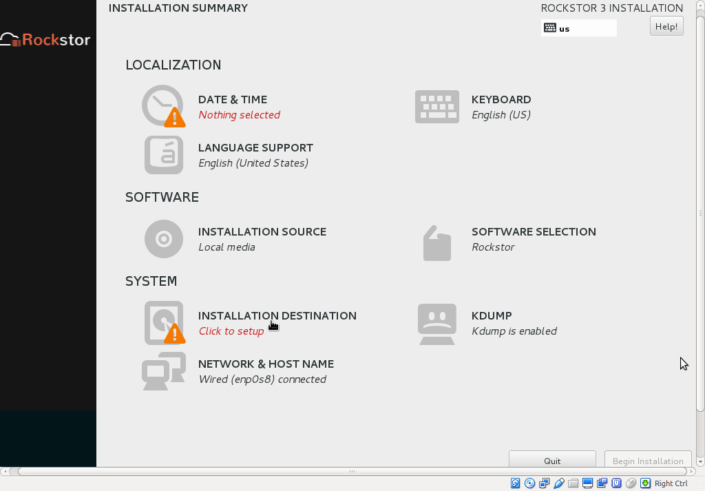

On the next screen, the two HDDs we are about to mirror should be
visible. Click to select them so that both are ticked. In the bottom half of
the screen, select *I will configure partitioning* radio button. Finally click
**DONE** at the top.

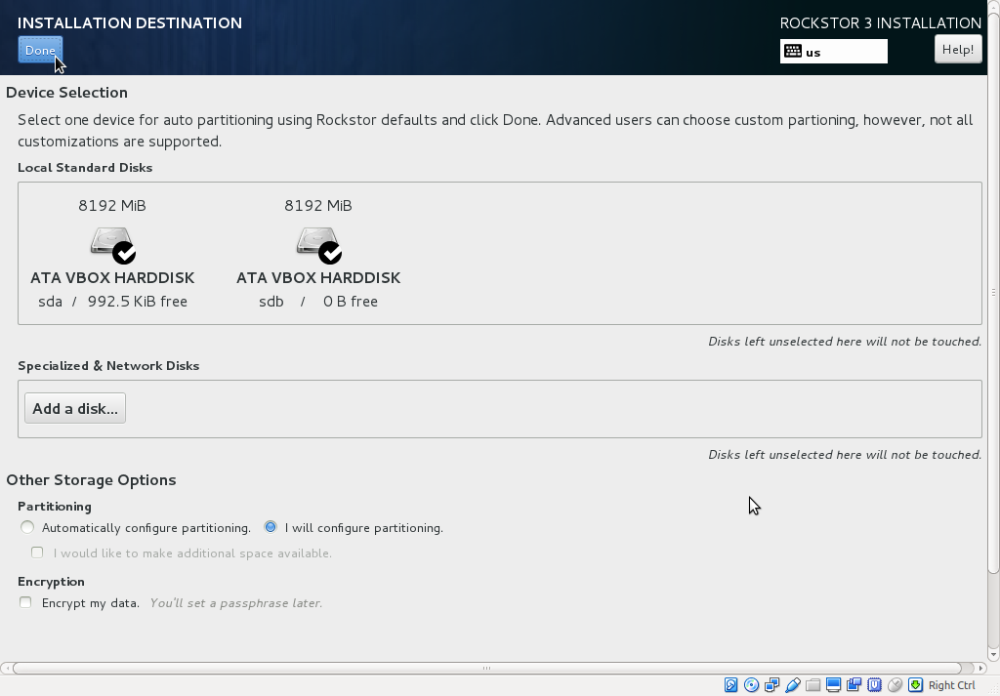

Step 2: Destroy old data, if any
^^^^^^^^^^^^^^^^^^^^^^^^^^^^^^^^

The next screen is titled **MANUAL PARTITIONING** as shown below. If there are
any partitions already on the two HDDs selected before, they will appear on the
left under a collapsible menu. If you don't see any, your HDDs are clean and
you can ignore this step. In our demonstration, HDDs are not clean and the
existing partitioning is titled **UNKNOWN**

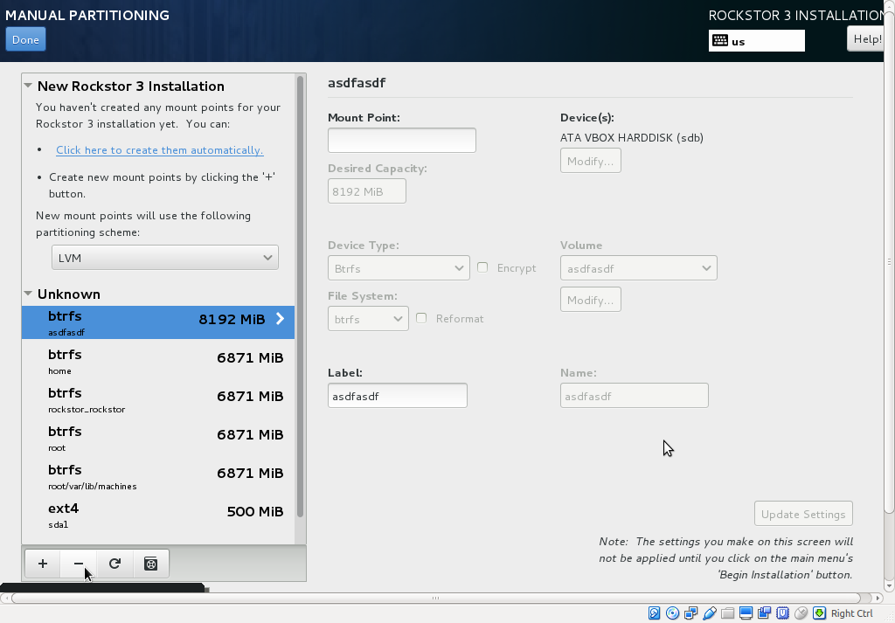

Click on the **-** button at the bottom to delete these partitions. Repeat this
process until all of them are deleted.

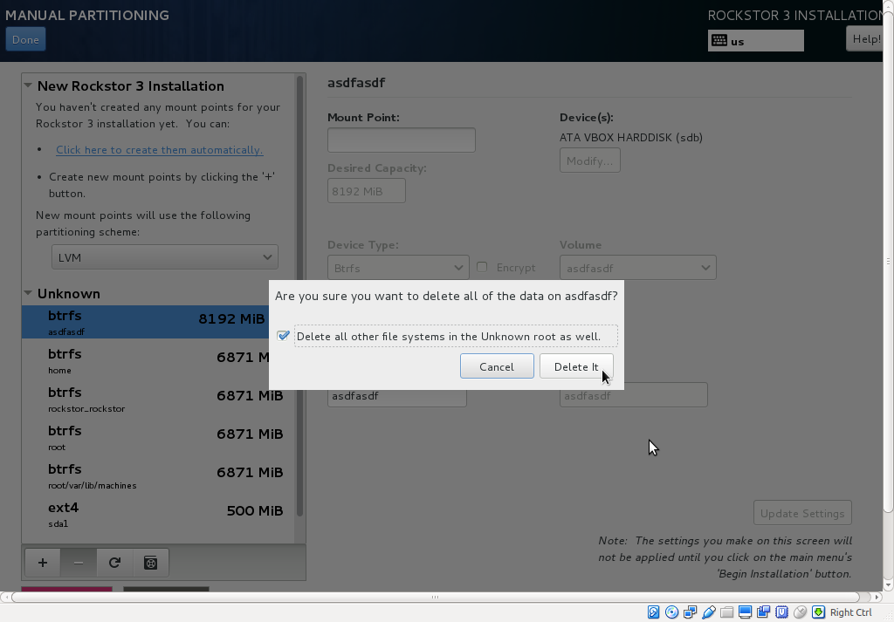

Step 3: Setup **/boot** partition
^^^^^^^^^^^^^^^^^^^^^^^^^^^^^^^^^

Select **Standard Partitioning** from the drop down menu and click the **+**
button at the bottom left to create a new partition.

.. image:: manual_partitioning_3.png
   :scale: 85%
   :align: center

A popup window will appear titled **ADD A NEW MOUNT POINT**. Select **/boot**
from the drop down, enter the size you planned out earlier (minimum 1GB) and
click *Add mount point* button.

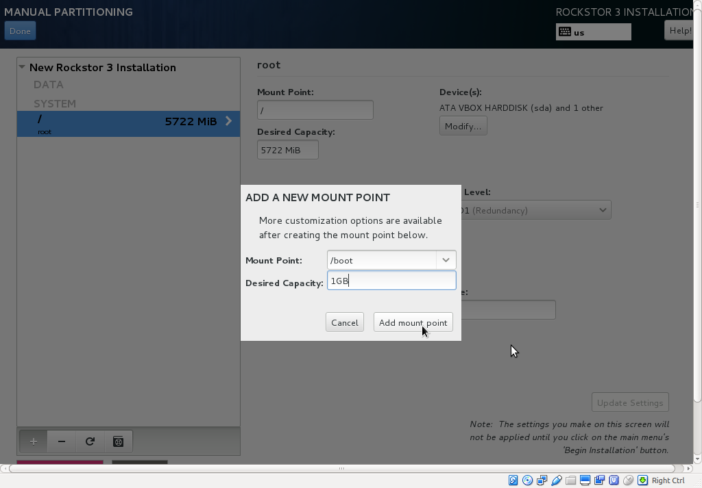

On the next screen, select **RAID** under **Device Type**, **RAID 1** under
**RAID Level** (the default) and **ext4** under **File System**. Click
*Update Settings* button (bottom right) to finalize the **/boot** partition
setup.

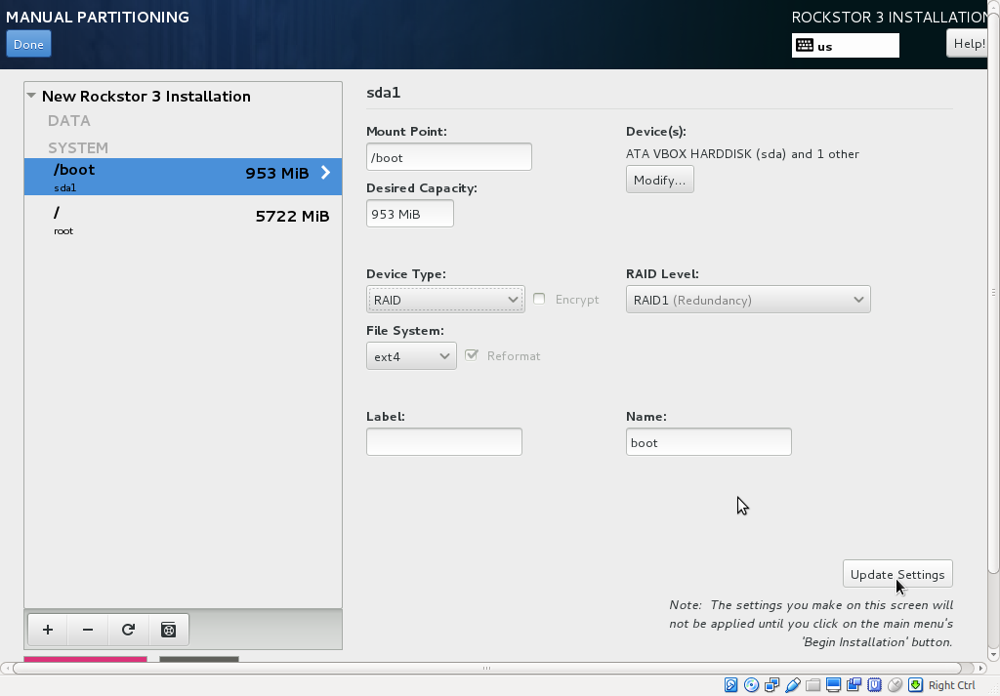

Step 4: Setup **swap** partition
^^^^^^^^^^^^^^^^^^^^^^^^^^^^^^^^

Click on **+** button at the bottom left to add the **swap** partition. The
procedure is just like above but pick **swap** from the drop down, enter the
appropriate size (1.5-4GB recommended) and click *Add mount point*.

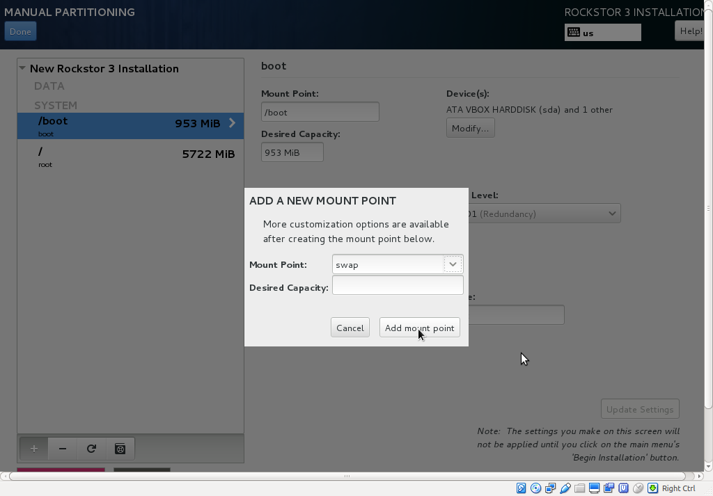

On the next screen, select **RAID** under **Device Type**, **RAID 1** under
**RAID Level** (the default) and **swap** under **File System**. Click
*Update Settings* button (bottom right) to finalize **swap** partition setup.

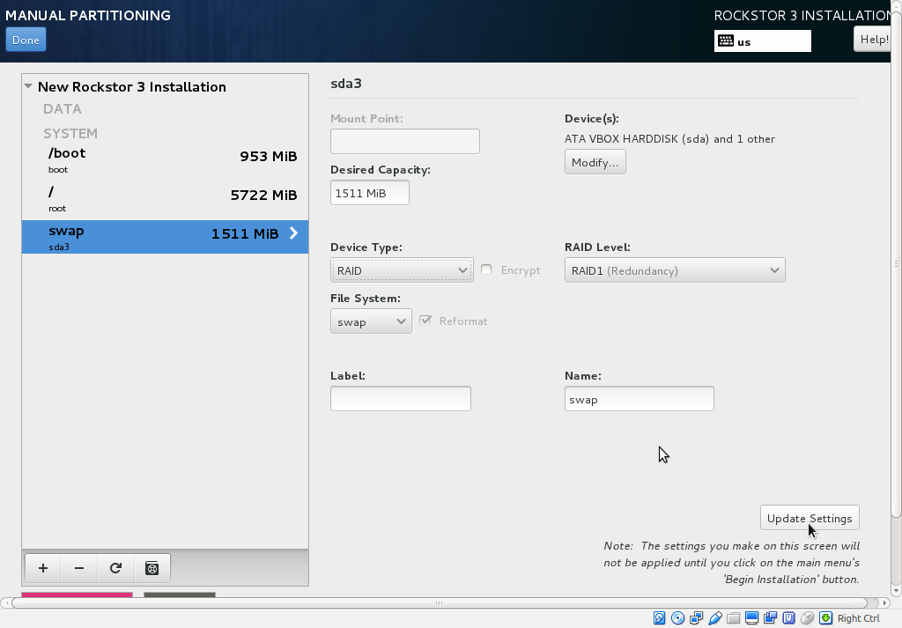

Redundancy on the swap partition may well introduce a performance overhead, but
it does allow for hot replacement of a system raid drive if all partitions on
the drive are setup with mdraid giving greater protection from drive faults.
Otherwise it would be necessary to shut the machine down prior to removing
or replacing a raid member drive. If live replacement is not a requirement or
your hardware doesn't support hot swapping then you can keep the default
**Standard Partitioning** selection. This will result in a single drives swap
being used until full and then the second drives swap will be used there after.
Assuming a swap partition is placed on each drive. Note that this will not
protect against drive failure as there will be no redundant mdraid device under
the swap device.

Step 5: Setup **/** partition
^^^^^^^^^^^^^^^^^^^^^^^^^^^^^

Just like in **/boot** above, click on the **+** button and pick **/** from
the drop down. Leave the size field blank and all of the remaining space will be
used. As we planned the sizes ahead of time, this will come out to be at least
the minimum size given our install devices of 8 GB minus the /boot and root
partitions. If we are using a larger than minimum system drive then any
remaining space will result in a larger root partition which is where the space
will be most useful anyway.

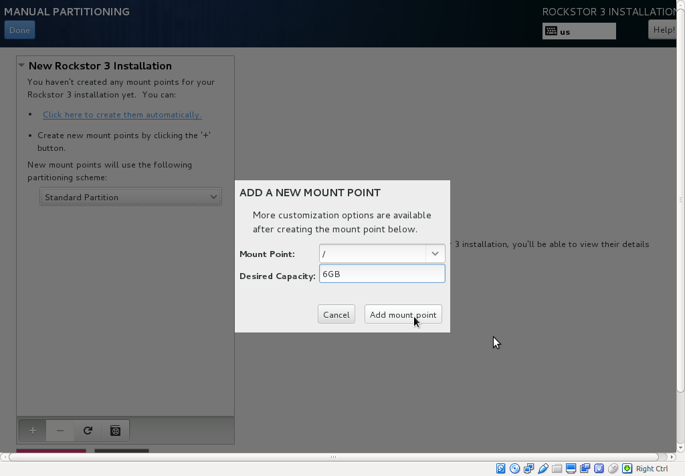

On the next screen, select **RAID** under **Device Type** and **RAID 1** under
**RAID Level**. Click the *Update Settings* button to finalize the **/**
partition setup.

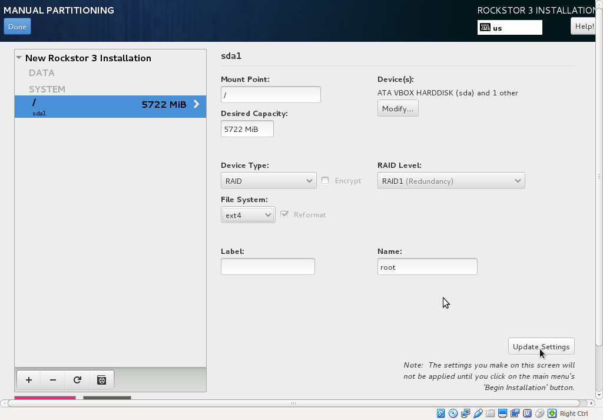

Step 6: Accept Changes and proceed
^^^^^^^^^^^^^^^^^^^^^^^^^^^^^^^^^^

Click **DONE** at the top left of the screen and then click on **Accept
Changes** to finalize the manual partition scheme. N.B. due to edits in this
document the *Destroy Format* entries are not reflective of the removed
partitions indicated earlier. Depending on your existing partitions if any
these entries will vary.

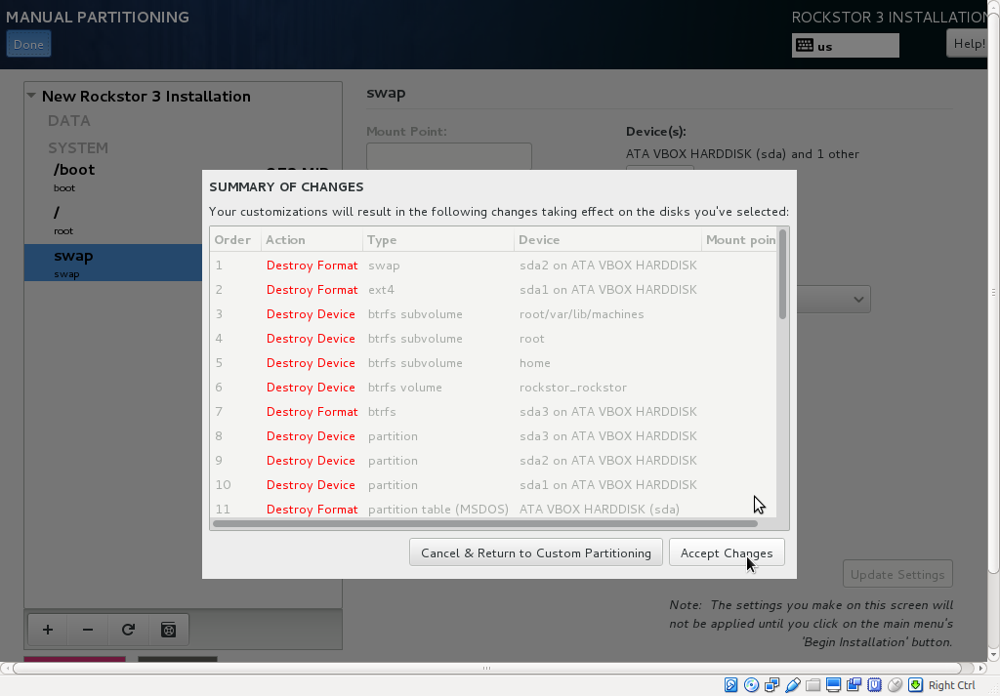

Note also in the above how the installer is about to create new partition
tables on both devices and the associated partitions and the mdraid device
counterparts for each of the /boot, swap, and / mount points.

The installer will then display the **INSTALLATION SUMMARY** screen. Click on
*Begin Installation* button at the bottom right to start the install. In this
demonstration, we did not show other configurations such as selecting Time Zone
and making sure there's network connectivity. If you need assistance with these
refer to our :ref:`quickstartguide` guide.

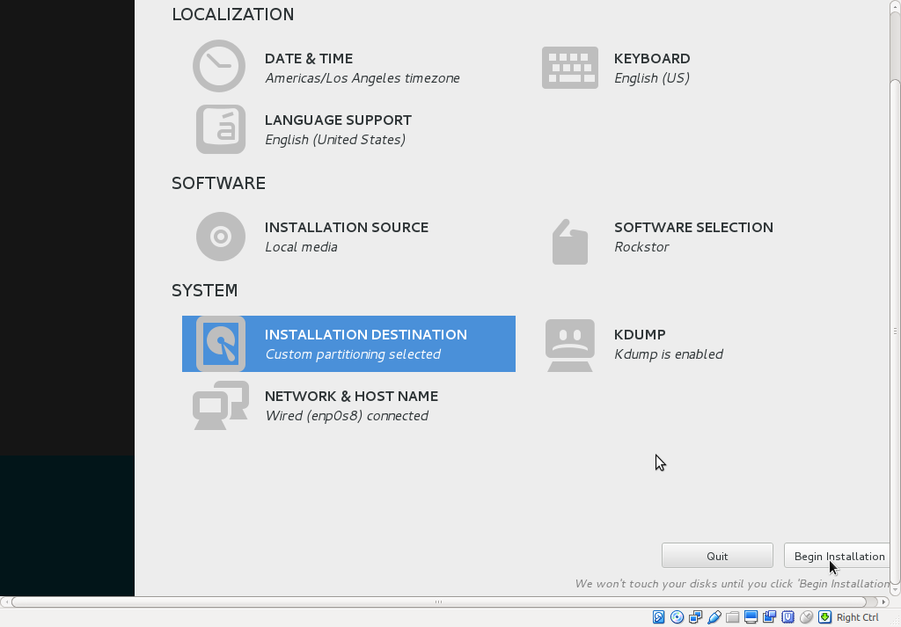

Verification of the mirror
--------------------------

It's a good idea to verify the setup once the installation is finished. You can
do that simply with the following command ::

  # cat /proc/mdstat
  Personalities : [raid1]
  md125 : active raid1 sdb2[1] sda2[0]
        976832 blocks super 1.0 [2/2] [UU]
        bitmap: 0/1 pages [0KB], 65536KB chunk

  md126 : active raid1 sda1[0] sdb1[1]
        5859328 blocks super 1.2 [2/2] [UU]
        bitmap: 1/1 pages [4KB], 65536KB chunk

  md127 : active raid1 sda3[0] sdb3[1]
        1546240 blocks super 1.2 [2/2] [UU]

Note that the actual block values will vary for different partition sizes.

The three md* devices correspond to the mirror configuration we setup earlier
during the install. Note that each partition is mirrored (raid1) where the
counterparts of the mirror are from different drives (**sda** and **sdb** in
our example). We can also verify that **/** and **/boot** are mounted and are
the right size with the following command ::

  # df -h | grep md
  /dev/md126      5.4G  1.4G  3.8G  28% /
  /dev/md125      923M  100M  761M  12% /boot

The specific md* device names may vary from install to install, this is why it
is a nice idea to have no 2 md devices of equal size ie /boot 1G and swap 1.5G
as it can make discerning a partitions function easier in a crash recovery
scenario.

Note that the installer will by default continue this raid building / resync
process on first boot which may reduce the systems performance. If you are
experiencing slow response times on the first boot after install check the raid
status using the above cat command. On slow hardware it may be advisable to
wait until all the md devices have completed their resync. This could take
anywhere from minutes to hours, but an estimated time left is given for each md
device listed.

Disaster Recovery
-----------------

Up to this point, we have setup the mirror and verified that everything looks
good. Over time, usually after a long time, one of the HDDs may start throwing
errors indicating that it's time to replace it. The following steps will guide
you through that process.

Step 1: Remove failing HDD
^^^^^^^^^^^^^^^^^^^^^^^^^^

If your hardware supports hot swapping HDDs, and you chose RAID1 for all your
partitions, then you can pull out the failing drive and leave the system
running while you replace it with a new HDD. After removing the failing drive,
the System continues to run normally, but the mirror is no longer redundant
as shown in the below output (note sdb parts are missing) ::

  # cat /proc/mdstat
  Personalities : [raid1]
  md125 : active raid1 sda2[0]
        976832 blocks super 1.0 [2/1] [U_]
        bitmap: 0/1 pages [0KB], 65536KB chunk

  md126 : active raid1 sda1[0]
        5859328 blocks super 1.2 [2/1] [U_]
        bitmap: 1/1 pages [4KB], 65536KB chunk

  md127 : active raid1 sda3[0]
        1546240 blocks super 1.2 [2/1] [U_]

Step 2: Add a replacement HDD
^^^^^^^^^^^^^^^^^^^^^^^^^^^^^

The next step is to replace the removed HDD with a new one. The same size and
brand is recommended, to keep things uniform. In our demonstration, I've added a
new 8GB virtual drive (similar to the failed HDD) and it appeared as **sdb** to
the system.

Step 3: Partition the replacement HDD
^^^^^^^^^^^^^^^^^^^^^^^^^^^^^^^^^^^^^

The replacement HDD must be partitioned, much like during OS install. But this
time we'll use command line tools. The advantage of using the same
size HDD is that we can just copy the partition scheme from the functioning
HDD. In our demonstration, **sda** is the still functioning HDD and it's
partition table looks as follows ::

  # sfdisk -d /dev/sda
  # partition table of /dev/sda
  unit: sectors

  /dev/sda1 : start=     2048, size= 11726848, Id=fd
  /dev/sda2 : start= 11728896, size=  1953792, Id=fd, bootable
  /dev/sda3 : start= 13682688, size=  3094528, Id=fd
  /dev/sda4 : start=        0, size=        0, Id= 0

We can copy the partition table of **sda** to **sdb** with the following
composite command ::

  # sfdisk -d /dev/sda > /tmp/sda.pt; sfdisk /dev/sdb < /tmp/sda.pt; rm -f /tmp/sda.pt
  Checking that no-one is using this disk right now ...
  OK

  Disk /dev/sdb: 1044 cylinders, 255 heads, 63 sectors/track
  Old situation:
  Units: cylinders of 8225280 bytes, blocks of 1024 bytes, counting from 0

     Device Boot Start     End   #cyls    #blocks   Id  System
  /dev/sdb1          0       -       0          0    0  Empty
  /dev/sdb2          0       -       0          0    0  Empty
  /dev/sdb3          0       -       0          0    0  Empty
  /dev/sdb4          0       -       0          0    0  Empty
  New situation:
  Units: sectors of 512 bytes, counting from 0

     Device Boot    Start       End   #sectors  Id  System
  /dev/sdb1          2048  11728895   11726848  fd  Linux raid autodetect
  /dev/sdb2   *  11728896  13682687    1953792  fd  Linux raid autodetect
  /dev/sdb3      13682688  16777215    3094528  fd  Linux raid autodetect
  /dev/sdb4             0         -          0   0  Empty
  Warning: partition 1 does not end at a cylinder boundary
  Warning: partition 2 does not start at a cylinder boundary
  Warning: partition 2 does not end at a cylinder boundary
  Warning: partition 3 does not start at a cylinder boundary
  Warning: partition 3 does not end at a cylinder boundary
  Successfully wrote the new partition table

  Re-reading the partition table ...

  If you created or changed a DOS partition, /dev/foo7, say, then use dd(1)
  to zero the first 512 bytes:  dd if=/dev/zero of=/dev/foo7 bs=512 count=1
  (See fdisk(8).)

Step 4: Rebuild the mirror
^^^^^^^^^^^^^^^^^^^^^^^^^^

This is the final and crucial step. We'll resync the partitions of the
replacement HDD with its working counterpart in the mirror. This can be done
with the following composite command ::

  # mdadm --manage /dev/md125 --add /dev/sdb2; mdadm --manage /dev/md126 --add /dev/sdb1; mdadm --manage /dev/md127 --add /dev/sdb3
  mdadm: added /dev/sdb2
  mdadm: added /dev/sdb1
  mdadm: added /dev/sdb3

After the above step, the mirror is re-synchronized. It will take some time
proportional to your HDD size. You can monitor the progress and confirm the
finish by looking at the contents of the **/proc/mdstat** file as shown here ::

  # cat /proc/mdstat
  Personalities : [raid1]
  md125 : active raid1 sdb2[2] sda2[0]
	976832 blocks super 1.0 [2/2] [UU]
	bitmap: 0/1 pages [0KB], 65536KB chunk

  md126 : active raid1 sdb1[2] sda1[0]
	5859328 blocks super 1.2 [2/1] [U_]
	[=============>.......]  recovery = 68.0% (3985280/5859328) finish=2.0min speed=15366K/sec
	bitmap: 1/1 pages [4KB], 65536KB chunk

  md127 : active raid1 sdb3[2] sda3[0]
	1546240 blocks super 1.2 [2/1] [U_]
	  resync=DELAYED

  unused devices: <none>

Note the estimated time for completion on md126 above ie **finnish=2.0mins**

The above output indicates that md125 and md127 have finished their recovery
(re-sync), but md126 is at 68%. It is completed after a short while as shown
again here. ::

  # cat /proc/mdstat
  Personalities : [raid1]
  md125 : active raid1 sdb2[2] sda2[0]
	976832 blocks super 1.0 [2/2] [UU]
	bitmap: 0/1 pages [0KB], 65536KB chunk

  md126 : active raid1 sdb1[2] sda1[0]
	5859328 blocks super 1.2 [2/2] [UU]
	bitmap: 0/1 pages [0KB], 65536KB chunk

  md127 : active raid1 sdb3[2] sda3[0]
	1546240 blocks super 1.2 [2/2] [UU]

  unused devices: <none>

That completes the disaster recovery section and the howto!
