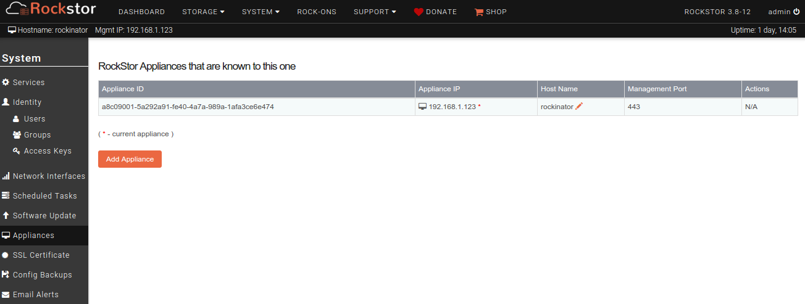
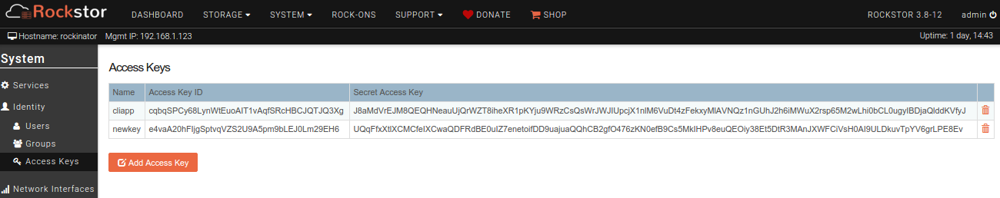

Multiple Rockstor appliances
============================

Rockstor runs on a single node or appliance, and can be managed with it's
Web-UI from a client computer's browser. Multiple appliances running Rockstor
are their own independent servers manageable from their respective
Web-UI's. However, features such as Rockstor-to-Rockstor replication require
the two appliances to be able to communicate with each other. Besides, it's
convenient to be able to hop from one appliance's UI to the other easily.

Every Rockstor appliance has a list of all appliances it's setup to communicate
with. They can be managed from **System -> Appliances** menu. By default, the
list only contains itself.

Access Keys
-----------

Access Keys are authentication credentials that can be used to communicate with
a Rockstor appliance's API directly. They are similar to username and password
credentails used to login to the Web-UI, but are meant for applications to
program directly using the API. Access keys can be managed under **System ->
Access Keys** menu.

In the above example, there are two keys. **cliapp** is generated by default
duing OS installation, whereas **newkey** is later created by me. A key has two
components, an *ID* and a *Secret*. Access keys are required for one Rockstor
appliance to communicate with another programatically. **cliapp** is also used
internally within a single appliance.

.. _add_appliance:

Adding a remote Rockstor appliance
----------------------------------

To add a remote Rockstor appliance to the list, click on the *Add Appliance*
button. Note that for this to work, the remote appliance must be reachable over
the network. In a common scenario, the remote appliance is inside the same LAN
or setup with appropriate firewall rules so the access is not restricted to it.

.. image:: images/add_appliance_form.png
   :scale: 85%
   :align: center

Each input field has a helpful tooltip displayed when you mouse over it. Remote
**Appliance IP or Hostname** should be resolvable from the current
appliance. The **Management Port** refers to the management port of remote
appliance's Web-UI and defaults to **443**.

**Access Key ID** and **Access Key Secret** are the credentials of
the remote appliance. They can be obtained from **System -> Access keys** menu
of the remote appliance's Web-UI. Any available key, including the default
**cliapp** can be used.

.. image:: images/add_appliance_form2.png
   :scale: 85%
   :align: center

In the above example, the remote appliance being added is identified by it's
ip(**192.168.1.123**) and I used credentials of a new access key created on it
earlier. Note that every field in this form refers to the information of the
remote appliance.

Many remote appliances can be added. There are three appliances including itself
in the below example.

.. image:: images/appliance_list.png
   :scale: 85%
   :align: center

Clicking on an entry in the **Appliance IP** column will take you to the Web-UI
of that remote appliance.

Pairing up two Rockstor appliances
----------------------------------

So far, I've demonstrated how to add a remote Rockstor appliance to a given
Rockstor appliance. This is a symmetric feature and appliances can be added to
each other. By doing so, both appliances can communicate with each other
directly. This is necessary for certain features like Rockstor <--> Rockstor
replication of Shares.
