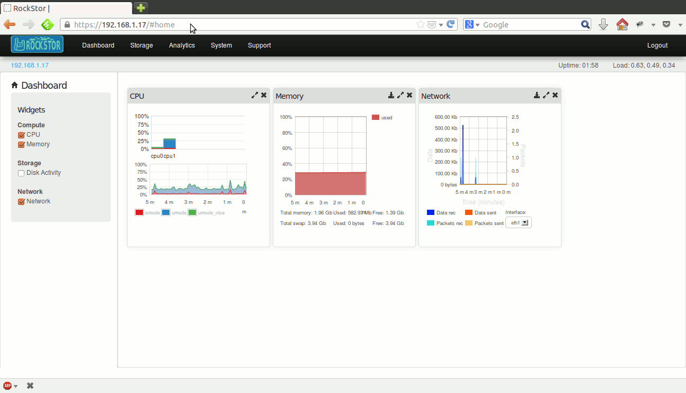

Multiple Rockstor appliances
===================================

Rockstor provides a simple way to manage multiple appliances. The web-ui is
designed to manage a single appliance at once. However, switching between
web-uis of multiple appliances is easy. In addition, appliances can be made
aware of each other.

.. _add_appliance:

Add a new Rockstor appliance
----------------------------

Suppose there are two Rockstor appliances that are fully setup. Their web-uis
can be accessed individually as expected. However, for convenience, the second
appliance can be added to the first's configuration. In the top left corner of
the web-ui under the logo is the ip address of the appliance. Click on it and
the Appliances popup window will open. Now click on the **Add Appliance**
button and submit the form as shown below.

From the Appliances popup, clicking on an appliance's ip will open it's
web-ui. Besides the convenience of management, adding an appliance is necessary
inorder to replicate shares to it.
