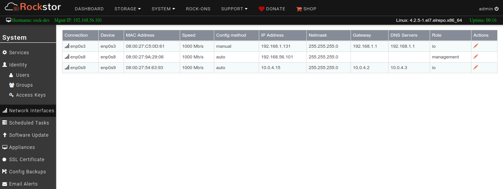
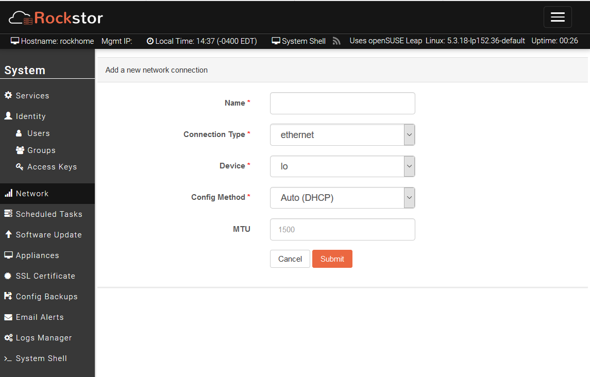
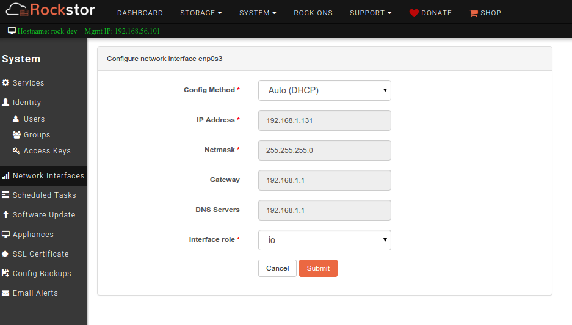
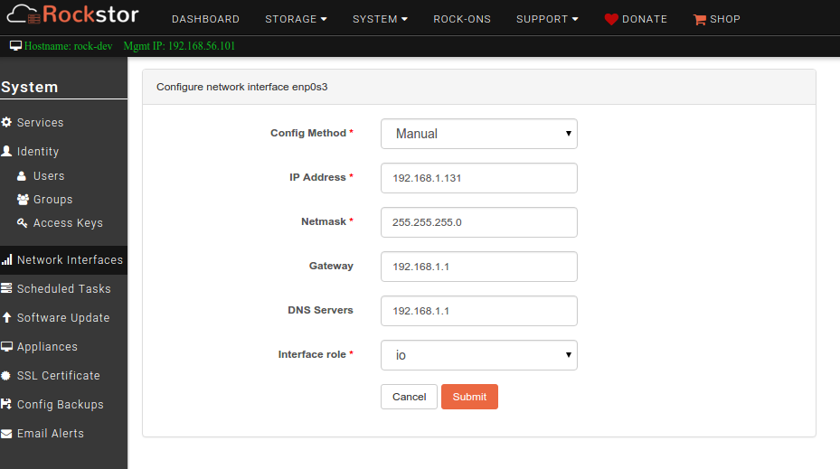

.. _network_config:

Network configuration
=====================

Rockstor supports basic network configuration from the Web-UI. Network
interfaces can be configured with DHCP or Static IP
configuration. Configuration using the Web-UI is intuitive and self guided with
helpful tooltips for each input field.

To view or configure network, navigate to **Network Interfaces** screen under
the **System** tab. Rockstor fetches the current state and lists all ethernet
devices and connection information on this screen.

Clicking on a **connection name** will provide additional information on its
member device(s), including its *name*, *type*, *MAC address*, *MTU*, and
*Status code*. For convenience, all network devices detected on the system are
listed with their respective details in the table at the bottom of the page.
If the connection is a rocknet (see :ref:`network_add_connection_docker`), the
information will include the attached containers and their rock-on (if any).

.. _network_add_connection:

Adding a network connection
---------------------------

To **add** a network connection, simply click on the **Add Connection** button.

The following types of connection can be chosen:

- Ethernet
- Team
- Bond
- Docker

.. _network_add_connection_docker:

Docker network (Rocknet)
^^^^^^^^^^^^^^^^^^^^^^^^

Choosing the **docker** type will create a user-defined docker bridge network
(referred to as **rocknet** in Rockstor). Such docker bridge networks
(rocknets) differ from the default docker network and allow for advanced
customizations of rock-ons and communication both within and between rock-ons.
Rocknets can, for instance, be used to connect several rock-ons with each
other, granting external access to some, while preventing it from others. As a
result, docker networks (rocknets) are ideal ways to connect a front-end
container to a back-end database container, or connect multiple rock-ons
together hidden behind a reverse-proxy rock-on. Please see the
`docker's documentation <https://docs.docker.com/network/bridge/>`_
for further details on the different features and settings of such networks.

.. note::

   Please see :ref:`rockons_edit_rocknets` for how to connect rock-ons.

.. _network_reconfig:

Re-configuring the Network
--------------------------

To **alter** the network configuration **click** on the **pen icon** next to
the connection **Name**. Please be aware though that altering the network
configuration of the interface over which you are currently communicating with
Rockstor can be problematic as once submitted you will have to manually change
the IP used to access Rockstor's Web-UI.

.. _network_dhcp:

Auto (DHCP)
^^^^^^^^^^^

DHCP is a very common and easy way to configure a network interface. This is
the default/recommended method for home-office/small-office type
deployments. Just select *Auto (DHCP)* in the **Config Method** dropdown and
submit. An example of this default configuration is shown below.

.. _static_ip:

Manual (Static IP)
^^^^^^^^^^^^^^^^^^

It is more common to use Static IP configuration in commercial
installations. Select *Manual* in the **Config Method** dropdown and provide
appropriate input. The following is an example of a Static IP configuration.

Network Bonding and Teaming
^^^^^^^^^^^^^^^^^^^^^^^^^^^

Network bonding and teaming can be configured from the Web-UI. While further
documentation will be coming here soon, please visit our
`friendly forum <https://forum.rockstor.com/>`_ for questions and resources in
the meantime.

Implementation details
^^^^^^^^^^^^^^^^^^^^^^

NetworkManager is used to configure and manage connections. For more
information see `implementation details
<http://forum.rockstor.com/t/network-management-implementation-details/441>`_.
