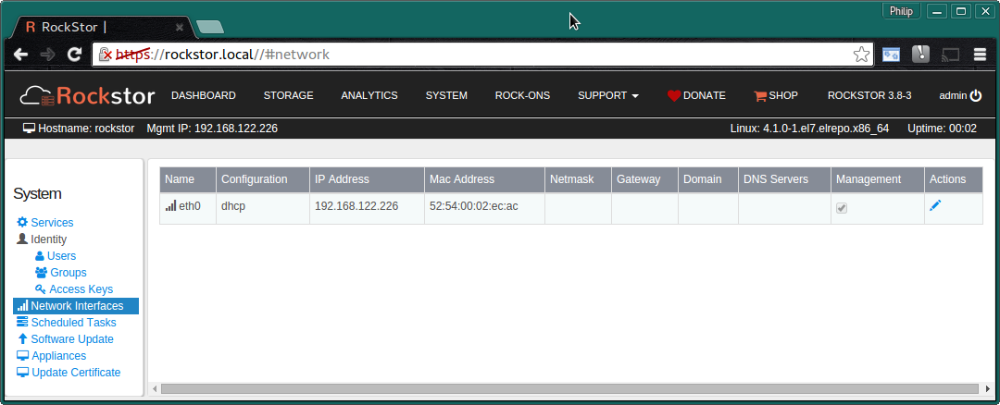
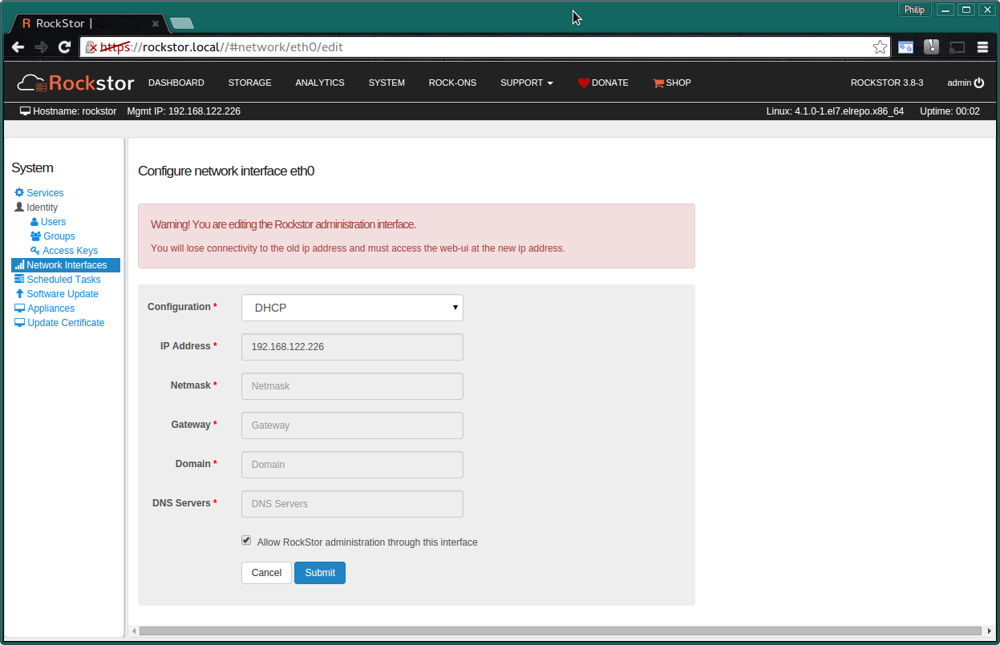
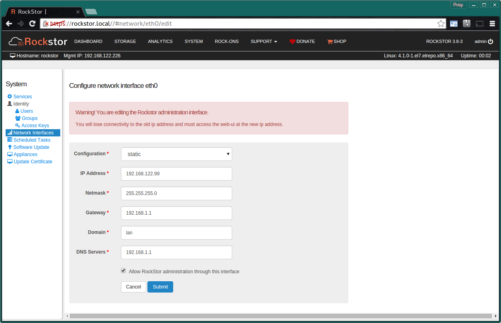
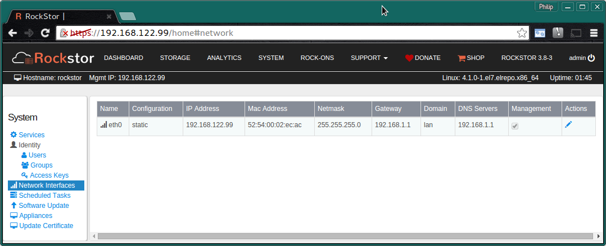

.. _network_config:

Network configuration
=====================

Rockstor's network configuration is found on the **System page** under the
**Network Interfaces** section ie:-

Note the **Configuration** column indicating **DHCP**.

.. _network_reconfig:

Re-configuring the Network
--------------------------

To **alter** the network configuration **click** on the **pen icon** in the
**Actions column**. Please be aware though that altering the network
configuration of the interface over which you are currently communicating with
Rockstor can be problematic as once submitted you will have to manually change
the IP you use to access Rockstor's WebUI interface.

.. _network_dhcp:

DHCP
^^^^

The default network configuration established during Rockstor install is of the
DHCP (Dynamic Host Configuration Protocol) type
which is the most common and compatible configuration for general purpose use,
this is what is most commonly used in home office / small office arrangements.
An example of this default configuration is show below. Note the warning in red.

**Submit** button to **confirm** the configuration. The above is the edit panel
of an existing **DHCP** configuration.

.. _static_ip:

Static IP
^^^^^^^^^

A more usual configuration for Rockstor in professional installations is of the
Static IP variant. This simply means assigning a stationary, unchanging IP to
Rockstor's network port.  This requires knowledge of your specific network and
should not be required for home use, it is however a very common configuration
in pro server installs. If you are assigning a static IP to Rockstor, or any
machine instance for that matter, make sure to use an address that is not also
in your DNS server's dynamic pool range. The following is an example of a
Static IP configuration.

**Submit** button to **confirm** the configuration.

In the following image we see the results of applying the above static IP
configuration

Note the **configuration column** entry has changed to **static** and the
additional details are now displayed.

**N.B. The URL was manually changed to reference this static IP.**