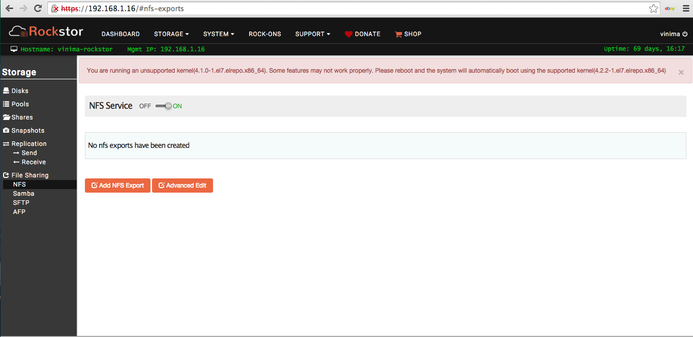
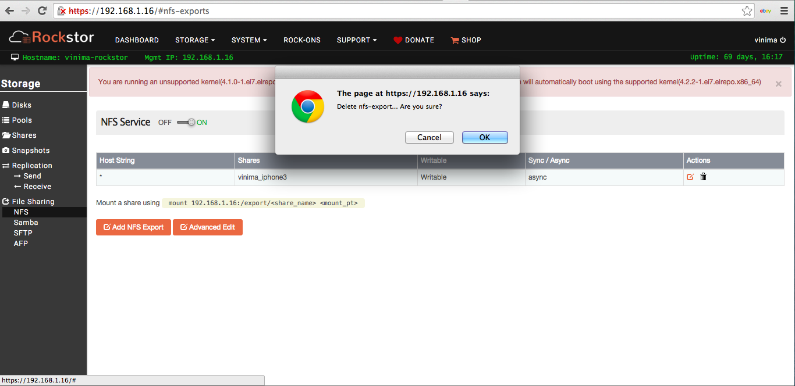

.. _nfs:

Network File System (NFS)
=========================

Export Shares via NFS
---------------------

Rockstor uses Linux NFS server to support exporting Shares to remote clients
via NFS. Both NFS v3 and v4 are supported. UID and GID mapping for the exported
shares can be handled by manually creating users or by using directory services
like LDAP, NIS or AD.

To manage NFS exports, click on *NFS* under the *Storage* tab in the Web-UI. If there are any exports in the system, they are displayed in a table. If there are large number of exports, the table is paginated and the current page number is displayed below the table along with **Prev** and **Next** buttons.

The display can be sorted by individual columns by clicking small up/down
arrows displayed in each column header.

Below are the main operations possible from the *NFS* view, which
operate on one or more shares and is a convenient way to manage exports for the
entire system. Rockstor also makes NFS export management possible for a
specific share from within the *NFS* tab of a share's detail view.

Add NFS export
^^^^^^^^^^^^^^

A single NFS export represents a unique combination of clients to which a set
of shares are made accessible via chosen options. Go to the *NFS* view under the *Storage* tab of the Web-UI and click on **Add NFS Export** button to add a new NFS export as shown in the video below.

.. youtube:: https://www.youtube.com/watch?v=4xRsIIbXYXI

Various fields of the form are explained as follows.

* **Shares to export**: Choose one or more shares to be exported.
* **NFS Clients** or **Host String**: This field can be a single host, comma sep  arated host names,hostnames with wildcards or IP networks. This field can be c  omplex. For a detailed explanation, read the `manpage <http://linux.die.net/ma  n/5/exports>`_ of exports.
* **Writable**: Choose ro to make the share(s) available read-only or rw for
  read-write.
* **Sync**: async mode is the default and the norm. For synchronous IO, select
  sync.

Edit NFS export
^^^^^^^^^^^^^^^

An NFS export can be edited to add or remove a Share or allow different set of
clients to be able to access it. In the displayed table of NFS exports under the *NFS* view of the Web-UI, click on the **edit** icon of the corresponding export to edit as shown in the video below.

.. youtube:: https://www.youtube.com/watch?v=OSs6BteniX0

Advanced Edit
^^^^^^^^^^^^^

Delete NFS export
^^^^^^^^^^^^^^^^^

In the Web-UI, click on the *Storage* tab to
enter the main Storage view. Now click on *NFS* in the left sidebar to
enter *NFS* view. In the displayed table of NFS exports, click on the
**trash** icon of corresponding export to delete as shown below.

