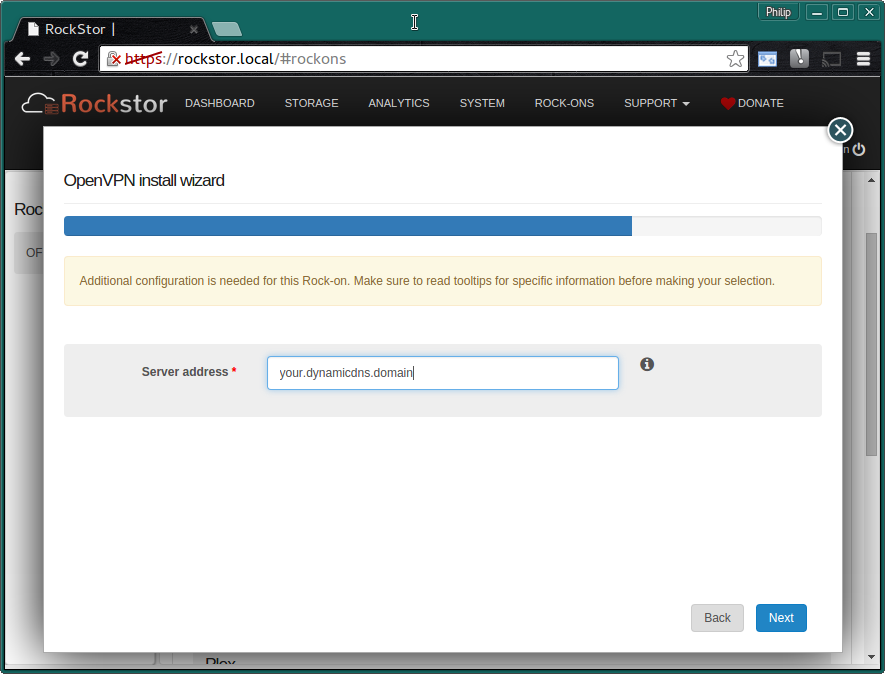
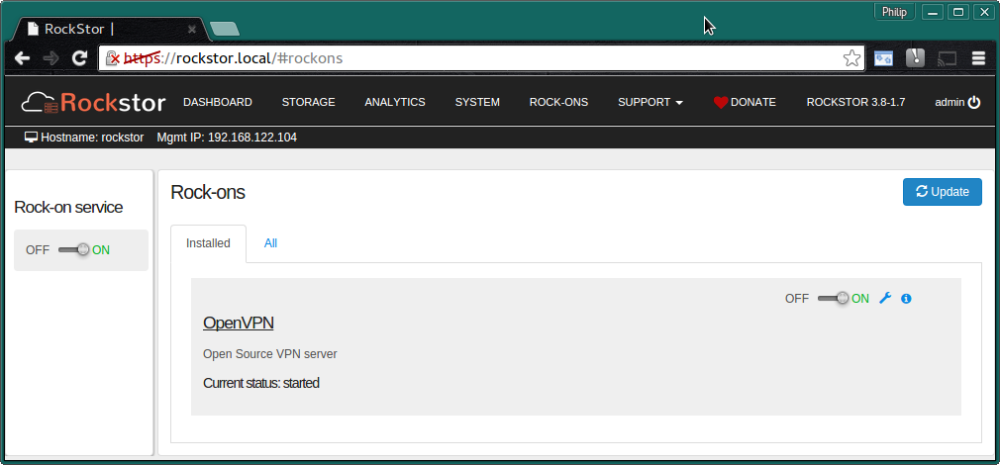

.. _openvpn_rockon:

OpenVPN Server Rock-on
======================

Please be aware of the common prerequisites for all Rockstor :ref:`rockons_intro`;
specifically the :ref:`rockons_preinstall` and :ref:`rockons_root`
requirement.

What is OpenVPN
---------------

This Rock-on installs an `OpenVPN <https://openvpn.net/>`_ or Open (as in Open
Source) Virtual Private Network Server.  This is a network technology that creates a
private encrypted *tunnel*, usually over the internet.  In combination with client
software installed on another machine that initiates one end of the tunnel, this
server forms the other end of this tunnel and does so at the request of the
client software.

OpenVPN Requirements
--------------------

To use this OpenVPN server you will need an internet name, otherwise
called a hostname, that point back to your Rockstor's internet gateway.  This
allows the client software to be able to find your Rockstor machine on the
internet; see :ref:`openvpn_hostname` detailed below.

The OpenVPN Port
^^^^^^^^^^^^^^^^

The OpenVPN install wizard will first request that you set a port and will
suggest the default:-

.. image:: openvpn_port.png
   :scale: 100%
   :align: center

You may well have to open and forward the configured port on your Rockstor's
internet gateway router back to the Rockstor machine.  This effectively makes at least
this port on Rockstor appear on your routers red (internet) interface. The client OpenVPN
software can then talk directly and securely to your Rockstor's OpenVPN Rock-on
using this port.

.. _openvpn_hostname:

An Internet Hostname or IP
^^^^^^^^^^^^^^^^^^^^^^^^^^

Although the OpenVPN client can be told which port you are using it also needs
to know where on the internet your Rockstor machine is; this is done using
an internet hostname or in much less common instances your routers public IP
address, but this will only work in the long run if your public IP is static:-

N.B. **no default is provided** as this is specific to your install, the image
shows a **made up example**.

In the case of your internet connection having a dynamically assigned IP
(common in domestic internet installs) you
will have to use a `dynamic dns <https://en.wikipedia.org/wiki/Dynamic_DNS>`_
naming services. These work by using client
software running either on your internet router or on a machine within your
network that periodically calls out to your dynamic dns naming provider and
updates that provider with your routers current location / IP on the internet.
The dynamic dns naming provider will then update their publicly available
records of the hostname you agreed upon during account sign up.  This then allows
for your Rockstor's internet connection to be located by that hostname / IP.

The client OpenVPN software can then use this port / name combination to make
the necessary connections to establish the tunnel.

.. image:: openvpn_verify.png
   :scale: 100%
   :align: center

Now check that the entered details are correct before clicking **Submit**

The Authentication Credentials
^^^^^^^^^^^^^^^^^^^^^^^^^^^^^^

Once the install has completed you will see the following:-

.. image:: openvpn_exitcode.png
   :scale: 100%
   :align: center

This is a peculiar complexity that exist in our *first flush* OpenVPN Rock-on
implementation. Please click on the **"i" icon** to get the following instructions:-

.. image:: openvpn_certs.png
   :scale: 100%
   :align: center

The above indicated steps are reproduced here for clarity:-

**Additional steps are required by this Rockon**

Run the following commands as the **root** user on your Rockstor system ie via
a ssh console.

**Initialize PKI    The OpenVPN Rock-on will not start without it**::

/opt/rockstor/bin/ovpn-initpki

Note this command will ask for a PEM pass phrase, a Common Name (after which a long list of
.'s and +'s will appear as the key is generated), and a pass phrase for the private
key.

**Generate a client certificate    One for every client**::

/opt/rockstor/bin/ovpn-client-gen

N.B this command will ask for the client name (no spaced) and a pass phrase

**Retrieve the client configuration. For any one of your clients. The resulting
.ovpn file can be used to connect to this OpenVPN server.**::

/opt/rockstor/bin/ovpn-client-print

N.B. this command will ask for the name of the client you wish the .ovpn
file to be created for; the file will be placed in **/tmp** ie:-::

/tmp/<clientname>.ovpn

**Please note that if you change your hostname you will need to regenerate
your client authentication credentials and re-deploy them as they contain this
information in order to inform the Client OpenVPN software on how to find your
Rockstor's OpenVPN Server Rock-on.**

Now we just need to turn the OpenVPN Rock-on ON:-

It should then appear as shown in the **Installed** tab above.