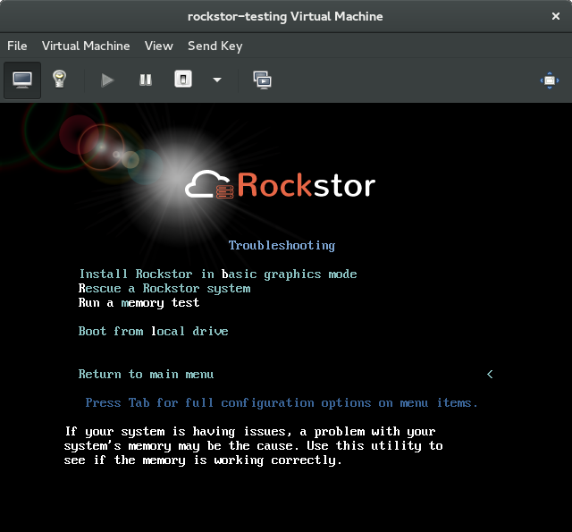

.. _pre_install:

Pre-Install Best Practice (PBP)
===============================

This howto sets
out to establish **Best Practice** prior to a **Rockstor install**. It has grown
out of a number of suggestions on the `Rockstor forum
<http://forum.rockstor.com/>`_ where problems have been
encountered that might otherwise have been avoided. The basic premise is to
first ensure that the hardware you are to install Rockstor on is fit for
purpose and tested reasonably with the readily available tools.

.. _memory_test:

Memory Test (memtest86+)
------------------------

Built into the Rockstor installer (inherited from the upstream CentOS installer)
is the famous `memtest86+ <http://www.memtest.org/>`_ boot option. This program
is actually derived from the linux kernel itself, the core of the operating
system that Rockstor is built on and is a boot option within the Rockstor
*Troubleshooting* installer menu.

First select the **Troubleshooting** menu item on the initial boot screen of
the installer:-

.. image:: troubleshooting.png
   :scale: 80%
   :align: center

Use the **Cursor Keys** and then the **Enter Key** to select this entry.

The following options should then be displayed:

Then select the **Run a memory test** option to boot the machine into the
**memtest86+** system.

N.B. This memory test system will **continue indefinitely** until you either
turn off the system, which is safe to do, or press the **ESC Key**. It is
recommended that 2 full test cycles be completed however a single full pass of
all available tests is better than no memory testing at all.

An effective memory test is likely not to be complete in less than a few
hours, though this depends on the speed of the hardware involved and how many
passes one is content with.

Memtest86+ Cautionary Note
^^^^^^^^^^^^^^^^^^^^^^^^^^

Memtest86+ can place a very intense load on your system, especially if run in
the new Multithreaded mode (version 5.01 and onwards via F1 on initial start)
but a sufficiently cooled system should be able to execute this test
indefinitely however if your system has cooling issues then it may lockup
or even sustain damage. Please take care to monitor your systems temperate
during this test. Version 5.01 and on have a built in CPU temperature monitor.
If you find that your version of the Rockstor installer doesn't include the 5
.01 or newer version of memtest86+ and you would like to monitor your CPU
temperature then download a `Pre-Compiled Bootable ISO
<http://www.memtest.org/#downiso>`_ from their official page and write it to a
USB key in exactly the same way you do for a Rockstor install ISO.
Memtest86+ is licensed under the GPL.

.. _wiping_disks:

Wiping Disks (DBAN)
-------------------

A popular tool to securely erase HDDs prior to their deployment or disposal is
`Darils Boot and Nuke <http://www.dban.org/>`_. This tools essentially writes
to every part of a
disks surface and in the process exercises the drive across it's entire
working area. This like the :ref:`memory_test` will stress the system; in this
case the drives selected for wiping. The purpose here is to first remove all
data on the existing drives and second to test that the drive is able to
write to all it's available sectors, it is often the case that a drive is
unaware of an issue with itself, via the built in SMART system, until it
attempts to write to a faulty sector. In fact this can trigger a drives build
in ability to allocate spare sectors reserved for this very purpose.

Note that the zero fill *fast* option is probably sufficient for testing
purposes but that there are many official options available. All options will
take a considerable amount of time to complete, ie in the region of a few
hours per drive.

It is **not** strongly recommended that any drives be tested this way prior to
using them for Rockstor but is included here as an advisory procedure if you
suspect a drive of having hardware issues.

DBAN Cautionary Note
^^^^^^^^^^^^^^^^^^^^

The DBAN program / procedure will **Irreversibly Erase all data**. Use with
caution and disconnect any drives that you wish not to be affected prior to
booting into DBAN. Due to the comparatively limited write cycles of earlier
generation SSD's further consideration should be given prior to running DBAN
on these devices due to it's write heavy nature.

.. _check_md5sum:

Check Integrity of Downloaded ISO File
--------------------------------------

If the original download is corrupt then all else that follows is likely to have
problems. ISO is computer slang short for ISO9660 which is the
`International Organization for Standardization
<http://www.iso.org/iso/home.html>`_ official definition of the structure of
data on a CD/DVD. If this structure is wrong or the data contained within it is
corrupt then problems are bound to follow. To avoid this there is a simple
command that can be executed once the download of the Rockstor iso file is
complete: that of checking it's checksum.

A checksum is a mathematical
abstraction of a data set, in this case our file, that is unique (near enough
anyway). As a result of this it is possible to establish file corruption by
comparing the published checksum of the official file with that calculated from
the downloaded file. This in effect verifies the downloaded file as legitimate /
free from corruption. Note however though that if you used the BitTorrent
download option to acquire your install image then this check has already been
done by way of the internal workings of the BitTorrent system. No harm in double
checking though. If however you acquired your image by any other means then it
is highly recommended that you check it's md5sum. In the following operating
system specific sections it is assumed that you have downloaded your Rockstor
ISO file into the *Downloads* directory and have opened a system terminal
ready to execute the appropriate command.

.. _check_md5sum_linux:

On a Linux system
^^^^^^^^^^^^^^^^^

The following built-in command is how to get the md5sum of your downloaded file
on almost any linux system.

::

    md5sum ~/Downloads/Rockstor-3.8-11.iso

example output:

::

    fbb65344b31c7715807750e58e99f788  Rockstor-3.8-11.iso

.. _check_md5sum_osx:

On an OSX system
^^^^^^^^^^^^^^^^

Here we see the built-in command to use on an OSX system as used on modern Apple
computers.

::

    md5 ~/Downloads/Rockstor-3.8-11.iso

example output:

::

    MD5 (Rockstor-3.8-11.iso) = fbb65344b31c7715807750e58e99f788

.. _check_md5sum_win:

On an MS Windows system
^^^^^^^^^^^^^^^^^^^^^^^

Using the built-in tool available on MS Windows.

::

    CertUtil -hashfile %userprofile%\Downloads\Rockstor-3.8-11.iso MD5

example output:

::

    MD5 hash of file C:\Users\username\Downloads\Rockstor-3.8-11.iso:
    fb b6 53 44 b3 1c 77 15 80 77 50 e5 8e 99 f7 88
    CertUtil: -hashfile command completed successfully.

.. _check_install_media:

Checking the Install Media
--------------------------

Once you have created the USB or in deed the CD / DVD by your chosen method:
see :ref:`makeusbinstalldisk` in our :ref:`quickstartguide` guide there is one
final measure one can take to ensure the the install media is as
expected. That is to choose the **Test this media & install Rockstor** option
on the initial boot screen of the installer:-

.. image:: test_this_media.png
   :scale: 80%
   :align: center

Using this option the installer will first check that it can successfully read
the contents of the USB key or CD / DVD and only proceed if the integrity check
of what it reads succeeds. Note that this does take additional time but not
more than a few minutes on modern USB hardware.

The purpose of this test is two fold as it is not only checking the contents of
the install media but also the computers ability to read that contents.
