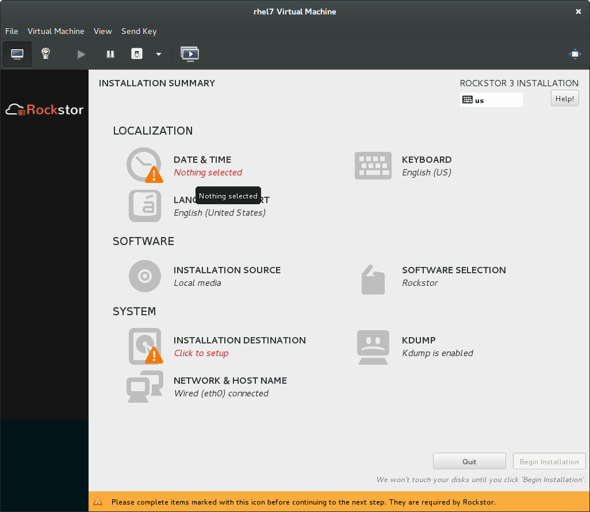
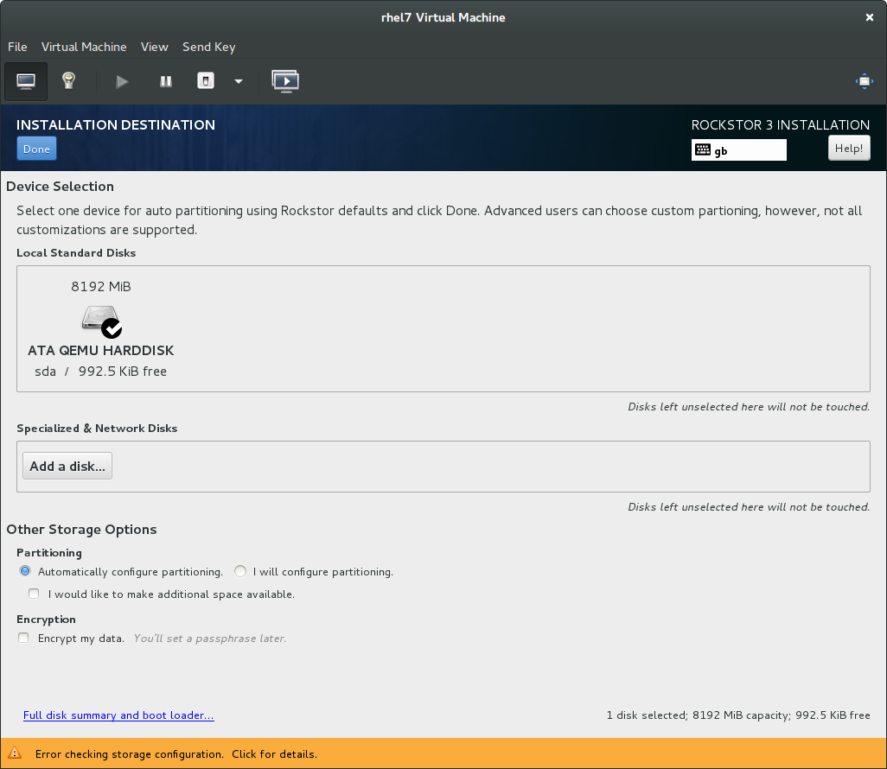
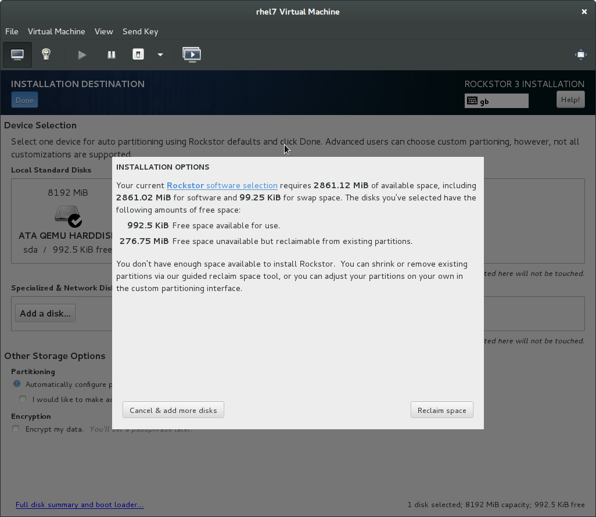
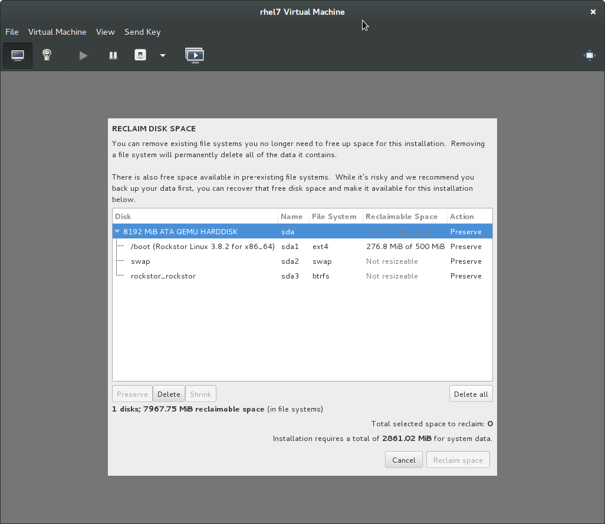
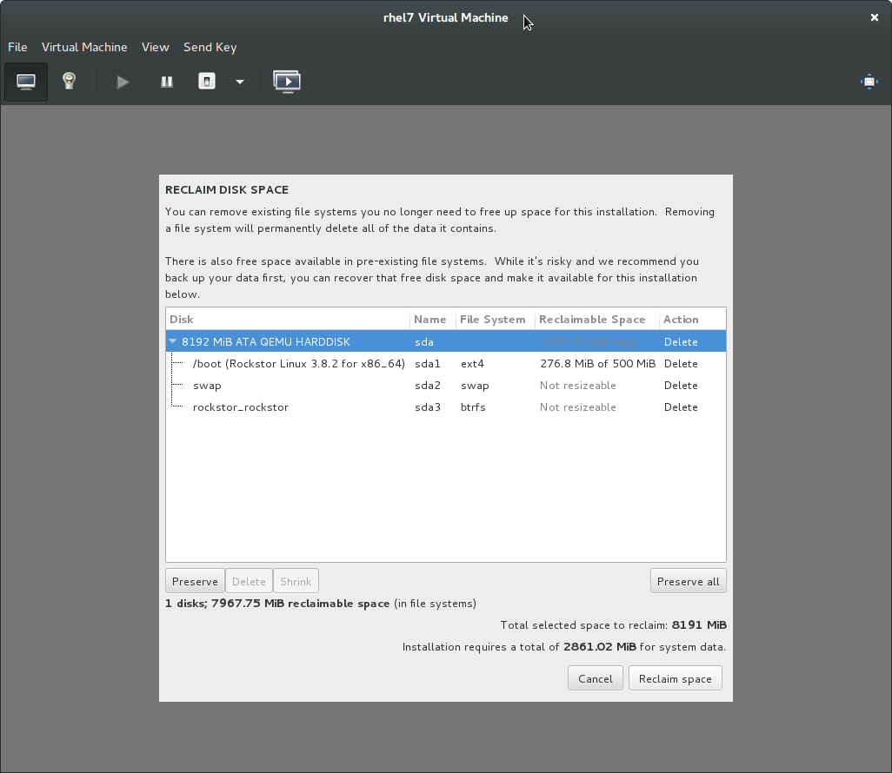
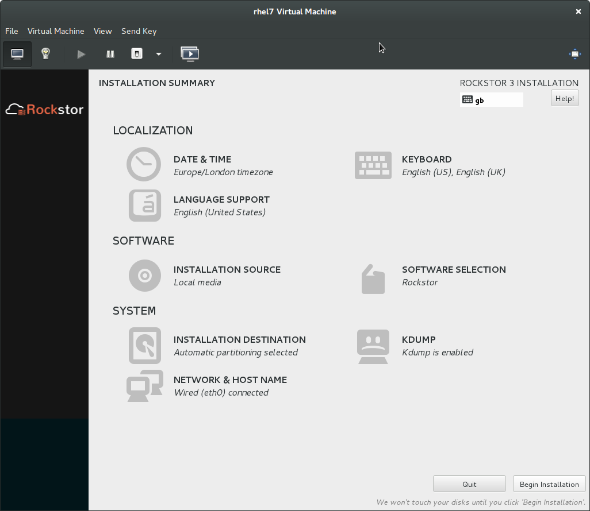
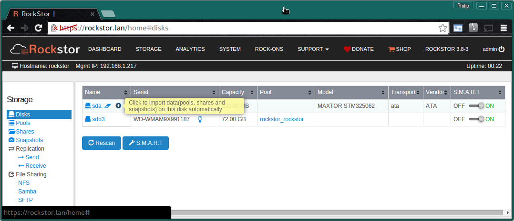

.. _reinstall:

Reinstalling Rockstor
=====================

When reinstalling Rockstor or when the **Installation Destination** disk is
**not blank** it is necessary to take a few more steps within the installer to
prepare the **system disk**.

.. _wiping_disk:

Wiping the system disk
----------------------

As Rockstor’s semi-automated installer expects a blank disk we must arrange
this whenever the system disk already has partitions on it.  This will be
evident from the **Installation Summary** screen by an **exclamation mark**
next to **Installation Destination**.

Note in the above we have attention required  in **Data & Time** and
**Installation Destination**.  Date and Time simply needs to know your
location to set the time zone.

When Selecting the **Installation Destination** menu option we see the
following:-

Note how there is only 992.5 KB free space due to a previous install.

**Ensure** that the **correct disk is ticked**. Rockstor, with default boot
options, will only show **sda** but if you see other disks due to custom boot
options be very careful with where the tick is; there should be only one disk
ticked.

* Use the default **Automatically configure partitioning**

After pressing the **Done** button we get the following
**Installation Options** dialog. Use the **Reclaim Space** button.

**Reclaim space**

On the resulting **Reclaim Disk Space** dialog, after assuring yourself that
this is in fact the correct disk, click on the **Delete all** button.

**Delete all**

Note now how the Action column entries are all **Delete** and the
**Reclaim space** button has become available:-  

Click **Reclaim space** if you are certain this is the correct disk.

We should now be back at the **installation summary** screen where we can
**Begin Installation** as normal.

We are now ready for a regular :ref:`installation` as the system disk is now
blank.

.. _reinstall_import_data:

Data Import
-----------

Once Rockstor has been :ref:`reinstalled <reinstall>` and
you have applied the updates via the automated prompt in the WebUI you can
import the data that was present on your previous Rockstor install’s data
disks; assuming you had separate data disks of course.

This can be done by using the **tiny down arrow** icon next to the relevant
device on the **Storage** page **Disks** section.

This process is intended to import:-

* Pools
* Shares
* Snapshots

This image shows the yellow **mouse over** popup info window explaining the
**import icon**