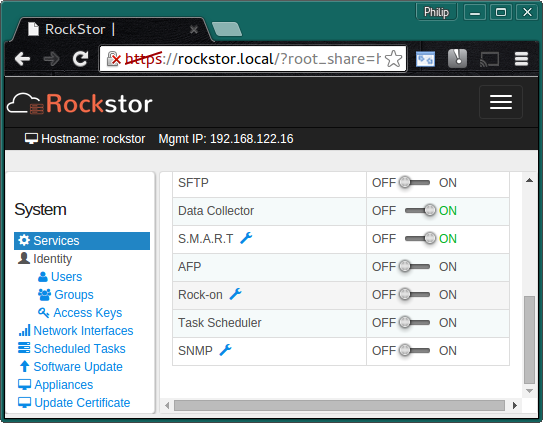
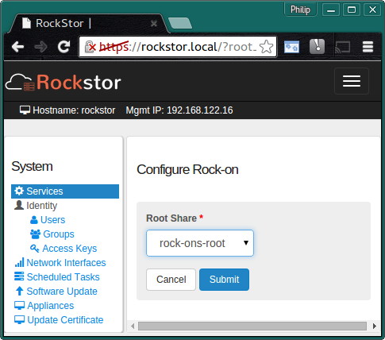

.. _rockons_intro:

Rock-ons (Docker Plugins)
=========================

**Rock-ons** are Rockstor's name for it's use of `docker
<https://www.docker.com/>`_ containers to provide a **Plugin System** to easily
expand the functions of a base Rockstor install. This feature is relatively new
to Rockstor but is proving to be quite popular and is under active development.

Each Rock-on aims to provide a single additional service and the list of
:ref:`rockons_available` is expanding all the time.

.. _rockons_preinstall:

Initial Rock-ons Setup
----------------------

As Rock_ons / docker containers are like mini linux installs they require
somewhere to live.  In Rockstor it is recommend that you setup a Share
specifically for this purpose.

Note that all Rock-ons will then be installed into this shared area but each will
remain independent and during the setup of each Rock-on you are given the option to
store their respective configuration and data in other shares.  This is
good practice as it keeps your Rock-on config and data apart from the
Rock-ons themselves.  You do not have to separate the config and data within each
Rock-on but that is also good practice, and is why this option is offered.

It is assumed you have already setup your :ref:`disksandpools` and one or more
shares in those pools (see our :ref:`createshare`) appropriate for your Rock-ons,
ie a plex-movies share and a plex-config share.

But we also need to create the :ref:`rockons_root` share.

.. _rockons_root:

The Rock-ons root
^^^^^^^^^^^^^^^^^
All Rock-ons require the **Rock-on service** be enabled and prior to enabling
this service it must be configured.  This is a simple matter of assigning a
sufficiently large share for the rock-ons to be installed into.  It is possible
to use the existing 'out of the box' home share but this is not recommended.

The following shows a **Recommended Minimum 5GB rock-on-root** Share.

.. image:: rockons_root_share.png
   :scale: 80%
   :align: center

Note that during the lifetime of Rock-ons several snapshots will be created so
plan to be able to expand this share if need be.

Then click on the **spanner** next to the **Rock-on service** on the **System** page.

Now to **select** the share to use for your **Rock-ons root**.

**Select** the **rock-on-root** share that we created earlier and **Submit**

You can now **enable** the **Rock-on service** and proceed to the Rock-ons page.
If no Rock-ons are showing on the 'All' tab then click the **Update** button
to refresh the list of available Rock-ons. To install a Rock-on use
its **Install** button on the Rock-ons WebUI page.

.. _rockons_available:

Available Rock-ons
------------------

Please see the following for specific Rock-on install details

.. toctree::
   :maxdepth: 2

   openvpn_howto
   plex_howto
   syncthing_howto
   owncloud_howto
   transmission_howto
   btsync_howto
