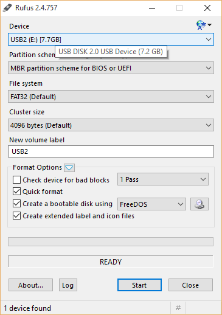
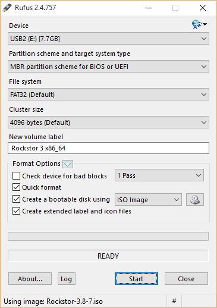
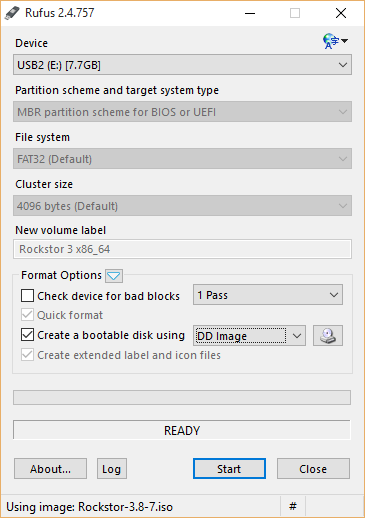
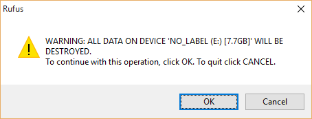

..  _rufus_howto:

Rockstor USB install disk using Rufus
=====================================

`Rufus <https://rufus.akeo.ie/>`_ is an open source multilingual general
purpose graphical utility for Windows XP and newer systems to help in the
creation of bootable USB flash drives. It is licenced under
`GNU GPLv3 or later <https://www.gnu.org/licenses/gpl.html>`_. Using it's
default settings it will NOT create a working Rockstor USB install disk but
using the following configuration options it can successfully prepare a working
USB flash drive to be used for Rockstor install.

N.B. The following method and screen captures were proved and provided by
@Dragon2611 a `Rockstor forum <http://forum.rockstor.com/`_ member.

.. _rufus_steps:

Steps required
--------------

First download the latest
`Rockstor iso image <http://rockstor.com/download.html>`_ and the latest
version of `Rufus <https://rufus.akeo.ie/>`_ then insert your USB key and run
Rufus:-

* Under **Device** select your **USB key**, double check you selection.
* Using the **CD icon button** select the **Rockstor iso**, the mouse over tooltip reads *Click to select an ISO*
* Change the dropdown next to the CD icon button to read **DD Image** mode.
* Double check all settings and **Click Start**.

First select the destination USB key using the **Device** drop down.

In the above example the Device selected was a 8 GB (7.7 GB) USB2 device.

Now select the **Rockstor iso image** using the **CD icon button**.

The Rockstor iso file name should now be visible in the bottom of the window.

Now select the **DD Image** option next to the *Create a bootable disk using*
and the *CD icon** button.

Note in the above we see the **DD Image** selection.

Double check all selections and then click the **Start Button**, the following
warning should result.

Note the device label and size in the warning before preceding.

Upon confirming continuation we should have the following progress screen

.. image:: rufus_wright_in_progress.png
   :scale: 100%
   :align: center

