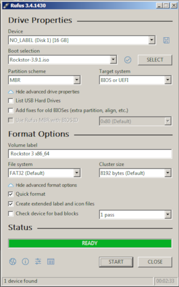

..  _rufus_howto:

Rockstor USB install disk using Rufus
=====================================

`Rufus 3.4 <https://rufus.ie/>`_ is an open source multilingual general
purpose graphical utility for Windows 7 and newer systems to help in the
creation of bootable USB flash drives. It is licensed under
`GNU GPLv3 or later <https://www.gnu.org/licenses/gpl.html>`_. Using it's
default settings it will **NOT** create a working Rockstor USB install disk.  However, 
using the following configuration options, it can successfully prepare a working
USB flash drive to be used for Rockstor install. Please see the
:ref:`makeusbinstalldisk` in our :ref:`quickstartguide` guide for other tested
methods.

N.B. The following method and screen captures were proved and
provided by @D_Jones a
`Rockstor forum <http://forum.rockstor.com/>`_ member.

.. _rufus_steps:

Steps required
--------------

First download the latest
`Rockstor iso image <http://rockstor.com/download.html>`_ and the latest
version of `Rufus <https://rufus.ie/>`_ then insert your USB key and run
Rufus:-

For the impatient, here's the quick version:

* Under **Device** select your **USB key**, double check your selection.
* Using the **SELECT button** select the **Rockstor iso**, the mouse over tooltip reads "*Click to select an Image*."
* Double check all settings and click **Start Button**.
* When prompted by the hybrid ISO pop-up window, change radio button to **DD Image** mode.
* Click **OK Button** on the following warning box to start the write.

For the more cautious, the following images and notes indicate the above steps in more detail.

First select the destination USB key using the **Device** drop down.

.. image:: rufus34_select_device.png
   :scale: 100%
   :align: center

In the above example the Device selected was a 16GB device.

In the "Boot Selection" drop down, pick "Disk or ISO Image"
Now click the **SELECT button** and browse to the **Rockstor iso image** on your system, and select the ISO file,
and click the **Open button** in the dialog box.

.. image:: rufus34_rockstor_selected.png
   :scale: 100%
   :align: center

The Rockstor iso file name should now be visible in the "Boot Selection" box, 
and the bottom of the Rufus window.

At this point, if you'd like to check the hash values for your iso image, click the **check mark symbol** 
to the right of the drop down button.  Mouse over tool tip shows
"*Compute the MD5, SHA1, and SHA256 Checksums for the selected image*."
When calculations are complete you'll see a pop-up window like this.

Note: If you downloaded through BitTorrent, this check is completed as part of its internal workings. 

.. image:: rufus34_hash_complete.png
   :scale: 100%
   :align: center

Click the **OK Button** to close the window, and we can proceed with USB creation.

Leave the remaining default inputs as is, and click the **START button**.
Rufus 3.4 will display a pop up box identifying this image as an "ISOHybrid" Image, and give you 2 choices.
Select the radio button next to **Write in DD Image Mode** 

.. image:: rufus34_select_dd.png
   :scale: 100%
   :align: center

In the above we see the **Write in DD Image Mode** selected.

You're now ready to write.  Click the **OK Button**, in the "ISOHybrid" box,
and you should then get this warning.

.. image:: rufus34_warning.png
   :scale: 100%
   :align: center

Note the device label and size in the warning before proceeding,
if they don't match your target device click the **Cancel button** and start over.  
If it is correct click **OK Button** to continue.

Upon confirming continuation you should see the progress bar update to track the operation.

.. image:: rufus34_write_in_progress.png
   :scale: 100%
   :align: center

When the write is complete Rufus will look like this.

Click the **CLOSE Button** to end the session.

**Before removing USB device be sure to eject / remove / unmount appropriately**

