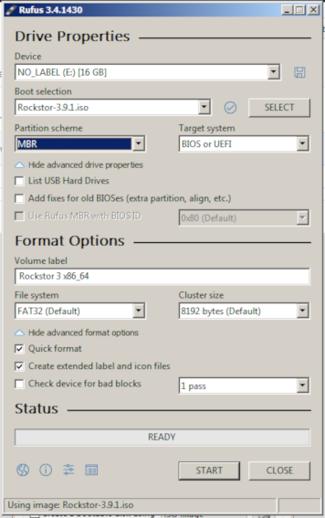
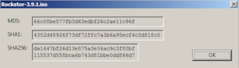
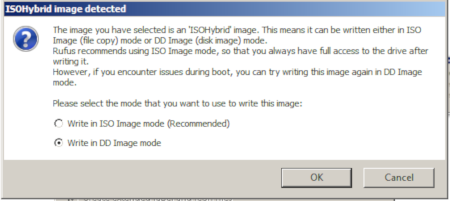
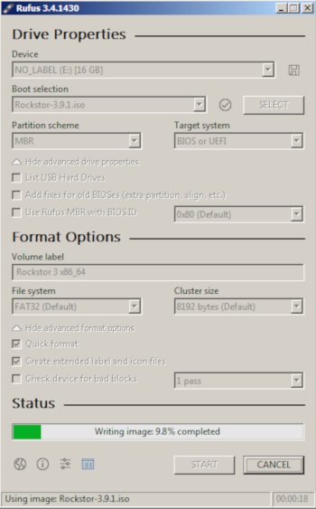

..  _rufus_howto:

Rockstor USB install disk using Rufus
=====================================

`Rufus 3.4 <https://rufus.ie/>`_ is an open source multilingual general
purpose graphical utility for Windows 7 and newer systems to help in the
creation of bootable USB flash drives. It is licenced under
`GNU GPLv3 or later <https://www.gnu.org/licenses/gpl.html>`_. Using it's
default settings it will NOT create a working Rockstor USB install disk but
using the following configuration options it can successfully prepare a working
USB flash drive to be used for Rockstor install. Please see the
:ref:`makeusbinstalldisk` in our :ref:`quickstartguide` guide for other tested
methods.

N.B. The following method and screen captures were graciously proved and
provided respectively by @D_Jones a
`Rockstor forum <http://forum.rockstor.com/>`_ member.

.. _rufus_steps:

Steps required
--------------

First download the latest
`Rockstor iso image <http://rockstor.com/download.html>`_ and the latest
version of `Rufus <https://rufus.ie/>`_ then insert your USB key and run
Rufus:-

* Under **Device** select your **USB key**, double check you selection, or confirm auto selection.
* Using the **SELECT button** select the **Rockstor iso**, the mouse over tooltip reads *Click to select an Image*
* Double check all settings and **Click Start**.
* When prompted by the hybrid ISO pop-up window change raido button to **DD Image** mode.

The following images and notes indicate the above steps.

First select the destination USB key using the **Device** drop down.

.. image:: rufus34_select_device.png
   :scale: 100%
   :align: center

In the above example the Device selected was a 16 GB USB2 device.

In the "Boot Selection" drop down, pick "Disk or ISO Image"
Now click the **SELECT button** and browse to the **Rockstor iso image** select the ISO file,
and click the open button in the dialog box.

The Rockstor iso file name should now be visible in the "Boot Selection" box, 
and the bottom of the Rufus window.

At this point if you'd like to check the hash valued for your download select the check mark
button to the right of the drop down button, mouse over tool tip shows:
"Computer the MD5, SHA1, and SHA256 Checksums for the selected image"
When calcculation are complete you'll see a pop-up window like this
Note: If you downloaded through BitTorrent, this check is completed as part of it's internal workings 

Click OK to close the window, and we can proceed with USB creation

Leave all of the defaults as is, and click the **START button**
Rufus 3.4 will display a pop up box identifying this image as an "ISOHybrid" Image, and give you 2 choices
Select the radio button next to **Write in DD Image Mode** 

In the above we see the **Write in DD Image Mode** selected.

You're now ready to write, click the **OK Button**, in the warning box,
and this warning should result.

.. image:: rufus34_warning.png
   :scale: 100%
   :align: center

Note the device label and size in the warning before preceding.

Upon confirming continuation we should have the following progress screen

**Upon completion safely eject / remove / unmount the USB device before
removing it**

