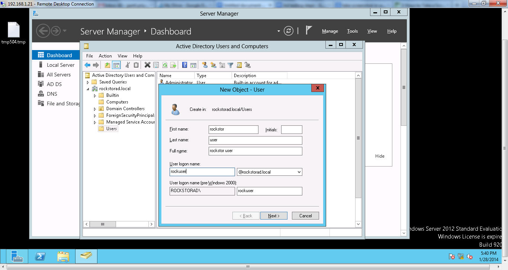

Samba/CIFS
==========

Rockstor supports making Shares available to SMB and CIFS clients via Samba
software suite. Samba service must be turned on before exposing shares.

.. _sharesamba:

Enable or disable Samba/CIFS access for a Share
^^^^^^^^^^^^^^^^^^^^^^^^^^^^^^^^^^^^^^^^^^^^^^^

In the web-ui, click on the *Storage* tab to enter the main Storage view. Now
click on *Samba* in the left sidebar to go to the *Samba* view.

Click on the *Add Samba Export* button. Fill in the form with the appropriate values as explained below.

In the list of shares, select the shares that you want to export through Samba.

In the *Admin Users* field, enter a space separated list of usernames who will
have administrative access to this share. These users can be local, from NIS or
Active Directory. *Admin Users* are equivalent to the *root* user on Rockstor
and have all permissions. If your users come from Active Directory, we
recommend you use one *Admin User* and add/change ACLs for other users from
a Windows machine.

Set *Browsable* to *yes* if you want clients to be able to see the exported shares.

Set *Guest OK* to *yes* if you want to permit guest access.

Set *Read only* to *yes* if the share should not be writable by clients.

.. image:: samba_add.gif
   :scale: 65%
   :align: center

To disable Samba/CIFS access, go to the *Samba* view as before, and click on the trash icon for the appropriate share to delete the Samba export for that share.

How to Access a share as a local user
^^^^^^^^^^^^^^^^^^^^^^^^^^^^^^^^^^^^^

Before you try to access the share as a local user, go to System tab -> Services and make sure that AD service is turned OFF.
This is just to avoid any interruption from AD server.

First and foremost you should know which share to access. 
Next you need a user who has permission to access the share.
You can see all the details in the Samba table displayed when you go to Storage tab -> File Sharing -> Samba

Now that you have all the details, use your local machine to access the share.

From **Windows** machine:

1. Go to the File explorer and give the ip address of your rockstor web ui similar to this *\\192.168.1.21* 

2. Double click on it and you see a window which prompts for the username and password. 

3. In general the domain name is set default to your machine name.

4. Inorder to change the domain, in the username field enter *WORKGROUP\username*
 
  (here username is name of the user who has permission to access the share)

5. Enter the password given while creating the user.

6. Check the box to remember credentials.

7. Press ok to access the share.

8. Now, you must be able to see the users and shares created.

9. To access a share, double click on it. 

Depending upon the options selecting while creating a Samba export, one should be able to create a folder, read, 
write and delete the files and folders inside the share.

From **Linux** machine:

1. Go to File Browser -> Network -> Browse Network

2. Open Browse Network and you should see the rockstor web ui machine with the ip address.

3. Double click on it which opens a window with username and password fields.

4. Give the Domain name as WORKGROUP and username as the user who has permission to access the share.

5. Enter the password used while creating the user in rockstor web UI.

6. Press enter.

7. You must be able to see the users and shares created.

8. Inorder to access a  share, double click on it.

Depending upon the options selecting while creating a Samba export, one should be able to create a folder, read, 
write and delete the files and folders inside the share.

More than 1 user can be given permission to access a share. This can be done by giving two users space seperated in the 
Admin Users field while creating Add samba export.

How to Access a share as an Active Directory user
^^^^^^^^^^^^^^^^^^^^^^^^^^^^^^^^^^^^^^^^^^^^^^^^

**Steps to be followed on Rockstor web UI:**

Now that you want to access a share as an Active Directory user, make sure that AD service is turned ON!

1. Turn ON the AD service if it's OFF.

2. Now, Configure AD by clicking on the wrench icon with following values:

Winbind Domain - rockstorad
Security Model - ads
Winbind ADS Realm - rockstorad.local
Winbind Domain Controllers - WIN-H323VCUT6GT.ROCKSTORAD.LOCAL
Template shell - /bin/bash
Don't check Allow offline login box.

3. Click Submit button.

4. Next, Click ‘Join Domain' and it prompts to enter Administrator and Password.

(Both of them are set while creating the AD server)

5. Click Submit button and verify that you get the Join ok message.

**Steps to be followed on Active Directory Server:**

Create a user on Active Directory

On Windows machine: 

1. From start go to Remote Desktop Connection (192.168.1.21)
 
2. Login with Username: Administrator

 and Password : St0r3smartly

3. Inside Active directory server, go to Server Manager -> Tools -> Active Directory Users and Computers -> Users

4. Right click on Users -> New -> User. This will open a window with some credentials as shown in the screenshot below

 
Keep the @rockstorad.local as it is.

5. Click on next button which prompts for password. Enter the password and re-type it.

For convenience, uncheck the user must change password at next logon and 

check password never expires.

6. Click on next  button which takes to last screen. Click on Finish.

This should create the user. Sometimes it can throw an error with regard to password not meeting the criteria.

Now go back to Rockstor web UI and do the following:

1. Create a new Add samba export with the follwowing configuration:
 Admin users - username (Newly created one on the AD server)
 Browsable - yes
 Guest Ok - yes/no
 Read only - yes/no

Acess the Share from a Windows Machine :

1. Go to explorer - > Computer -> right click and select map network drive. Then the following screen appears:

2. Drive is autoslected where as you need to select the folder as
\\server\sharename

3. Check connect using different credentials. This is to to login with a different user than which is already saved. Click Finish.

4. Next screen prompts for Network Username and Password. Select “Use another account” and enter the credentials of the Active Directory user who has permission to access the share.
Inorder to change the domain enter rockstorad\username in the username field.

5. Share should be visible in the explorer.

6. Share contents should be visible.

7. You should be able to (1) create a file (2) write to it (3) save it (4) read it (5) create a directory (6) delete a directory.

