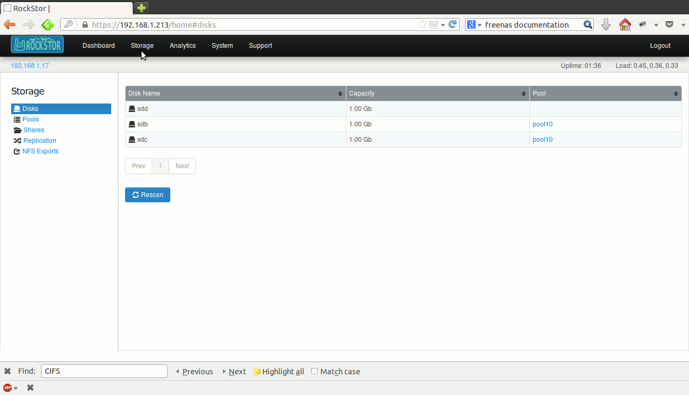
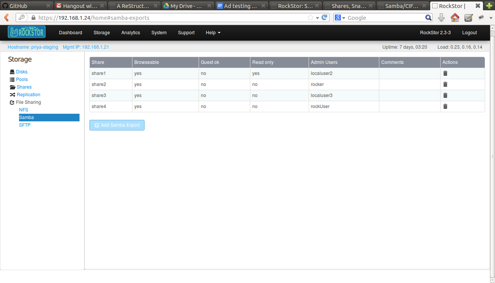

Samba/CIFS
==========

Rockstor supports making Shares available to SMB and CIFS clients via Samba
software suite. Samba service must be turned on before exposing shares.

.. _sharesamba:

Create a Samba Export of a Share
^^^^^^^^^^^^^^^^^^^^^^^^^^^^^^^^

In the web-ui, click on the *Storage* tab to enter the main Storage view. Now
click on *Samba* in the left sidebar to go to the *Samba* view.

Click on the *Add Samba Export* button. Fill in the form with the appropriate values as explained below.

In the list of shares, select the shares that you want to export through Samba.

In the *Admin Users* field, enter a space separated list of usernames who will
have administrative access to this share. These users can be local, from NIS or
Active Directory. *Admin Users* are equivalent to the *root* user on Rockstor
and have all permissions. If your users come from Active Directory, we
recommend you use one *Admin User* and add/change ACLs for other users from
a Windows machine.

Set *Browsable* to *yes* if you want clients to be able to see the exported shares.

Set *Guest OK* to *yes* if you want to permit guest access.

Set *Read only* to *yes* if the share should not be writable by clients.

View Samba Export  
^^^^^^^^^^^^^^^^^

If you already have Samba exports created, you can see them displayed in a table.

All the details about the samba export are present in the table. Here is what the columns in the table mean:

  * Name of the share ->  Share which is exported.
  * Browsable -> Is the Share browsable by everyone? yes/no
  * Guest Ok -> Are Guests Ok to access the share? yes/no
  * Read only -> Is the Share Read only?
  * Admin Users -> Users who want to access the Share.
  * Comments -> Comments related to particular samba export.
  * Actions -> To delete the Samba Export.

To disable Samba/CIFS access, go to the *Samba* view as before, and click on the trash icon for the appropriate share to delete the Samba export for that share.

How to Access a share 
^^^^^^^^^^^^^^^^^^^^^

From a **Windows** machine:

1. Go to the File explorer and in the location field, enter the ip address of your RockStor Web UI in the following format.
   
    * \\\\192.168.1.21

2. When you try to access this location, you will be presented with a window which prompts for the username and password. 

3. The domain name is defaulted to your machine name. Enter *DOMAINNAME\\username* in the username field to change the domain. Use WORKGROUP as the domainname if it is a local user, or use the AD domain if it is an AD user. (*username* is the username of the user who has permission to access the share)

4. Enter the user's password. 

5. Check remember credentials, and click Ok

6. Now, you must be able to see the shares available on RockStor.

7. To access a share, double click on it. 

From a **Linux** machine:

1. Open File Browser -> File -> Connect to Server and enter the address of the RockStor appliance in this format.
    
    * smb://<ip_address> 

2. Click Connect, and you will see the shares available on the RockStor appliance.

3. To access a share, double click on it, and you will be presented with a window with Username, Domain, and Password fields. Enter the following 

    * Username -> username of the user who has permission to access the share.
    * Domain -> WORKGROUP for a local user, AD domain for an AD user
    * Password -> password of the user

4. Click Connect

5. You should now be able to see the share contents. 

Depending upon the options selected while creating a Samba export, you should be able to create a folder, read, write and delete the files and folders inside the share.

