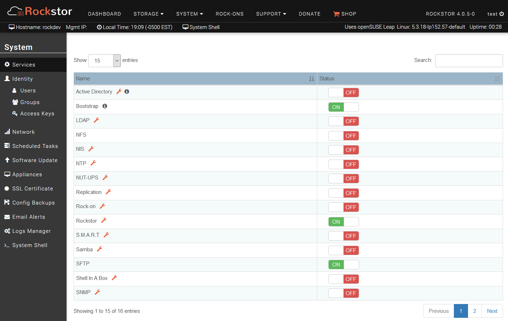
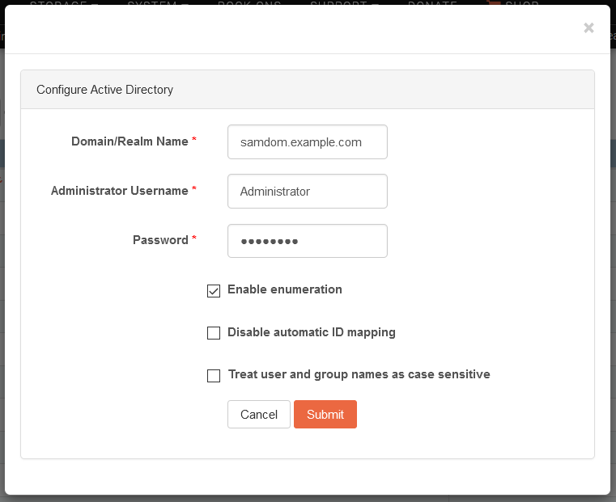

.. _services:

Services
========

Rockstor supports many services that are necessary or useful in a storage
system. Service management, *i.e.* turning on or off, and configuration can be
done via the **System** - **Services** page of the web-UI. Note that the
**spanner icon** next to each service name is used to **configure** that
service.

On the **Services** page, all services and their current state are displayed.

To **start** or **stop** a service, click its respective **ON** or **OFF**
buttons.

Some services need to be configured before they can be turned on. To access
the configuration page for a service, click the **wrench** icon next to the
service name.

Please note that not all services are documented here as we are currently
working on upgrading the documentation.

NFS
---

Rockstor uses Linux NFS server to support exporting Shares to remote clients
via NFS. Custom NFS configuration is not supported, but the service must be
turned on in order to export shares. See the :ref:`nfs` section for details.

Samba
-----

Rockstor supports making Shares available to SMB and CIFS clients via Samba
software suite. Custom Samba server configuration is not supported, but the
service must be turned on before exposing shares. See the :ref:`samba` section
for details.

SFTP
----

SFTP stands for Secure File Transfer Protocol and is essentially FTP over SSH.
In Rockstor user owned shares exported via this method are mounted withing a
minimal chroot environment for enhance security. Please see out :ref:`sftp`
section.

NTP
---

NTP maintains system time in synchronization with Internet
standard time server. This service must always be turned on.

To configure NTP, you can specify the address of an Internet standard time
server in the NTP configuration page.

.. image:: ntp-config.png
   :scale: 70 %
   :align: center

AD
--

AD is a directory service to connect to an Active Directory domain. It must be
turned ON in order to be part of the AD.

Before configuring the AD service, however, some preparations are required.
First, the Samba service must be configured with the AD domain realm as the
workgroup. For an AD domain of :code:`samdom.example.com`, for instance, the
Samba workgroup should be set as :code:`SAMDOM` as illustrated below. Note that
while the Samba service needs to be configured, it doesn't need to be turned
ON.

.. image:: images/services/ad_samba_config.png
   :scale: 70 %
   :align: center

Next, as correct time synchronization with the AD domain is necessary for good
performance, the NTP service should be configured and turned ON. Ideally, both
the AD domain and Rockstor machines should thus use the same NTP time server.

Now that the Samba workgroup has been defined, and the NTP service configured
and running, the AD service can be configured. To do so, click on the
**wrench** icon and fill in the form with the values corresponding to your AD
domain.

The individual fields of the form are described below.

* **Domain/Realm name**: Specifies the desired Active Directory or Domain.
* **Administrator Username**:  Name of the user to use for the enrollment to
  the AD. Tihs should be the AD's administrator account.
* **Password**: Password for the Administrator username.
* **Enable enumeration**: Fetch and display all users/groups values. As this
  option can have a notable performance cost in some servers (with high number
  of users, for instance), this option is disabled by default. Note, however,
  that this option must be enabled for Rockstor to be able to list AD users and
  groups in the web-UI. See `SSSD FAQ <https://sssd.io/docs/users/faq.html#when-should-i-enable-enumeration-in-sssd-or-why-is-enumeration-disabled-by-default>`_ for
  further details.
* **Disable automatic ID mapping**: By default, the AD provider will map UID
  and GID values from the objectSID parameter in Active Directory. Check this
  option if you want to disable ID mapping and instead rely on POSIX attributes
  defined in Active Directory. See `SSSD documentation <https://linux.die.net/man/5/sssd-ad>`_ for
  furhter details.
* **Treat user and group names as case-sensitive**

Rockstor 4 relies on `SSSD <https://sssd.io/>`_ for the management of identities
provided by AD. As a result, one can edit :code:`/etc/sssd/sssd.conf` to
further customize the enrollment into an AD.

Upon submission of the AD configuration form, Rockstor will test the
configuration settings by attempting to *discover* the AD domain and save the
configuration if successful. If Rockstor cannot discover the AD domain, it will
report the error back to the web-UI; notably, verify that the AD domain can be
resolved by name via DNS (see `Red Hat Windows Integration Guide <https://access.redhat.com/documentation/en-us/red_hat_enterprise_linux/7/html/windows_integration_guide/sssd-integration-intro#sssd-ad-proc>`_ for
further documentation).

Note that a successful configuration of the AD service does not enroll the
system into the AD. To do so, the AD service must be turned ON. To leave the
AD, simply turn the AD service OFF.

LDAP
----

LDAP is a directory service to connect to LDAP server.

In the web-ui, click on *System* tab to go to the *System* view. This also
serves as the *Services* view, which is selected by default in the left
sidebar. To configure LDAP, click on the **wrench** icon and submit the form
with appropriate values as shown below.

.. image:: ldap-config.png
   :scale: 70 %
   :align: center

The individual fields of the form are described below.

* **LDAP Server**: The IP address of the LDAP server.
* **Search base DN**: Specifies that user information should be retrieved using
  the listed Distinguished Name (DN).
* **Enable TLS**: If this is checked, TLS will be used to encrypt passwords
  sent to the LDAP server.
* **Certificate URL**: If the ``Enable TLS`` checkbox is checked, you can
  specify a URL from which to download a valid CA (Certificate Authority)
  Certificate. A valid CA Certificate must be in PEM (Privacy Enhanced Mail)
  format.

To start or stop the service, click the corresponding ON or OFF button.

NIS
---

NIS is a directory service to connect to a NIS server.

In the web-ui, click on *System* tab to go to the *System* view. This also
serves as the *Services* view, which is selected by default in the left
sidebar. To configure NIS, click on the **wrench** icon and submit the form
with appropriate values as shown below.

.. image:: nis-config.png
   :scale: 70 %
   :align: center

* **Domain**: NIS domain.
* **Server**: IP address of NIS server.

NUT-UPS
-------

A (Currently Beta) `Network UPS Tools <http://www.networkupstools.org/>`_
based service to orchestrate gracefull system shutdown in the event of a power
outage. Please see our: :ref:`ups_setup` section for more details.

ROCK-ON (DOCKER PLUGIN SYSTEM)
------------------------------

This is a very new service that is still in Beta, please see :ref:`rockons_intro`
For an introduction to Rockstor's `docker <https://www.docker.com/>`_ based
plugin system.

**To start or stop any service, click the corresponding ON or OFF button**
