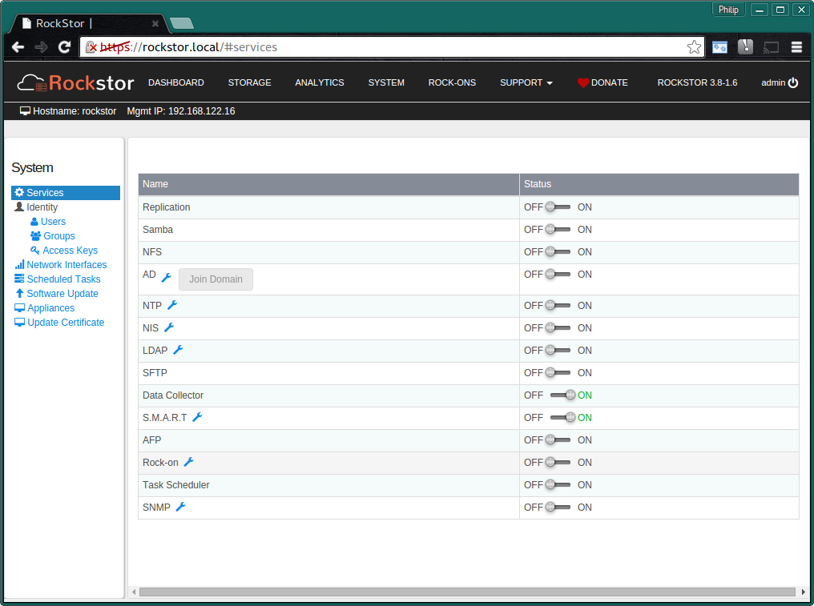
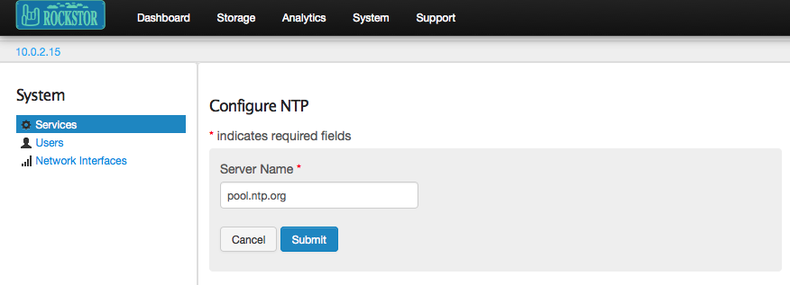
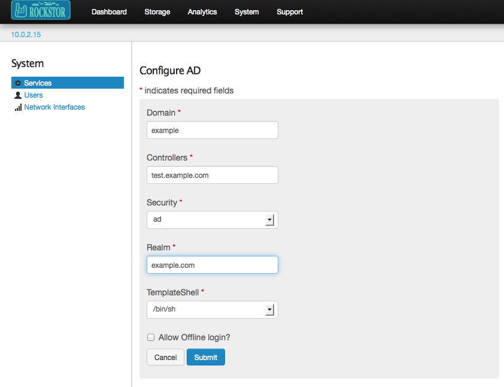
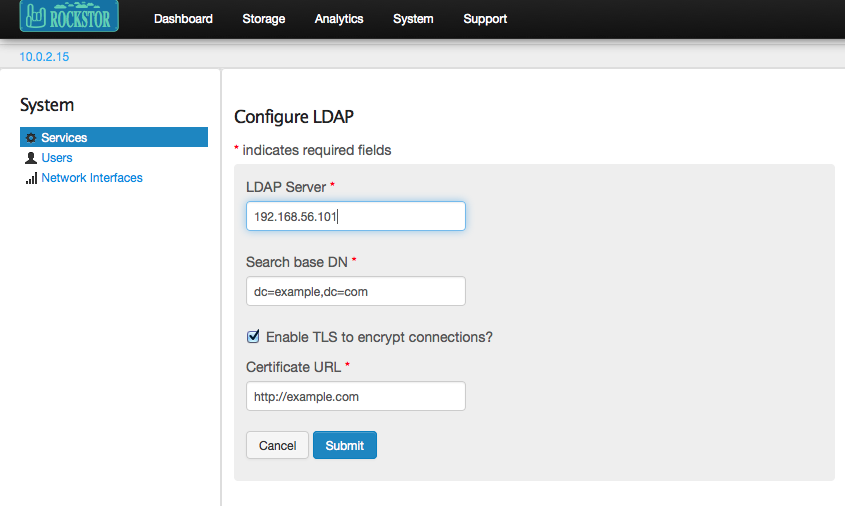
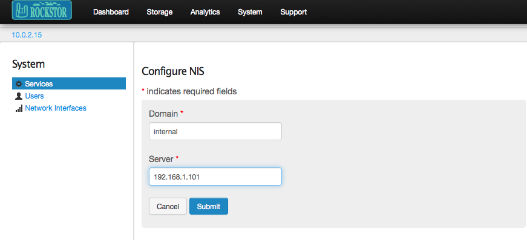

.. _services:

Services
========

Rockstor supports many services that are necessary or useful in a storage system.
Service management, ie turning on or off and configuration can be done via
the **System** - **Services** page of the web-ui. Note that the **spanner icon**
next to each service name is used to **configure** that service.

This section is the default for the System page: all services and their
current state are displayed.

To **start** or **stop** a service, click its respective **ON** or **OFF**
buttons.

Some services need to be configured before they can be turned on. To access
the configuration page for a service, click the **wrench** icon next to the
service name.

Please note that not all services are documented here, we are currently working
on upgrading the documentation

NFS
---

Rockstor uses Linux NFS server to support exporting Shares to remote clients
via NFS. Custom NFS configuration is not supported, but the service must be
turned on in order to export shares. See the :ref:`nfs` section for details.

In the web-ui, click on *System* tab to go to the *System* view. This also
serves as the *Services* view, which is selected by default in the left
sidebar. To start or stop the NFS server, click the corresponding ON or OFF
button.

Samba
-----

Rockstor supports making Shares available to SMB and CIFS clients via Samba
software suite. Custom Samba server configuration is not supported, but the
service must be turned on before exposing shares. See the :ref:`samba` section
for details.

In the web-ui, click on *System* tab to go to the *System* view. This also
serves as the *Services* view, which is selected by default in the left
sidebar. To start or stop the NFS server, click the corresponding ON or OFF
button.

AFP
---

Apple Filing Protocol is the native / proprietary equivalent of NFS in Linux /
Unix and SMB/CIFS from Windows. However as of OSX 10.9 Mavericks the default
network sharing protocol in OSX is SMB/CIFS. See the :ref:`afp` section for
details.

NTP
---

NTP maintains system time in synchronization with Internet
standard time server. This service must always be turned on.

To configure NTP, you can specify the address of an Internet standard time
server in the NTP configuration page.

AD
--

AD is a directory service to connect to Active Directory. It must be turned on
in order to be part of AD.

In the web-ui, click on *System* tab to go to the *System* view. This also
serves as the *Services* view, which is selected by default in the left
sidebar. To configure AD, click on the **wrench** icon and submit the form with
appropriate values as shown below.

The individual fields of the form are described below.

* **Domain**: Specifies the Windows Active Directory or domain controller to
  connect to.
* **Controllers**: domain controller to use.
* **Security**:  The security model to use, which configures how clients should
  respond to Samba. The options are

   1. user. A client must first log in with a valid username and password.
   2. server. In this mode, Samba will attempt to validate the username/password by authenticating it through another SMB server (for example, a Windows NT Server). If the attempt fails, the user mode will take effect instead.
   3. domain. In this mode, Samba will attempt to validate the username/password by authenticating it through a Windows NT Primary or Backup Domain Controller, similar to how a Windows NT Server would.
   4. ads. This mode instructs Samba to act as a domain member in an Active Directory Server (ADS) realm.

* **Realm**: When the ads Security Model is selected, this allows you to
  specify the ADS Realm the Samba server should act as a domain member of.
* **Template shell**: The login shell for the user
* **Allow offline login**

To start or stop the service, click the corresponding ON or OFF button.

For example, for an environment with the Winbind domain as *rockstorad*, and the AD controller as *WIN-H323VCUT6GT.ROCKSTORAD.LOCAL*, these are the values used to configure AD.

    * Winbind Domain - rockstorad
    * Security Model - ads
    * Winbind ADS Realm - rockstorad.local
    * Winbind Domain Controllers - WIN-H323VCUT6GT.ROCKSTORAD.LOCAL
    * Template shell - /bin/bash
    * Don't check Allow offline login box.

Once the AD service is configured, click *Join Domain* and enter the AD Administrator username and password, and click Submit. The appliance will now attempt to join the domain and will display a *Join Ok* message if successful.

LDAP
----

LDAP is a directory service to connect to LDAP server.

In the web-ui, click on *System* tab to go to the *System* view. This also
serves as the *Services* view, which is selected by default in the left
sidebar. To configure LDAP, click on the **wrench** icon and submit the form
with appropriate values as shown below.

The individual fields of the form are described below.

* **LDAP Server**: The IP address of the LDAP server.
* **Search base DN**: Specifies that user information should be retrieved using
  the listed Distinguished Name (DN).
* **Enable TLS**: If this is checked, TLS will be used to encrypt passwords
  sent to the LDAP server.
* **Certificate URL**: If the ``Enable TLS`` checkbox is checked, you can
  specify a URL from which to download a valid CA (Certificate Authority)
  Certificate. A valid CA Certificate must be in PEM (Privacy Enhanced Mail)
  format.

To start or stop the service, click the corresponding ON or OFF button.

NIS
---

NIS is a directory service to connect to a NIS server.

In the web-ui, click on *System* tab to go to the *System* view. This also
serves as the *Services* view, which is selected by default in the left
sidebar. To configure NIS, click on the **wrench** icon and submit the form
with appropriate values as shown below.

* **Domain**: NIS domain.
* **Server**: IP address of NIS server.

NUT-UPS
-------

A (Currently Beta) `Network UPS Tools <http://www.networkupstools.org/>`_
based service to orchestrate gracefull system shutdown in the event of a power
outage. Please see our: :ref:`ups_setup` section for more details.

ROCK-ON (DOCKER PLUGIN SYSTEM)
------------------------------

This is a very new service that is still in Beta, please see :ref:`rockons_intro`
For an introduction to Rockstor's `docker <https://www.docker.com/>`_ based
plugin system.

**To start or stop any service, click the corresponding ON or OFF button**
