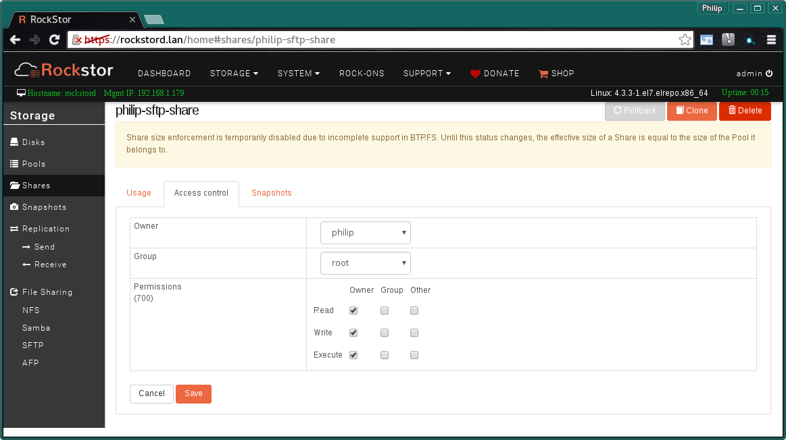
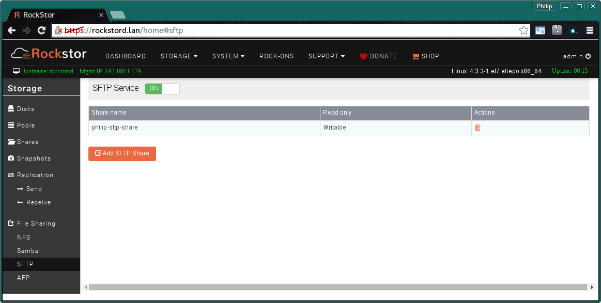
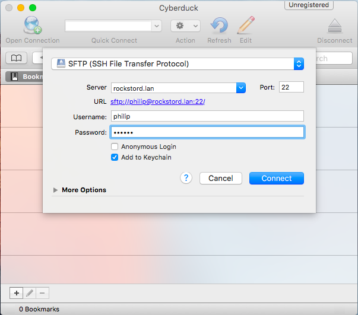
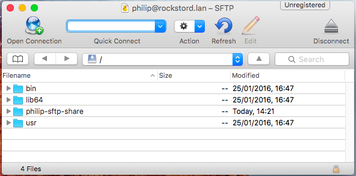

.. _sftp:

Secure File Transport Protocol (SFTP)
=====================================

This is a basic method / protocol for transferring data based on the ancient
and insecure File Transfer Protocol (FTP), only updated to be more secure. The
internal system used by Rockstor is that included as a subsystem within the
openssh server.

Unlike other file sharing systems like :ref:`samba`, SFTP has
no built in discovery or service publishing components. This makes it a
simpler system but one that requires a little more effort to connect with.
Most notably is it required that you manually enter the Rockstor's hostname
or ip address on the clients that wish to connect.

.. _rockstor_sftp:

The Rockstor SFTP System
------------------------

By default no user other than root are allowed to login via ssh or use SFTP.
This restriction improves security but means there are certain conditions that
must be met to gain SFTP access to a Rockstor share.

* the **SFTP user** must be a **Rockstor user**
* the **SFTP user** must also be the **owner** of an **exported SFTP share**

These restrictions make Rockstor's SFTP implementation more suited for
individual storage needs as opposed to a shared storage area accessed by
multiple users. In the following example we will setup a secure share for use by
a single user, ie for secure file access / storage across client platforms.

Note also that the share or shares owned by the SFTP user will be mounted within
a chroot environment, internally this is located at
*/mnt2/<username>/<sharename>*.

.. _create_sftp_share:

Creating a SFTP Share
---------------------

In order to establish a SFTP share it is first necessary to have a
pre-configured storage pool, a share of this pool or part there of, and a
Rockstor user to authenticate against this share. Finally the share must be
exported via the SFTP method. The following list details in the suggested order
and gives links to the documentation on each of these steps.

* Start with the :ref:`User Configuration page <users>` and follow the :ref:`Add a Rockstor user <adduser>` instructions to create a user to assign as owner of the share and use in the SFTP authentication process.
* If you don't already have a storage pool for your SFTP share, reference the :ref:`pools` page, :ref:`createpool` section to create the pool that will contain the SFTP Share.
* A :ref:`Share <shares>` of a storage pool area is then required, see :ref:`createshare`.
* Finally this Share is exported via :ref:`sftp_export`.

The following sections illustrate examples of the last 3 items in the above.

.. _sftp_pool:

The SFTP Pool
^^^^^^^^^^^^^

The following example shows a general purpose **rock-pool** has been created.

..  image:: rock_pool.png
    :scale: 80%
    :align: center

*A Raid1 pool of 2 drives*

.. _sftp_share:

The SFTP Share
^^^^^^^^^^^^^^

Here a :ref:`Share <shares>` has been created on the above rock-pool disk set.

..  image:: sftp_share.png
    :scale: 80%
    :align: center

A 20GB share of the rock-pool resource.

Note the required setting of owner is set here to the intended user, this page
appears when the share name is clicked on and the **Access control** tab is
selected. An **Edit button** brings up the following display.

Please note the **required setting** of **owner** has to be **non root**. If not
then when a SFTP export is attempted a warning will be given.

..  _sftp_export:

Add SFTP Export
^^^^^^^^^^^^^^^

Finally **export** the **Share** via the **SFTP** entry in **File Sharing**.
This menu entry is available in the **Storage** section. Note that the **SFTP
Service** must be **ON**, the default, for the configured shares to be
available to SFTP clients.

..  image:: add_sftp_export.png
    :scale: 80%
    :align: center

Note the **Writable** or **Read only** settings for this export option.

The resulting SFTP export is then displayed in summary form:

**N.B even if a share is writable by the user the export "read only" option
will take precedence.**

.. _sftp_access:

Accessing a SFTP Share
----------------------

Depending on your chosen operating system your options to access a SFTP Share
differ.

.. _sftp_linux:

SFTP Access from Linux
^^^^^^^^^^^^^^^^^^^^^^

Most Linux desktop systems have SFTP capability built into their file managers.
This is usually accessed either via a url entry such as in Nautilus, the
gnome file manager, or by way of a form entry system such as in KDE. The typical
URL that can be used in both desktop environments is as follows:-

* **sftp://username@rockstor-ip-or-name**

so to access the above example share the url would be:-

* **sftp://philip@rockstord.lan**

The following shows this url having been entered via the **Other Locations**
option in Nautilus. This is akin to **Ubuntu's** Unity **Connect to Server**. A
similar facility is possible via KDE's dolphin file manager.

..  image:: gnome_sftp.png
    :scale: 80%
    :align: center

And the consequent connection along with the associated eject icon.

..  image:: gnome_sftp_connected.png
    :scale: 80%
    :align: center

Here we see the minimal content associated with a chroot environment and the
share or shares owned by this use; in this case the **philip-sftp-share**.

Once connected the resource is available to other GUI programs via their
respective open / save dialogues and the connection can be bookmarked to ease
future access.

.. _sftp_osx:

SFTP Access From OSX
^^^^^^^^^^^^^^^^^^^^

A popular SFTP client program on OSX is `Cyberduck <https://cyberduck.io>`_.
This is a particularly feature full client available directly from the link
given or if preferred via a paid version on the Mac App Store where updates
will then be automated. Cyberduck is licensed under GNUv2 and is available
for OSX 10.7 (Lion) or later. Source code and issue tracking are available
at `trac.cyberduck.io <https://trac.cyberduck.io/>`_.

A partner project by the same founding author of Cyberduck is Mountain Duck
which allows for drive mappings to be made in the Finder over a variety of
protocols including SFTP.

Here we see the dialog resulting from the **Open Connection** button filled out
with the example used in this guide. Note the generated url in blue from the
information entered. The 22 at the end of the url is required by some clients
and is the default port used by SSH/SFTP.

The display once the above connection is made is shown below; note the
**eject** icon to disconnect.

Finally we see Cyberduck used to transfer the OSX screen shots used in this
document via the example Rockstor share. A testfiles directory is also visible.

..  image:: cyberduck_sftp_share.png
    :scale: 80%
    :align: center

Note that Cyberduck supports **drag and drop** from the OSX Finder app.

.. _sftp_win:

SFTP Access from Windows
^^^^^^^^^^^^^^^^^^^^^^^^

Most versions of MS Windows do not have a build in ability to access a SFTP
resource. To partially get around this limitation one can install
an explorer extension such as `Swish <http://www.swish-sftp.org/>`_ which is
Licensed under GPLv2 with source code available on their `Swish GitHub page
<https://github.com/alamaison/swish/blob/develop/LICENSE.txt>`_. Note also
that Swish has been translated to over 20 languages via `their Transifex
account <https://www.transifex.com/alamaison/swish/>`_.

An important aspect to the use of Swish is that it is an explorer extension
only and `does not map a drive <http://www.swish-sftp.org/wiki/FAQ>`_ in the
traditional Windows way so does not make the SFTP resource available to other
programs. Ie it is not a filesystem driver.

Also note that Cyberduck, as referenced in the :ref:`sftp_osx` section above,
is also available for various versions of windows.

A dedicated SFTP client application that has found favour in `our forum
<http://forum.rockstor.com/>`_ is `WinSCP <https://winscp.net>`_ which is
`GPLv3 Licenced <https://winscp.net/eng/docs/license>`_.

.. _sftp_winscp:

SFTP Access From WinSCP
^^^^^^^^^^^^^^^^^^^^^^^

When you install WinSCP, it will ask you to pick your preferred interface either 
the commander interface, or the explorer interface pictured below.  The WinSCP recommendation
is for Windows users to chose the explorer interface.  If you have worked with ftp clients
in the past, you may find the commander interface more familiar.  After you've installed
WinSCP, when you start the program it will immediately bring up the Login window to start
an SFTP session.

..  image:: winscp_login.png
    :scale: 100%
    :align: center

In host Name you can enter your Rockstor appliance's hostname, or IP address.  For User name
enter the  :ref:`user you created <adduser>` and made owner of the SFTP share, and enter that users password.  Click
the **Login** button, and it should open a session.  Your Rockstor server will have a self signed
certificate which may generate a warning the first time you connect.  If you are sure you're
connected to your server, accept the certificate.  Once the session is established you'll
be viewing the interface you chose during install

Either the Explorer interface.

..  image:: winscp_explorer_view.png
    :scale: 100%
    :align: center

Which provides of view of the files on the SFTP share in familiar Windows Explorer like interface, or 
if you choose the Commander interface.

..  image:: winscp_commander_view.png
    :scale: 100%
    :align: center

Your view will have local files on the left, server files on the right, and a status window on the bottom. 
