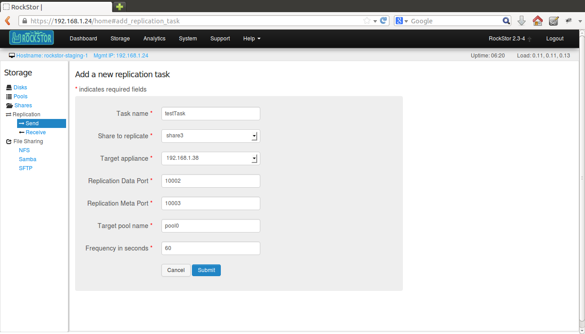
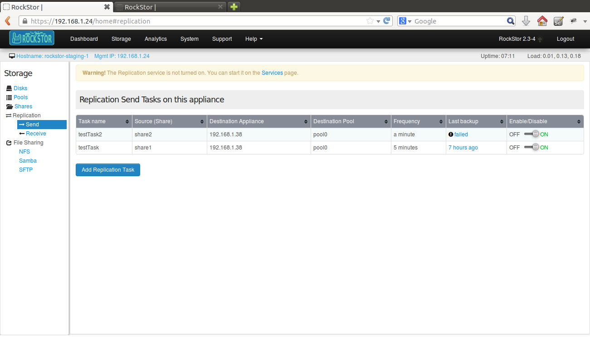
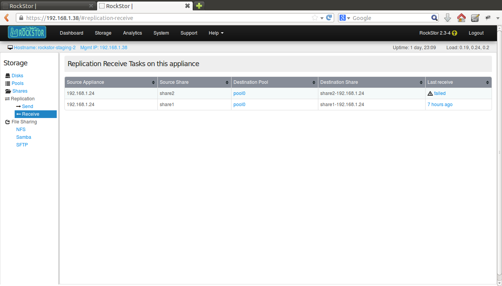
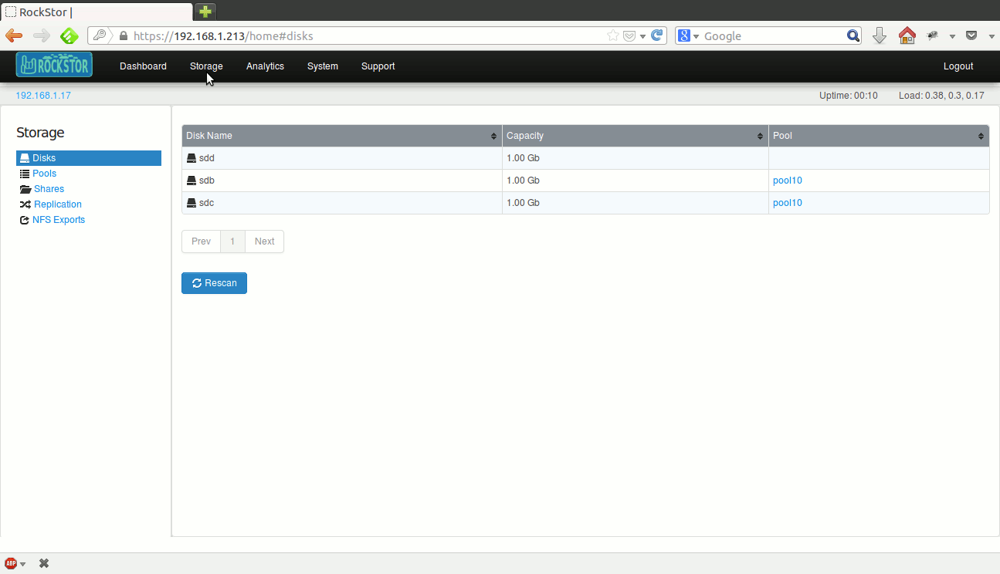

Share replication
=================

Redundancy options of a pool operate at the single appliance level. While this
reduces the risk of data loss from bad disks, it does no good if the entire
appliance fails. To mitigate and distribute this risk, Shares can be replicated
to other Rockstor appliances.

Replicate shares to other Rockstor appliances
---------------------------------------------

Shares from one Rockstor appliance can be replicated to others at scheduled
frequencies. Replication frequency is in seconds and can be as little as 60
seconds. The appliance that hosts the replica is called a target
appliance. At least one target appliance must be added before setting up
replication for shares. 

Before you want to replicate a share make sure you do the following:

1. Know what shares on source appliance are to be replicated.

2. Know what pool on target appliance you want to send your shares to.

3. Turn ON the Replication services on both source and target appliances.

In order to make replication work, you should add a target appliance on the source
and a source appliance on the target. This way,they will be aware of each other.
See :ref:`add_appliance` for more details.

Once the appliance is successfully added it's Ip address is shown in the Appliance table. 
Click on the Ip address and it should take you Web UI of the target appliance.

In the webui, click on the *Storage* tab to enter he main Storage view. Now
under *Replication*, click on *Send* in the left sidebar to enter Replication view. Click
on **Add Replication Task** button and a form will be displayed. Submit the
form as shown in the screenshot. Here is what the fields in the form mean:
 
	* Share to replicate : choose the share you want to replicate.
	* Target Appliance : select the Ip address of the Target appliance.
	* Replication Data Port : give a port number through which the actual file system data is transferred.(ex:*1002*)
	* Replication Meta Port : give a port number through which the meta data is transferred.(ex:*1003*)
	* Target pool name : give Pool on the Target appliance you want to store your data to.
	* Frequency in seconds : give number as how often you want to create a replica.

Note that a pool must already exist on the target appliance to host the
replica of the share.

After the given frequency of time you can see the history of the tasks created
by checking either on source or target appliances.

In order to see the repliaction task table,

on a source appliance
go to *Storage-> Replication-> Send*

on a target appliance
go to *Storage-> Replication-> Receive*

Disable or enable a replication task
^^^^^^^^^^^^^^^^^^^^^^^^^^^^^^^^^^^^
You can't delete a replication but you can disable it.
In the webui, click on the *Storage* tab to enter the main Storage view. Now
under *Replication* click on *Send* in the left sidebar to enter *Replication* view. In the
displayed table of replication tasks, click on the **disable** icon of the
corresponding task to disable it as shown below.

Follow the same procedure to enable a replication task back again.
