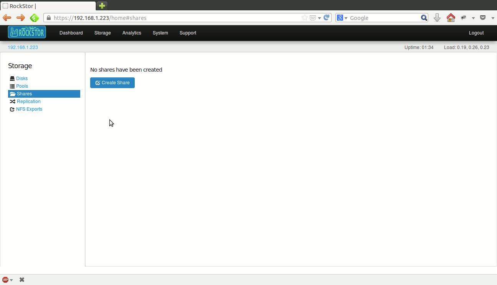
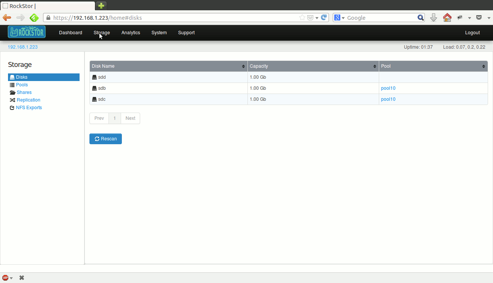
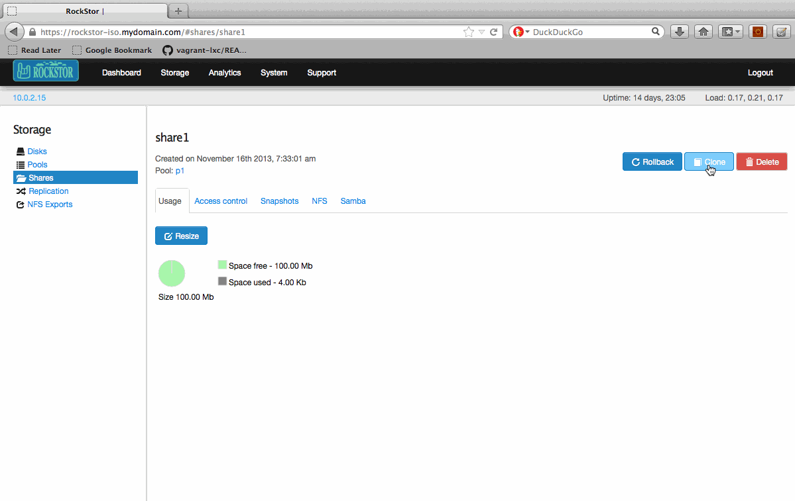
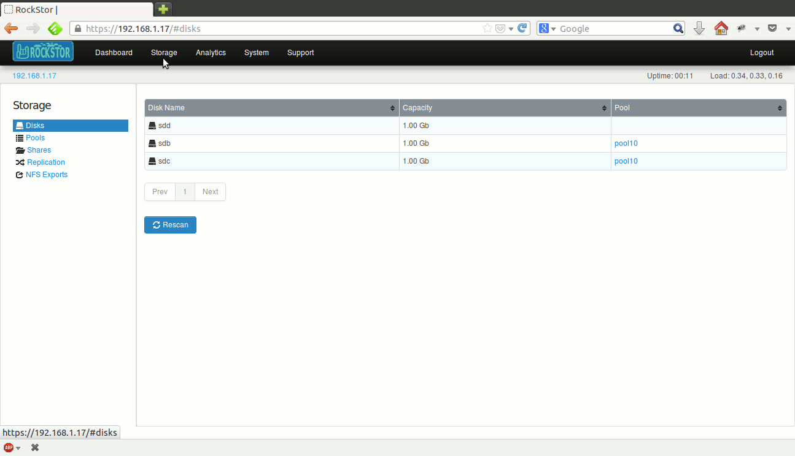
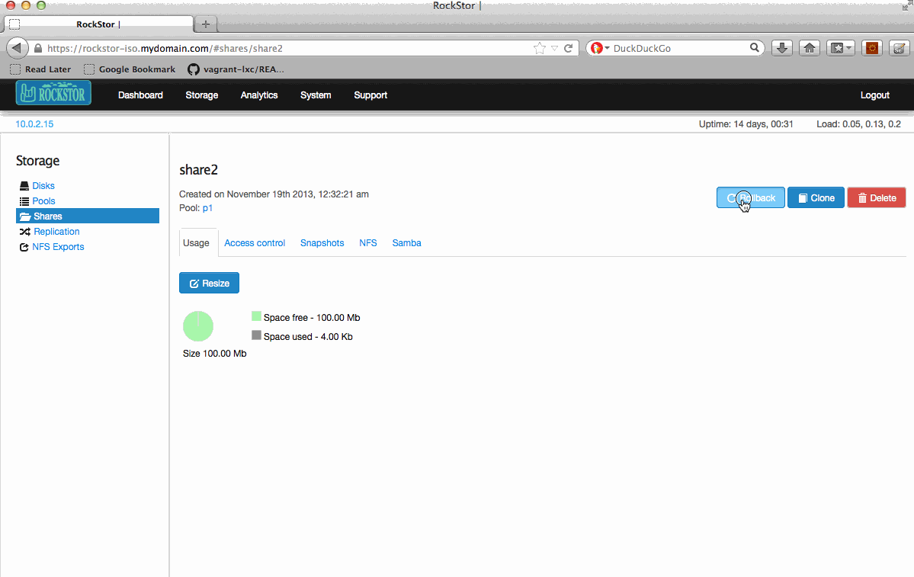

Shares, Snapshots and Clones
====================

.. _createshare:

Create a share
--------------

Share related operations including creating a share can be done from the
*Shares* view. In the web-ui, click on the *Storage* tab to enter the main
Storage view. Now click on *Shares* in the left sidebar to enter the *Shares*
view. If there are any shares in the system, they are displayed in a table. If
there are large number of shares, the table is paginated and the current page
number is displayed below the table along with **Prev** and **Next** buttons.

The display can be sorted by individual columns by clicking small up/down
arrows displayed in each column header.

Click on **Create Share** button and the create share form will be
displayed. Submit this form to create a new share as shown below.

When creating a share, an arbitrary size can be chosen to thin provision or
over provision the share. As long as the underlying pool is resized enough to
accomodate the share capacity, users will not see out of space errors. If a
share's usage exceeds the provisioned capacity or underlying actual capacity,
out of space errors will occur as users try to write.

Resize a share
--------------

A share can be resized by increasing or decreasing it's provisioned
capacity. Go to the Storage tab of the web-ui and click on *Shares* in the
left
sidebar to enter the *Shares* view. In the displayed table of shares, click on
the share to be resized to enter the share detail view. Now, click on the
**Resize** button and a small form is dispalyed. Submit it after
entering the new desired size as shown below.

Note that a share cannot be decreased to a capacity lower than it's current usage.

Delete a share
--------------

A share that is not in use and has no snapshots can be deleted. However, if a
share is made available to remote clients via NFS or SMB, or has snapshots, it
cannot be deleted. So, ensure that all snapshots have been deleted and that the
share is not in use before deleting it.

Go to the Storage tab of the web-ui and click on *Shares* in the left sidebar to
enter the *Shares* view. In the displayed table of shares, click on the
**trash** icon corresponding to the share to delete it as shown below.

A share can also be deleted by clicking the **Delete** button inside it's
detail view.

Clone a share
-------------

A Clone is a Share that is an exact copy of the Share (or Snapshot) that it was created from, at the time that it was created.

In RockStor, clones can be created from shares or snapshots.

To clone a Share, go to the Storage tab of the web-ui and click on *Shares*
in the left sidebar to enter the *Shares* view. In the displayed table of
shares, click on the share to be cloned to enter the share detail view. Now,
click on the **Clone** button and the form to create a clone is
dispalyed. Submit it after entering a desired name for the soon to be created
Share as shown below.

To clone a snapshot, see :ref:`clonesnap`.

Snapshots
---------

Snapshots are read-only point in time copies of a share. They are created
instantaneously and take up no extra space when created because of CoW nature
of BTRFS filesystem. Unlimited number of snapshots can be created for a given
share.

Create a snapshot
^^^^^^^^^^^^^^^^^

In the web-ui, click on the *Storage* tab to enter the main Storage view. Now
click on *Shares* in the left sidebar to enter the *Shares* view. In the
displayed table of shares, click on the share to snapshot, to enter the share
detail view. Any existing snapshots of the share are displayed in a table
inside the *Snapshots* tab. Now click on the **Create snapshot** button and a
small form is displayed. Submit it to create the snapshot as shown below.

By checking *Visible to user?* box in the form, the snapshot will be made
visible to remote clients as a read-only directory inside the share. This is
useful for users to fetch or refer to older files.

Delete a snapshot
^^^^^^^^^^^^^^^^^

In the web-ui, click on the *Storage* tab to enter the main Storage view. Now
click on *Shares* in the left sidebar to enter the *Shares* view. In the
displayed table of shares, click on the share from which to delete a snapshot
to enter the share detail view. Click on the **trash** icon
next to the snapshot to delete it as shown below.

.. _clonesnap:

Clone a snapshot
^^^^^^^^^^^^^^^^^
A Clone can be created from a Snapshot of a Share. This is useful if you wish
to create a new Share that is an exact copy of the Snapshot.

In the web-ui, click on the *Storage* tab to enter the main Storage view. Now
click on *Shares* in the left sidebar to enter the *Shares* view. In the
displayed table of shares, click on the desired share to enter the share detail
view, and click on the *Snapshot* tab to view the list of snapshots of the
share. Click the **Clone** button to display the form to create a clone. Submit
it after entering the new name for the newly created share as shown below.

.. image:: clone_snap.gif
   :scale: 65%
   :align: center

Rollback a Share
----------------

A Share can be rolled back to any of its snapshots. This is useful if you wish
to restore a Share to it's previous state represented by its snapshots

In the web-ui, click on the *Storage* tab to enter the main Storage view. Now
click on *Shares* in the left sidebar to enter the *Shares* view. In the
displayed table of shares, click on the desired share to enter the share detail
view. Click the **Rollback** button to display the form to select a snapshot to
rollback to, and submit the form as shown below.

*Note:* Shares that are exported through NFS or Samba cannot be rolled back. The
NFS or Samba shares should be deleted before the share can be rolled back.

