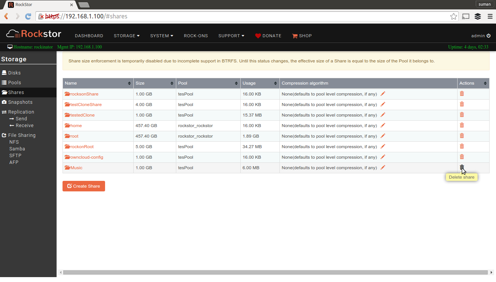

.. _shares:

Shares
======

A Share is a chunk of space carved out of a Pool. Shares behave like
directories on the Rockstor system which can be accessed via protocols like
:ref:`samba`, :ref:`afp`, :ref:`nfs` and :ref:`sftp`. They also provide storage
to Rock-ons for application and user generated data. See :ref:`rockons_intro`
for more information.

Internally, Shares are BTRFS subvolumes of a given filesystem(Pool).

Share related operations can be managed from the **Shares** screen listed under
the **Storage** tab of the Web-UI.

.. _createshare:

Creating a share
----------------

Since Shares are BTRFS subvolumes, they can be created and resized instantly to
grow and shrink capacity at a later time. Click on **Create Share** button and
submit the Share creation form to create one. There is a tooltip for each input
field to help you choose appropriate parameters. Here's a video showing this
operation.

.. youtube:: https://www.youtube.com/watch?v=T5sg8xSoH1E

Resizing a share
----------------

A share can be resized by increasing or decreasing it's provisioned
capacity. To resize a Share, Click the **Resize** button in it's detail screen
as shown in this video

.. youtube:: https://www.youtube.com/watch?v=T5sg8xSoH1E

Note that a share cannot be decreased to a capacity lower than it's current
usage. Internally, Share capacity enforcement is done via BTRFS qgroup feature
set. To find out more, go `here <https://btrfs.wiki.kernel.org/index.php/Quota_support>`_.

.. _sizedisabled:

Share size enforcement temporarily disabled
^^^^^^^^^^^^^^^^^^^^^^^^^^^^^^^^^^^^^^^^^^^

.. raw:: html

   

   Currently, as of 3.8-7 version, Share size enforcement has been disabled. So
   the Size input during Share creation has no real effect. Any Share can grow up
   to the Pool's capacity. Consequently, resizing a Share also has no effect. We
   will re enable the enforcement when support in BTRFS improves.
   

Deleting a Share
----------------

A Share that is not in use and has no snapshots can be deleted. However, if a
share is exported to remote clients via sharing protocols, or has snapshots, it
cannot be deleted. So, ensure that all Snapshots have been deleted and that it
is not in use before deleting it.

To delete a Share, click on the corresponding **trash** icon for it in the
*Shares* screen under the *Storage* tab of the Web-UI.

A Share can also be deleted using the **Delete** button inside it's detail screen.
