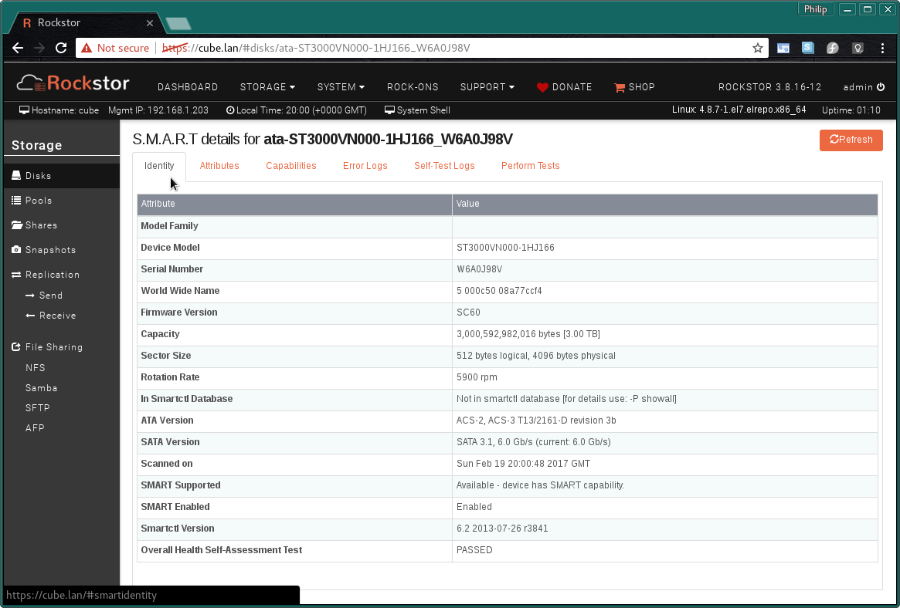
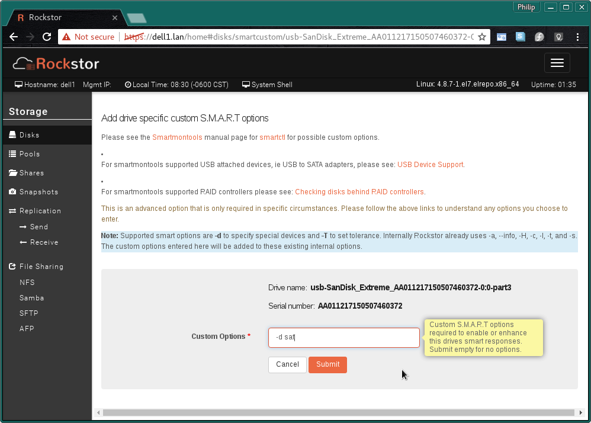
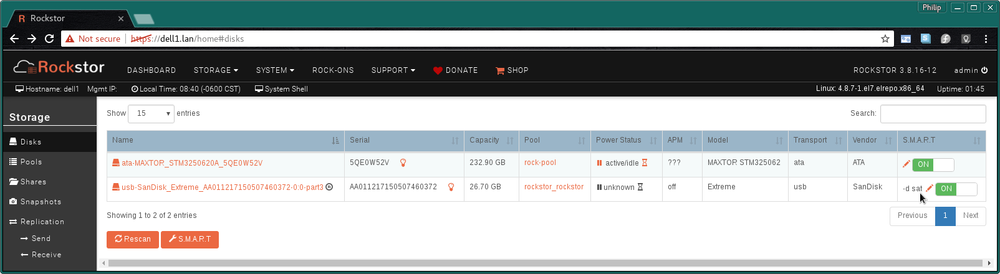
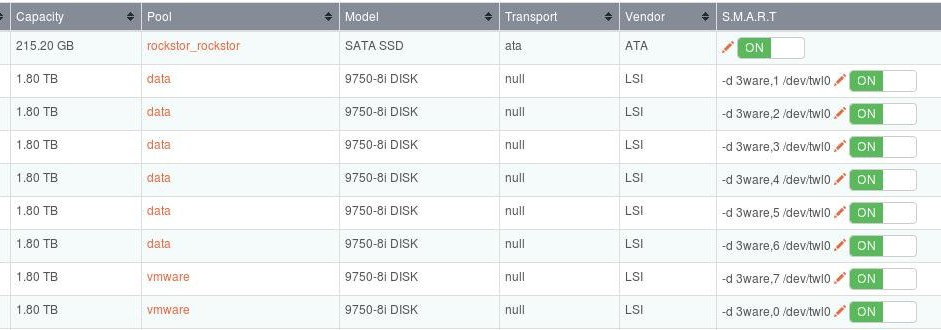

.. _smart:

S.M.A.R.T
=========

S.M.A.R.T Stands for Self-Monitoring, Analysis, And Reporting Technology and
Rockstor uses the tools provided by the
`Smartmontools <https://www.smartmontools.org/>`_ project to interface
with the hardware it finds attached that supports this technology.

Clicking on the name of a device in the table on the :ref:`disks` page results
in a multi tabbed view. What follows are examples of these tabs.

.. image:: smart_attributes_tab.png
   :width: 100%
   :align: center

.. image:: smart_capabilities.png
   :width: 100%
   :align: center

.. image:: smart_error_logs_tab.png
   :width: 100%
   :align: center

.. image:: smart_self_test_logs_tab.png
   :width: 100%
   :align: center

.. image:: smart_perform_test_tab.png
   :width: 100%
   :align: center

Clicking on the **Refresh** button in any of the tabs results in all the SMART
information across all tabs being updated. Note that currently these tabs only
display the information as of the last time this Refresh button was used.

In most cases modern Hard Disk Drives (HDD) and Solid State Drives (SSD) have
varying degrees of SMART capability build into them. However some devices,
especially if only partially supported, or if very new (and so un-know to
smartmontools by default), may require custom options to 'assist'
smartmontools in it's job of reporting SMART capability and or status. The
next section covers how Rockstor enables configuration of these additional
manual settings.

..  _diskcustomsmart:

Disk Custom S.M.A.R.T Options
-----------------------------

On the :ref:`disks` page in the Web-UI there is a **S.M.A.R.T** column in the
disk table which contains a :ref:`smartswitch` and a :ref:`smartpen`, the
following sections detail the meaning and use of these elements.

.. _smartswitch:

S.M.A.R.T Switch
^^^^^^^^^^^^^^^^

This option is both a control and an indicator of Rockstor's finding on SMART
availability for the given device / disk. The state of the switch indicates
if SMART monitoring is enabled or disabled, and can apply the same, but there
is also a **Not Supported** text state that indicates no SMART availability
or compatibility was found on the specific device.

In the following example we see one disk with support (as switch is visible),
and another device, a *SanDisk Extreme USB 3.0*, indicating **Not Supported**.

.. image:: no_smart_support.png
   :width: 100%
   :align: center

But note that in some cases the reason for no SMART support is down to the
device, or rather the smartmontools subsystem, requiring a custom smart option.
In many cases an indication of this requirement can be found in the *System -
Logs Manager* shortly after using the **Rescan** button on the :ref:`disks`
page. Using the default option of tailing the Rockstor Logs we see an example
in the following image:

Example of an error suggesting the need for :ref:`diskcustomsmart`:

.. image:: smart_d_logs.png
   :width: 100%
   :align: center

Note in the last entry that smartctl, the main program/binary of smartmontools,
is indicating an Error reading infomation from the SanDisk device.

Repeating the error message here for clarity we have:

   Error running a command. cmd = ['/usr/sbin/smartctl', '--info',
   '/dev/disk/by-id/usb-SanDisk_Extreme_AA011217150507460372-0:0'].
   rc = 1. stdout = ['smartctl 6.2 2013-07-26 r3841[x86_64-linux-
   4.8.7-1.el7.elrepo.x86_64] (local build)', 'Copyright (C) 2002-13,
   Bruce Allen, Christian Franke, www.smartmontools.org', '',
   '**/dev/disk/by-id/usb-SanDisk_Extreme_AA011217150507460372-0:0:
   Unknown USB bridge [0x0781:0x5580 (0x010)]', 'Please specify device
   type with the -d option.**', '', 'Use smartctl -h to get a usage summary',
   '', '']. stderr = ['']

In the above, in bold to aid this explanation, we see that smartmontools
doesn't understand this device and is suggesting that a custom smart option
be specified. This can be done using the :ref:`smartpen`.

.. _smartpen:

S.M.A.R.T Pen Icon (Edit)
^^^^^^^^^^^^^^^^^^^^^^^^^

In some instances, such as the one detailed in the previous :ref:`smartswitch`
section, additional functionality can be had by adding custom SMART options.
The **Pen Icon** and it's consequent :ref:`drivecustomsmart` page is intended
for this purpose.

.. _drivecustomsmart:

Add Drive Specific Custom S.M.A.R.T Options
-------------------------------------------

After clicking on a devices :ref:`smartpen` within the :ref:`Disks` table the
following Web-UI page is presented:

In the following we have entered the "-d sat" option

This configuration page includes links to smartmontools pages that can be used
to research what options may be appropriate for your devcie.

**Do not try random options without first researching what might be
appropriate for your particular device**

The research links contained within the configuration screen are duplicated
here for convenience:

* Main `Smartmontools <https://www.smartmontools.org/>`_ home page.
* *Smartmontools* `manual <https://www.smartmontools.org/browser/trunk/smartmontools/smartctl.8.in>`_ for the the smartctl program.
* `USB Device Support <https://www.smartmontools.org/wiki/Supported_USB-Devices>`_ note the *Options* column in the *Supported Devices* table.
* `Checking disks behind RAID controllers <https://www.smartmontools.org/wiki/Supported_RAID-Controllers>`_ page.

In our "SanDisk Extreme USB 3.0" example the following is the resulting disk
page:

Note that the custom options entered will be displayed in the S.M.A.R.T
:ref:`disks` table column and in this example SMART support has now been
identified; via our custom smart option.

**Note: The Rescan button below the Disks table will apply all custom smart
options, prior to it's use their affect may not be visible.**

.. _smartviahwraid:

S.M.A.R.T through Hardware RAID Controllers
-------------------------------------------

Another facility enabled by adding custom SMART options is that of enabling
the reading of SMART information when the drives concerned are connected to a
hardware raid controller. In this instance there must of course be a one to
one mapping of actual drives to the devices presented to Rockstor, ie JBOD
or Just a Bunch Of Disks mode or otherwise know as pass-through or HBA mode,
or IT (initiator target) mode. Essentially the hardware raid controller does
no RAID functions and simply presents the drives 'as is'.

Due to controller manufacture differences the way SMART data is retrieved
differs; smartmontools can cope with some of these differences but it often
requires additional custom smart options. And these options are also often
controller model specific. Please see the `Checking disks behind RAID
controllers <https://www.smartmontools.org/wiki/Supported_RAID-Controllers>`_
for the specific options required.

Currently, in Rockstor, these 'SMART through hardware raid controller' options
are entirely manual but an example posted by a Rockstor forum user who also
helped to develop these options is shown in the following example:

Thanks to `Rockstor forum <https://forum.rockstor.com/>`_ user **kcomer** for
`helping with the development
<https://forum.rockstor.com/t/s-m-a-r-t-support-is-not-available-for-this-disk/830>`_
of this custom smart option and for supplying this image of it's use.

**Note that in the above example the "/dev/twl0" identifies the first (and
only in this case) controller and the "-d 3ware,X" identifies the card port
that each drive is attached to.** Identifying which port relates to which
drive is still a manual process that has yet to be automated in Rockstor and
in this case care should be take to update these port when re-arranging
drives. It is hoped that this facility is improved in the future.

**It is always best to take a not of a SMART reports drive serial number to be
sure which drive it references. Especially when connected to a hardware raid
controller.**

