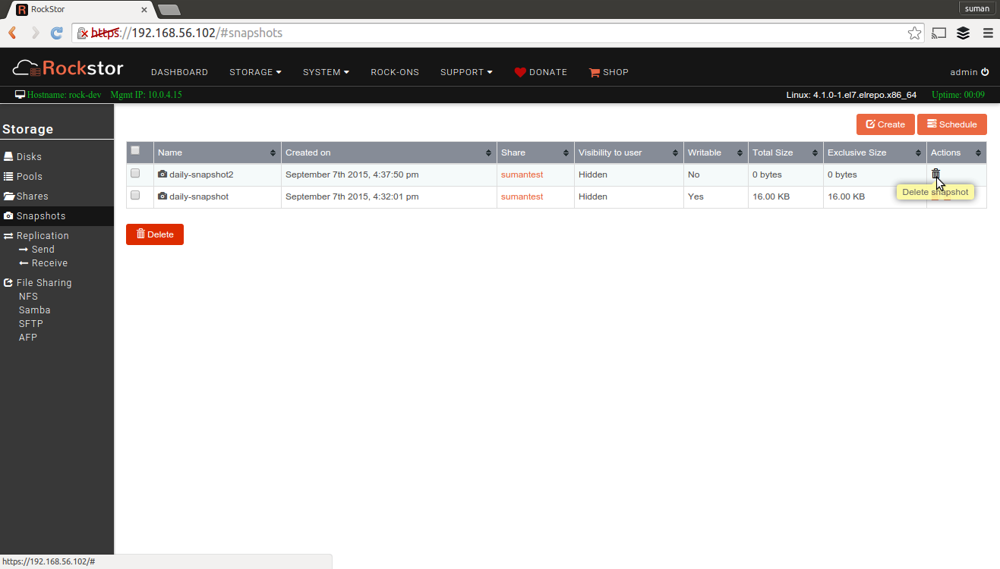

.. _snapshots:

Snapshots
=========

Snapshots are point in time representations of :ref:`shares`. Here are some benefits of Snapshots.

* They can be created and deleted instantly.
* They take up very little extra space when created.
* They can be read-only or read-write
* Files present in a Share when a Snapshot is taken are preserved in it even if
  they are deleted in the original Share afterwards.
* A Snapshot takes up extra space only to store files deleted in it's Share over time.
* A Share can be rolled back in time to one of it's Snapshots
* A Snapshot can be cloned to become a brand new Share
* Many Snapshots can be taken overtime

Internally, Snapshots are BTRFS Snapshots and valuable benefits listed above
are possible due to BTRFS's CoW(Copy on Write) capabilities. To find out more,
go `here <https://btrfs.wiki.kernel.org/index.php/SysadminGuide#Snapshots>`_.

Snapshot related operations can be managed from the **Snapshots** screen listed
under the **Storage** tab of the Web-UI.

Creating a Snapshot
-------------------

To create a Snapshot, use the **Create Snapshot** button and submit the form
with your chosen input values. There is a tooltip for each input field with
more help. Here's a sample video showing this operation.

.. youtube:: https://www.youtube.com/watch?v=k537gsx8ifQ

Scheduling Snapshots
--------------------

Using Rockstor's :ref:`tasks` system it is also possible to schedule Snapshot
creation automatically at a predefined time and frequency similar to cronjobs
in Linux. To find out more, see :ref:`snapshottask`.

You can also schedule Snapshots such that the frequency decreases over
time. For example, you can schedule 12 hourly Snapshots during the day, 4
weekly, 12 monthly and 2 yearly and so on. To find out more, see
:ref:`mpsnapshots`.

Deleting a snapshot
-------------------

Snapshots can be easily deleted from the Web-UI. To delete a single Snapshot,
use the corresponding **trash** icon for it in the **Snapshots** screen under
the **Storage** tab. To delete multiple Snapshots, select them and use the
**Delete** button at the bottom.

