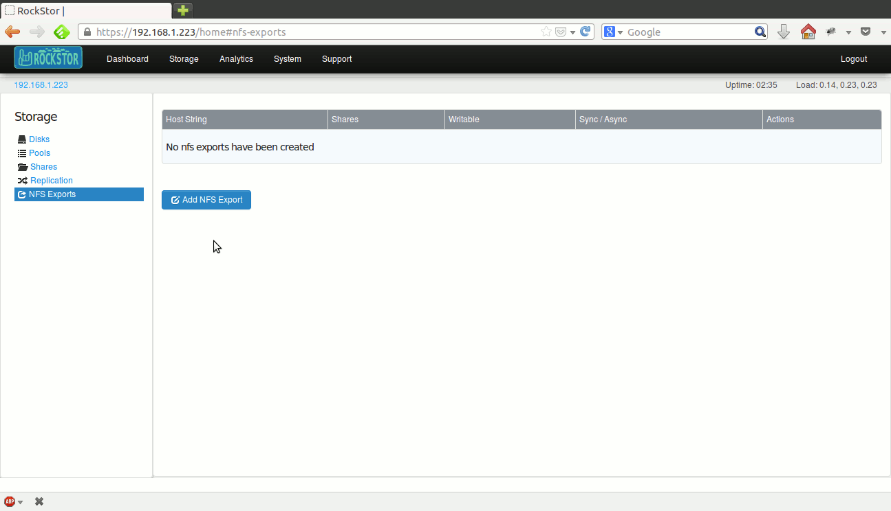
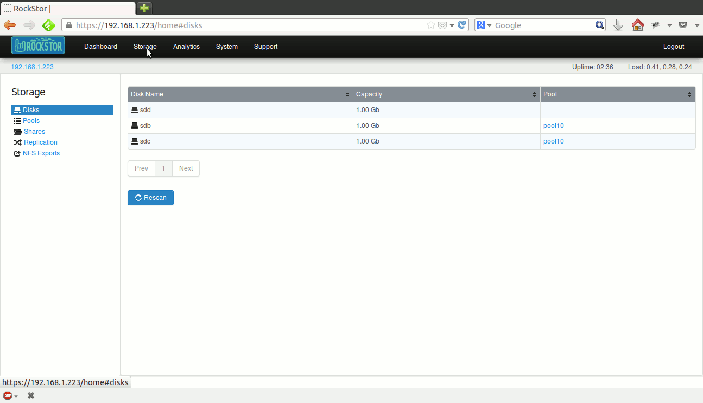
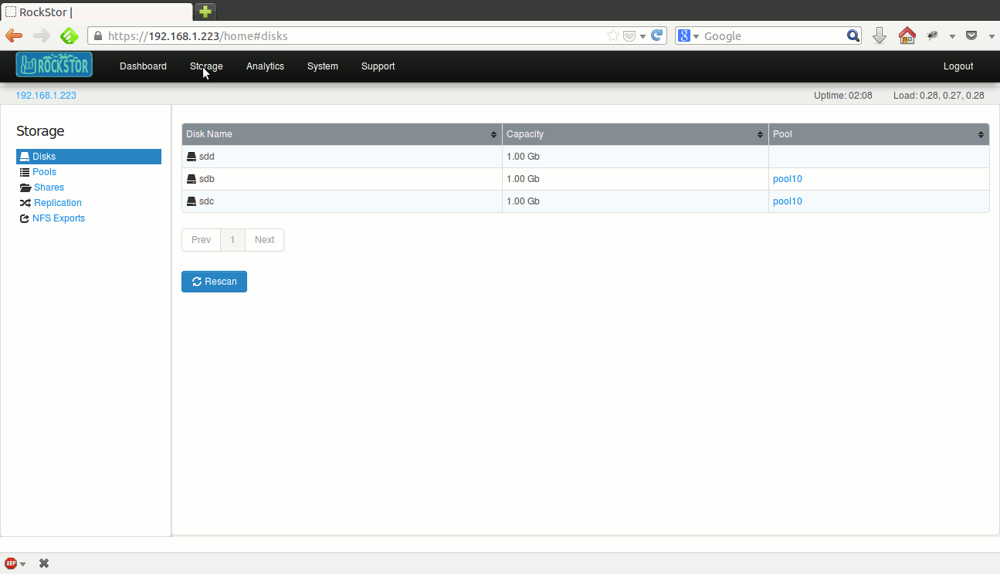

Common storage operations
=========================

Common storage operations including creating pools, shares etc.. are possible
with few clicks on the webui. Click on the Storage tab of the webui to enter
the main Storage view. Below is a collection of most common operations.

Scan the appliance for new disks
--------------------------------

In the webui, click on the *Storage* tab to enter the main Storage view. This
also serves as the Disks view, which is selected by default in the left
sidebar. Already existing disks in the system are displayed.

.. image:: disks_rescan.png
   :scale: 65%
   :align: center

Click the **Rescan** button to scan for any new disks added to the system since
the last scan.

If there are large number of disks in the system, the table is paginated and
the current page number is displayed below the table along with **Prev** and
**Next** buttons.

The display can be sorted by individual columns by clicking small
up/down arrows displayed in each column header.

Partitioned disks
^^^^^^^^^^^^^^^^^

Rockstor works only with whole disk drives that do not contain a partition
table. If a disk has a partition table, it is suspected to have data. Such
disks are displayed with a little sprocket icon next to them and relevant help
text is displayed upon mousing over this icon.

.. image:: partitioned_disk.png
   :scale: 65 %
   :align: center

Inorder to use a partitioned disk, it's partition table needs to be wiped as
indicated by the help text. Click on the sprocket icon and a popup confirmation
dialog is displayed. Upon confirmation, the partition table is wiped and the
disk will be ready for use as shown below.

.. image:: disk_wipe_partition.png
   :scale: 65 %
   :align: center

Broken or removed disks
^^^^^^^^^^^^^^^^^^^^^^^

Rockstor detects when a disk drive goes offline(damaged or removed from the
system) and marks it as such. This is indicated by the little trash icon next
to the disk and relevant help text is displayed upon mousing over this icon.

.. image:: disk_offline.png
   :scale: 65 %
   :align: center

Inorder to remove the disk from Rockstor, click on the trash icon and a popup
confirmation dialog is displayed. Upon confirmation, the disk will be removed
as shown below.

.. image:: disk_remove.png
   :scale: 65 %
   :align: center

Create pool
-----------

Pool related operations including creating a pool can be done from the *Pools*
view. In the webui, click on the *Storage* tab to enter the main Storage
view. Now click on **Pools** in the left sidebar to enter the *Pools* view. If there are any pools in the system, they are displayed in a
table. If there are large number of pools, the table is paginated and the
current page number is displayed below the table along with **Prev** and
**Next** buttons.

The display can be sorted by individual columns by clicking small
up/down arrows displayed in each column header.

.. image:: pools_view.gif
   :scale: 65 %
   :align: center

Click on **Create Pool** button and the create pool form will be
displayed. Submit this form to create a new pool as shown below.

.. image:: create_pool.gif
   :scale: 65 %
   :align: center

When creating a new pool, choose the appropriate redundancy from the *Raid
configuration* dropdown menu.

Redundancy options
^^^^^^^^^^^^^^^^^^
All standard BTRFS redundancy options are available when creating a pool.

* **Single**: One or more disks can be used. Data is neither mirrored nor
  striped. But metadata is mirrored across drives. Drives of different
  capacities can be used with this configuration.
* **Raid0**: Two or more disks of same size can be used. Both metadata and data
  are striped across the disks.
* **Raid1**: Two or more disks of same size can be used and the configuration applies
  to both data and metadata.
* **Raid10**: This is a Raid0 of Raid1 mirrors. Four or more disks of same size
  can be used and the configuration applies to both data and metadata.

Resize pool
-----------
A pool can be resized by adding more disks to it. Go to the Storage tabl of the
webui and click on *Pools* in the left sidebar to enter the *Pools* view. In
the displayed tabled of pools, click the pool to be resized to enter the pool
detail view. Now, click on the **Resize** button and a popup form is
displayed. Select disks to be added and submit the form. Upon success, pool's
detail view is dispalyed which lists the new disk(s) added and the resulting
new size of the pool as shown below.

.. image:: resize_pool.gif
   :scale: 65%
   :align: center

Delete pool
-----------
A *pool* can be deleted as long as it is empty, i.e., there are no *shares*
remaining in it.

Go to the Storage tab of the webui and click on *Pools* in the left sidebar to
enter the *Pools* view. In the displayed table of pools, click on the **trash**
icon corresponding to the pool to delete it as shown below.

.. image:: delete_pool1.gif
   :scale: 65%
   :align: center

A pool can also be deleted by clicking the **Delete** button inside it's detail
view.

Scrub pool
----------
A *pool* scrub operation can take a while depending on the size of the pool. To
start a scrub, go to the pool's detail view and click on the **Start scrub**
button. The button will be disabled during the scrub process and enabled again
once the scrub finishes.

Create share
------------

Share related operations including creating a share can be done from the
*Shares* view. In the webui, click on the *Storage* tab to enter the main
Storage view. Now click on *Shares* in the left sidebar to enter the *Shares*
view. If there are any shares in the system, they are displayed in a table. If
there are large number of shares, the table is paginated and the current page
number is displayed below the table along with **Prev** and **Next** buttons.

The display can be sorted by individual columns by clicking small up/down
arrows displayed in each column header.

.. image:: shares_view.gif
   :scale: 65%
   :align: center

Click on **Create Share** button and the create share form will be
displayed. Submit this form to create a new share as shown below.

.. image:: create_share.gif
   :scale: 65%
   :align: center

When creating a share, an arbitrary size can be chosen to thin provision or
over provision the share. As long as the underlying pool is resized enough to
accomodate the share capacity, users will not see out of space errors. If a
share's usage exceeds the provisioned capacity or underlying actual capacity,
out of space errors will occur as users try to write.

Resize share
------------

A share can be resized by increasing or decreasing it's provisioned
capacity. Go to the Storage tab of the webui and click on *Shares* in the
left
sidebar to enter the *Shares* view. In the displayed table of shares, click on
the share to be resized to enter the share detail view. Now, click on the
**Resize** button and a small form is dispalyed. Submit it after
entering the new desired size as shown below.

.. image:: resize_share.gif
   :scale: 65%
   :align: center

Note that a share cannot be decreased to a capacity lower than it's current usage.

Delete share
------------

A share that is not in use and has no snapshots can be deleted. However, if a
share is made available to remote clients via NFS or SMB, or has snapshots, it
cannot be deleted. So, ensure that all snapshots have been deleted and that the
share is not in use before deleting it.

Go to the Storage tab of the webui and click on *Shares* in the left sidebar to
enter the *Shares* view. In the displayed table of shares, click on the
**trash** icon corresponding to the share to delete it as shown below.

.. image:: delete_share.gif
   :scale: 65%
   :align: center

A share can also be deleted by clicking the **Delete** button inside it's
detail view.

Snapshots
---------

Snapshots are read-only point in time representations of a share. Snapshots are
created instantaneously and take up no extra space when created. Unlimited
number of snapshots can be created for a given share.

Create a snapshot
^^^^^^^^^^^^^^^^^

In the webui, click on the *Storage* tab to enter the main Storage view. Now
click on *Shares* in the left sidebar to enter the *Shares* view. In the
displayed table of shares, click on the share to snapshot, to enter the share
detail view. Any existing snapshots of the share are displayed in a table
inside the *Snapshots* tab. Now click on the **Create snapshot** button and a
small form is displayed. Submit it to create the snapshot as shown below.

.. image:: create_snap.gif
   :scale: 65%
   :align: center

By checking *Visible to user?* box in the form, the snapshot will be made
visible to remote clients as a read-only directory inside the share. This is
useful for users to fetch or refer to older files.

Delete a snapshot
^^^^^^^^^^^^^^^^^

In the webui, click on the *Storage* tab to enter the main Storage view. Now
click on *Shares* in the left sidebar to enter the *Shares* view. In the
displayed table of shares, click on the share from which to delete a snapshot
to enter the share detail view. Click on the **trash** icon
next to the snapshot to delete it as shown below.

.. image:: delete_snap.gif
   :scale: 65%
   :align: center

NFS exports
-----------

Shares can be exported to remote clients via NFS. Both NFS v3 and v4 are
supported. UID and GID mapping for the exported shares can be handled by
manually creating users or by using directory services like LDAP, NIS or AD.

NFS exports can be managed from the *NFS Exports* view. In the webui, click on
the *Storage* tab to enter the main Storage view. Now click on *NFS Exports* in
the left sidebar to enter *NFS Exports* view. If there are any exports in the
system, they are displayed in a table. If there are large number of exports,
the table is paginated and the current page number is displayed below the table
along with **Prev** and **Next** buttons.

The display can be sorted by individual columns by clicking small up/down
arrows displayed in each column header.

Below are the main operations possible from the *NFS Exports* view, which
operate on one or more shares and is a convenient way to manage exports for the
entire system. Although redundant, Rockstor also makes NFS export management
possible for a specific share from within the *NFS* tab of a share's detail
view.

Add NFS export
^^^^^^^^^^^^^^

A single NFS export represents a unique combination of clients to which a set
of shares are made accessible via chosen options. In the webui, click on the
*Storage* tab to enter the main Storage view. Now click on *NFS Exports* in the
left sidebar to enter *NFS Exports* view. Click on **Add NFS Export** button
and the export creation form will be displayed. Submit this form to add a new
nfs export as shown below.

Various fields of the form are explained as follows.

* **Shares to export**: Choose one or more shares to be exported.
* **Host String**: This field can be a single host, comma separated host names,
  hostnames with wildcards or IP networks. This field can be complex. For a
  detailed explanation, read the `manpage
  <http://linux.die.net/man/5/exports>`_ of exports.
* **Writable**: Choose ro to make the share(s) available read-only or rw for
  read-write.
* **Sync**: async mode is the default and the norm. For synchronous IO, select
  sync.

Edit NFS export
^^^^^^^^^^^^^^^

An NFS export can be edited to add or remove a share or allow different set of
clients to be able to access it. In the webui, click on *Storage* tab to enter
the main Storage view. Now click on *NFS Exports* in the left sidebar to enter
*NFS Exports* view. In the displayed table of nfs exports, click on the
**edit** icon of the corresponding export to edit as shown below.

Delete NFS export
^^^^^^^^^^^^^^^^^

In the webui, click on the *Storage* tab to
enter the main Storage view. Now click on *NFS Exports* in the left sidebar to
enter *NFS Exports* view. In the displayed table of nfs exports, click on the
**trash** icon of corresponding export to delete as shown below.

