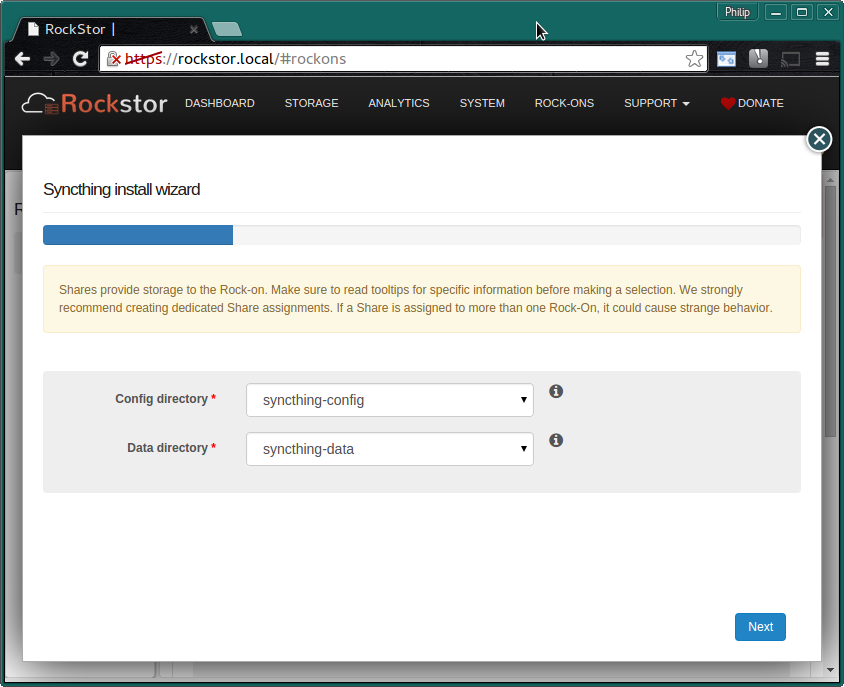
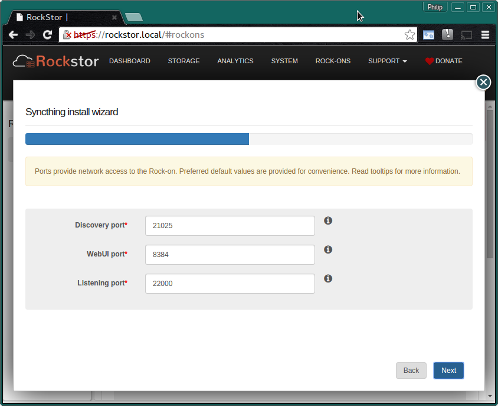

.. _syncthing_rockon:

Syncthing Rock-on
=================

Please be aware of the common prerequisites for all Rockstor :ref:`rockons_intro`;
specifically the :ref:`rockons_preinstall` and :ref:`rockons_root`
requirement.

What is Syncthing
-----------------

`Syncthing <https://syncthing.net>`_ is a cross platform decentralized file
synchronization service written in Googles Open Source Go language. It aims to
be simple to setup yet able to synchronize folders across machines even over the
internet. Each machine is identified via an ID so sharing a folder can be as
simple as giving an ID to a friend and sharing a folder: UPnP (Universal Plug
and Play) built into many modern routers can take care of the rest. It also
features an easy to use WebGUI making it a nice fit with Rockstor.

.. _syncthing_doc:

Syncthing Documentation
-----------------------

Syncthing's `own documentation <http://docs.syncthing.net/>`_ is the best place
to start with understanding its nature and capabilities, they also have a very
accessibly `getting started
<http://docs.syncthing.net/intro/getting-started.html#getting-started>`_ guide.
N.B. if your network gateway router does not have UPnP or you don't wish to
enable it then please see the
`Firewall Setup <http://docs.syncthing.net/users/firewall.html#firewall-setup>`_
section of syncthing's docs.

.. _syncthing_install:

Installing Syncthing Rock-on
----------------------------
First please consider the pre-requisites for any Rockstor Rock-on; these
are linked to at the :ref:`top <syncthing_rockon>` of this document. Note also
that the Syncthing Rock-on will require a Share to share / sync and optionally
(but recommended) another Share on which you store its configurations files.
This makes a total of 3 shares, one for the Rock-on system itself ie
:ref:`rockons_root` that may well already have been made and an additional 1 or 2
shares depending on whether you wish to split your Syncthing config from its data;
this is highly recommended though.

.. image:: syncthing_install.png
   :scale: 80%
   :align: center

Click the **Install** button next to the Syncthing listing on the Rock-ons page.

.. _syncthing_shares:

Syncthing Shares
^^^^^^^^^^^^^^^^

Next we select the **Storage areas** for Syncthing's **data** and
**configuration** files.  Here we are using the **recommended names**.

* **syncthing-config** - min 1 GB
* **syncthing-data** - room enough for your data and snapshots.

If you find that these values are insufficient then please discus this on the
`Rockstor forum <http://forum.rockstor.com/>`_ so that this document might be
updated and improved.

N.B. to create these storage areas please see our :ref:`createshare`.

.. _syncthing_ports:

Syncthing Ports
^^^^^^^^^^^^^^^

These are the **Default Ports** and it is unlikely you will have to alter them.

N.B. if you have used Syncthing before note that it's default **User Interface**
port may have changed** from your previous installs; browser bookmarks may
have to be updated.

.. image:: syncthing_verify.png
   :scale: 80%
   :align: center

Now check that the entered details are correct before clicking **Submit**.

Closing the resulting simple *Installation is in progress* dialog and we have:-

**The Syncthing Rock-on is ON**

.. image:: syncthing_on.png
   :scale: 80%
   :align: center

N.B. Notice the **Syncthing UI** button and the **spanner** to adjust the Rock-on
settings.

The first time you visit the **Syncthing UI** the following will appear:-

.. image:: syncthing_allow_anon.png
   :scale: 80%
   :align: center

This is an opt in to providing your usage statistic to an aggregate.  This can
help the developers asses how people are using their technology and develop it
accordingly.

For convenience and curiosity these are the global
`Syncthing Statistics <https://data.syncthing.net>`_.

Note that once the above Syncthing statistic share consent dialog has been
dismissed there is a notification that the **Configuration** has been **saved
but not activated** this is normal; just press the **restart button** in the UI.

.. _syncthing_ui:

Syncthing UI
------------

We now have the **Default Syncthing UI**:-

.. image:: syncthing_ui.png
   :scale: 80%
   :align: center

You can now configure your shiny new Syncthing Rock-on; :ref:`syncthing_doc`